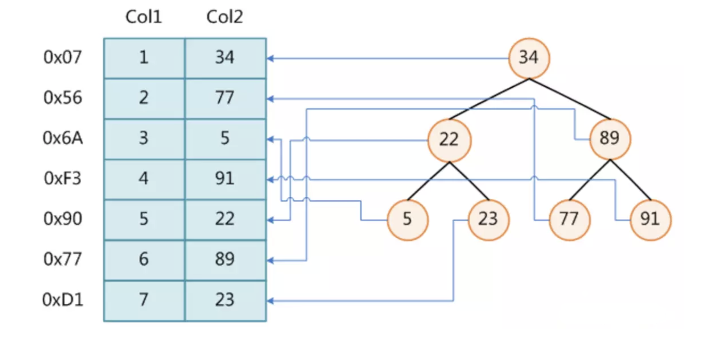
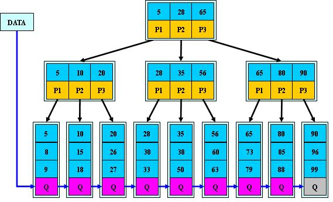
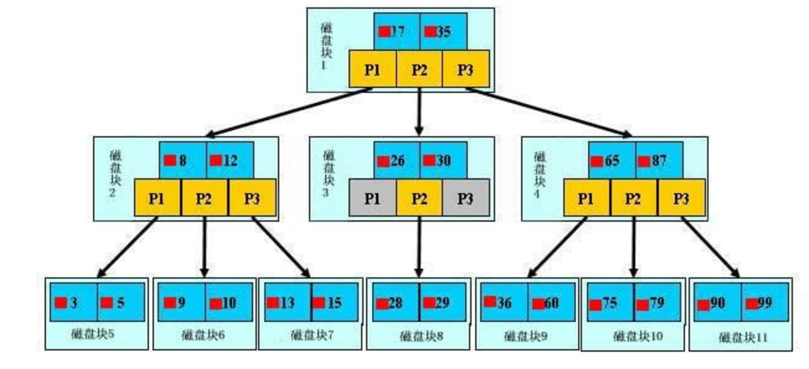
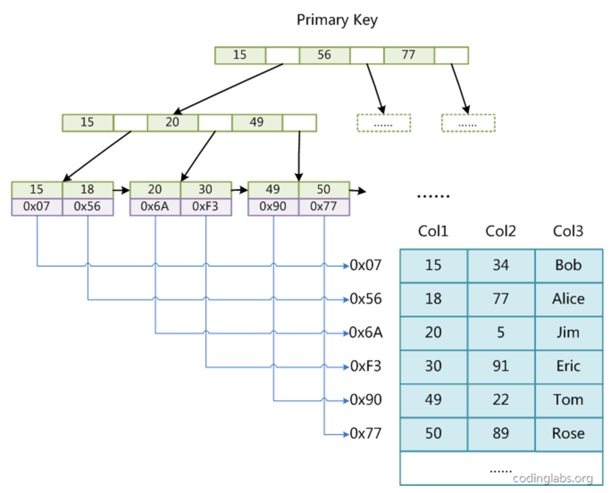
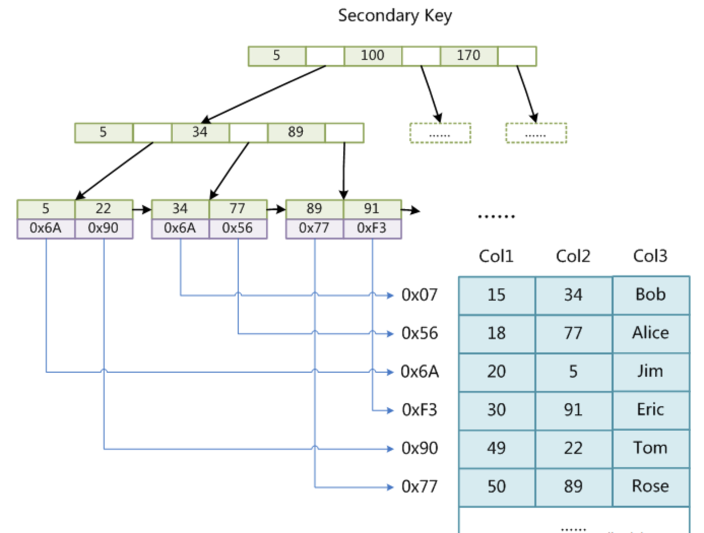
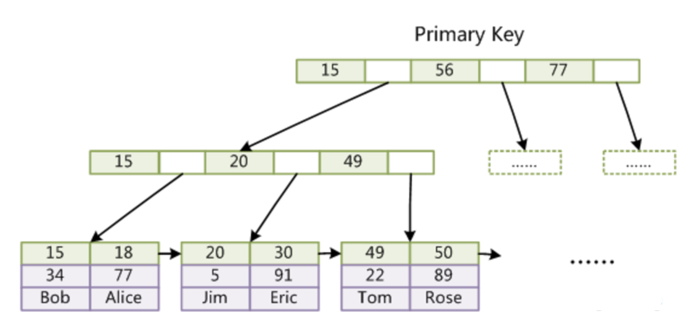
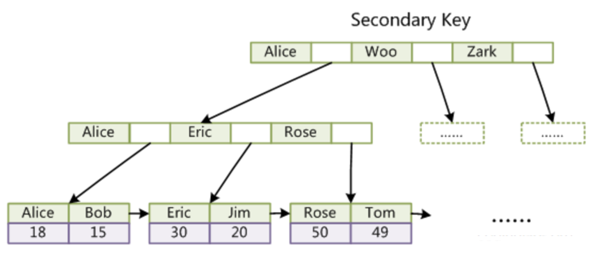

## 概述

> **取自：**https://www.jianshu.com/p/1775b4ff123a

MySQL官方对索引的定义为：索引(Index)是帮助MySQL高校获取数据的数据结构。我们知道，数据库查询是数据库的最主要功能之一。我们都希望查询数据的速度能尽可能的快，因此数据库系统的设计者会从查询算法的角度进行优化。最基本的查询算法当然是[顺序查找](https://link.jianshu.com?t=http://en.wikipedia.org/wiki/Linear_search)（linear search），这种复杂度为O(n)的算法在数据量很大时显然是糟糕的，好在计算机科学的发展提供了很多更优秀的查找算法，例如[二分查找](https://link.jianshu.com?t=http://en.wikipedia.org/wiki/Binary_search_algorithm)（binary search）、[二叉树查找](https://link.jianshu.com?t=http://en.wikipedia.org/wiki/Binary_search_tree)（binary tree search）等。如果稍微分析一下会发现，每种查找算法都只能应用于特定的数据结构之上，例如二分查找要求被检索数据有序，而二叉树查找只能应用于[二叉查找树](https://link.jianshu.com?t=http://en.wikipedia.org/wiki/Binary_search_tree)上，但是数据本身的组织结构不可能完全满足各种数据结构（例如，理论上不可能同时将两列都按顺序进行组织），所以，在数据之外，数据库系统还维护着满足特定查找算法的数据结构，这些数据结构以某种方式引用（指向）数据，这样就可以在这些数据结构上实现高级查找算法。这种数据结构，就是索引。

图中展示了一种可能的索引方式。左边是数据表，一共有两列七条记录，最左边的是数据记录的物理地址（注意逻辑上相邻的记录在磁盘上也并不是一定物理相邻的）。为了加快Col2的查找，可以维护一个右边所示的二叉查找树，每个节点分别包含索引键值和一个指向对应数据记录物理地址的指针，这样就可以运用二叉查找在O(log2n)的复杂度内获取到相应数据。
 虽然这是一个货真价实的索引，但是实际的数据库系统几乎没有使用二叉查找树或其进化品种[红黑树](https://link.jianshu.com?t=http://en.wikipedia.org/wiki/Red-black_tree)（red-black tree）实现的，原因会在下文介绍:

我们平时所说的索引，如果没有特别指明，都是指B树(多路搜索树，并不一定是二叉树)结构组织的索引。其中`聚集索引，次要索引，覆盖索引，复合索引，前缀索引，唯一索引`默认都是使用B+树索引，统称索引。当然,除了B+树这种类型的索引之外，还有哈希索引(hash index)等。

## B树和B+树

这里对B树进行简要的讲解，我们都知道平衡查找树是高效的查找数据结构，而B树就是一种适用于文件存储的平衡查找树，B树具体的特性在在相应的数据结构笔记中记录，就拿23树举例，蓝色的块我们看作存储的内容 k，不提及B树在插入和删除的时候的维护过程，每次我们搜索一个 k 的时候层与层之间采用二叉查找树的搜索策略，而每个块中横向查找，从头遍历到尾(每层数据节点数固定，所以是常数级别的时间复杂度)。

B-Tree有许多变种，其中最常见的是B+Tree，例如MySQL就普遍使用B+Tree实现其索引结构。与B-Tree相比，B+Tree有以下不同点：

- 非叶子结点的子树指针与关键字个数相同；
- 内节点不存储data，只存储key；
- 所有关键字都在叶子结点出现；

B+的搜索与B-树也基本相同，区别是B+树只有达到叶子结点才命中（B-树可以在非叶子结点命中），其性能也等价于在关键字全集做一次二分查找；

**B+的特性：**

1. 所有关键字都出现在叶子结点的链表中（稠密索引），且链表中的关键字恰好是有序的，这点很重要在下面的innodb的索引中有所体现。

2. 不可能在非叶子结点命中。

3. 非叶子结点相当于是叶子结点的索引（稀疏索引），叶子结点相当于是存储（关键字）数据的数据层。

4. 更适合文件索引系统；

## 索引的物理存储

一般来说，索引本身也很大，不可能全部存储在内存中，因此索引往往以索引文件的形式存储的磁盘上。这样的话，索引查找过程中就要产生磁盘I/O消耗，相对于内存存取，I/O存取的消耗要高几个数量级，所以评价一个数据结构作为索引的优劣最重要的指标就是在查找过程中磁盘I/O操作次数的渐进复杂度。换句话说，索引的结构组织要尽量减少查找过程中磁盘I/O的存取次数。

假如每个盘块可以正好存放一个B树的结点（正好存放2个文件名）。那么一个BTNODE结点就代表一个盘块，而子树指针就是存放另外一个盘块的地址，但是B树的结构并不能直接用来做索引，因为索引和数据是kv的对应形式，所以说我们需要借用上面B+树的结构。

**B+tree的优点：**

B+-tree的磁盘读写代价更低：内部结点并没有指向关键字具体信息的指针。因此其内部结点相对B 树更小。如果把所有同一内部结点的关键字存放在同一盘块中，那么盘块所能容纳的关键字数量也越多。一次性读入内存中的需要查找的关键字也就越多。相对来说IO读写次数也就降低了。

B+-tree的查询效率更加稳定：由于非终结点并不是最终指向文件内容的结点，而只是叶子结点中关键字的索引。所以任何关键字的查找必须走一条从根结点到叶子结点的路。所有关键字查询的路径长度相同，导致每一个数据的查询效率相当。

## mysql的两种存储引擎的索引存储机制

#### MyISAM索引实现

MyISAM引擎使用B+Tree作为索引结构，叶节点的data域存放的是数据记录的地址。下图是MyISAM索引的原理图：

这里设表一共有三列，假设我们以Col1为主键，则上图是一个MyISAM表的主索引（Primary key）示意。可以看出MyISAM的索引文件仅仅保存数据记录的地址。在MyISAM中，主索引和辅助索引（Secondary key）在结构上没有任何区别，只是主索引要求key是唯一的，而辅助索引的key可以重复。如果我们在Col2上建立一个辅助索引，则此索引的结构如下图所示：

同样也是一颗B+Tree，data域保存数据记录的地址。Col3就不多做讨论了，因为字符串的编码也可以中十进制数表示。因此，MyISAM中索引检索的算法为首先按照B+Tree搜索算法搜索索引，如果指定的Key存在，则取出其data域的值，然后以data域的值为地址，读取相应数据记录。MyISAM的索引方式也叫做“非聚集”的。

#### InnoDB索引实现

虽然InnoDB也使用B+Tree作为索引结构，但具体实现方式却与MyISAM截然不同。

第一个重大区别是InnoDB的数据文件本身就是索引文件。从上文知道，MyISAM索引文件和数据文件是分离的，索引文件仅保存数据记录的地址。而在InnoDB中，表数据文件本身就是按B+Tree组织的一个索引结构，这棵树的叶节点data域保存了完整的数据记录。这个索引的key是数据表的主键，因此InnoDB表数据文件本身就是主索引。

上图是InnoDB主索引（同时也是数据文件）的示意图，可以看到叶节点包含了完整的数据记录。这种索引叫做聚集索引。因为InnoDB的数据文件本身要按主键聚集，所以**InnoDB要求表必须有主键（MyISAM可以没有）**，如果没有显式指定，则MySQL系统会自动选择一个可以唯一标识数据记录的列作为主键，**如果不存在这种列，则MySQL自动为InnoDB表生成一个隐含字段作为主键，这个字段长度为6个字节，类型为长整形。**

第二个与MyISAM索引的不同是InnoDB的辅助索引data域存储相应记录主键的值而不是地址。换句话说，InnoDB的所有辅助索引都引用主键作为data域。例如，定义在Col3上的一个辅助索引：

这里以英文字符的ASCII码作为比较准则。聚集索引这种实现方式使得按主键的搜索十分高效，但是辅助索引搜索需要检索两遍索引：首先检索辅助索引获得主键，然后用主键到主索引中检索获得记录。

了解不同存储引擎的索引实现方式对于正确使用和优化索引都非常有帮助，例如知道了InnoDB的索引实现后，就很容易明白为什么不建议使用过长的字段作为主键，因为所有辅助索引都引用主索引，过长的主索引会令辅助索引变得过大。再例如，用非单调的字段作为主键在InnoDB中不是个好主意，因为InnoDB数据文件本身是一颗B+Tree，非单调的主键会造成在插入新记录时数据文件为了维持B+Tree的特性而频繁的分裂调整，十分低效，而使用自增字段作为主键则是一个很好的选择。

