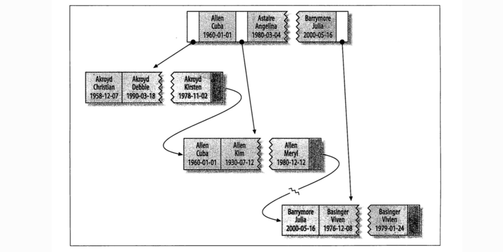
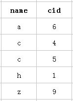
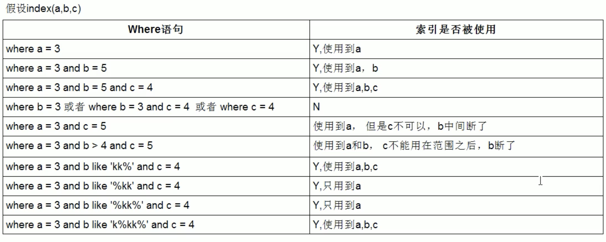

## 复合索引

#### 数据结构：

了解复合索引的数据结构才能更好的理解索引建立的最左原则，在`《高性能MySQL 第三版》P144`，有一张关于索引类型的插图，说明了复合索引是N个字段组合成一个索引的。

**举例：**

复合索引就是含有多个列的索引结构，mysql创建复合索引的规则是首先会对复合索引的最左边的，比如说这个表：有三个字段，分别是id,name,cid，索引方面：id是主键，(name,cid)是一个多列索引。

```sql
CREATE TABLE `student` (
  `id` int(11) NOT NULL AUTO_INCREMENT,
  `name` varchar(255) DEFAULT NULL,
  `cid` int(11) DEFAULT NULL,
  PRIMARY KEY (`id`),
  KEY `name_cid_INX` (`name`,`cid`),
) ENGINE=InnoDB AUTO_INCREMENT=8 DEFAULT CHARSET=utf8
```

以该表的(name,cid)复合索引为例,它内部结构简单说就是下面这样排列的：



```sql
mysql> select * from student order by name cid;
```

所以：第一个name字段是绝对有序的，而第二字段就是无序的了。所以通常情况下，直接使用第二个cid字段进行条件判断是用不到索引的，当然，可能会出现上面的使用index类型的索引。这就是所谓的mysql为什么要强调最左前缀原则的原因。

#### 最左原则：

所以说按照最左原则来讲，当我们使用cid查询的时候应该是用不到索引的，但是这种理解是完全错误且狭隘的：

**情况1：使用到并且是ref类型的查找**

这种类型表示mysql会根据特定的算法快速查找到某个符合条件的索引，而不是会对索引中每一个数据都进行一 一的扫描判断，也就是所谓你平常理解的使用索引查询会更快的取出数据。而要想实现这种查找，索引却是有要求的，要实现这种能快速查找的算法，索引就要满足特定的数据结构。**简单说，也就是索引字段的数据必须是有序的，才能实现这种类型的查找，才能利用到索引。**

**那么什么时候才能用到呢?**当然是cid字段的索引数据也是有序的情况下才能使用咯，什么时候才是有序的呢？观察可知，当然是在name字段是等值匹配的情况下，cid才是有序的。发现没有，观察两个name名字为 c 的cid字段是不是有序的呢。从上往下分别是4，5。

这也就是mysql索引规则中要求复合索引要想使用第二个索引，必须先使用第一个索引的原因。（而且第一个索引必须是等值匹配）。

```sql
EXPLAIN SELECT * FROM student WHERE cid=1 AND name='h';
```

**情况2：使用到并且是index类型的查找**

index这种类型表示是mysql会对整个该索引进行扫描。要想用到这种类型的索引，对这个索引并无特别要求，只要是索引，或者某个复合索引的一部分，mysql都可能会采用index类型的方式扫描。但是呢，缺点是效率不高，mysql会从索引中的第一个数据一个个的查找到最后一个数据，直到找到符合判断条件的某个索引。

在下面这条语句里面，mysql认为进行全表扫描，不如使用cid进行索引树扫描：

```sql
EXPLAIN SELECT * FROM student WHERE cid=1;
+----+-------------+-------+------------+-------+--------------------------+
| id | select_type | table | partitions | type  | Extra                    |
+----+-------------+-------+------------+-------+--------------------------+
|  1 | SIMPLE      | c3    | NULL       | index | Using where; Using index |
+----+-------------+-------+------------+-------+--------------------------+
```

**情况三：使用索引但是只是用了以一个索引：**

下面的表有一个复合索引`name、age、postion`，这样查询只能使用到第一个索引。

```sql
mysql> explain select * from staff where name = 'july' and postion = 'dev';
+----+-------------+-------+------------+------+----------------------+-------------
| id | select_type | table | partitions | type | possible_keys        | key                  | key_len | ref   | rows | filtered | Extra                 |
+----+-------------+-------+------------+------+----------------------+-------------
|  1 | SIMPLE      | staff | NULL       | ref  | idx_staff_nameAgePos | idx_staff_nameAgePos | 82      | const |    1 |    25.00 | Using index condition |
+----+-------------+-------+------------+------+----------------------+-------------
1 row in set, 1 warning (0.00 sec)
```

