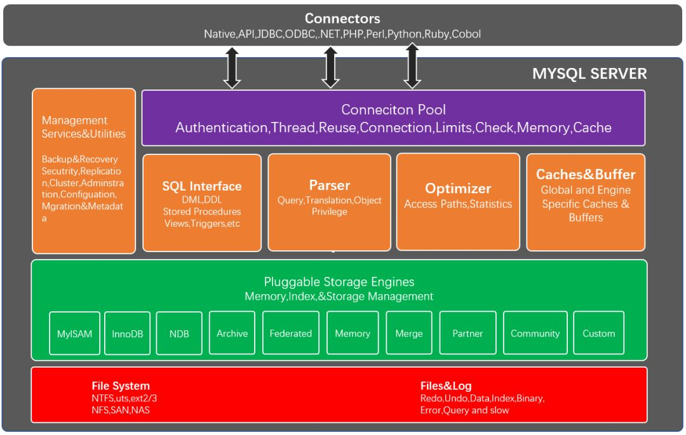

## Mysql 逻辑架构

和其它数据库相比，MySQL有点与众不同，它的架构可以在多种不同场景中应用并发挥良好作用。主要体现在存储引擎的架构上，插件式的存储引擎架构将查询处理和其它的系统任务以及数据的存储提取相分离。这种架构可以根据业务的需求和实际需要选择合适的存储引擎。

#### 1.连接层

我们客户端发送一个Select是直接交给连接层来处理，而它的作用就是提供与客户端连接的服务.连接层只是与客户端建立起连接.完成一些类似连接处理,授权认证 及相关的安全方案. 在该层上引入了连接池的概念.

#### 2.服务层

mysql在服务层提供核心的服务功能，如sql接口，完成缓存的查询，sql的分析和优化部分及内置函数的执行，服务包括以下内容：

- Mangement Service：备份，安全，复制，集群。
- SQL interface：接受用户的SQL命令，并且返回用户需要查询的结果。比如select from就是调用SQL Interface
- Parser：SQL命令传递到解析器的时候会被解析器验证和解析。 
- **Optimizer 优化器**：当我们编写Sql语句执行时，优化器会觉得我写的sql语句性能不够好，这个时候，优化器会自写一个等价于跟我写的执行后结果一致的sql语句进行代替
- Cache Buffers：缓存服务器会查询内部的缓存,如果缓存空间足够大,这样可以解决大量读操作的环境中,能够很好的提升系统性能

#### 3.引擎层

存储引擎是真正负责MYSQL中数据的存储和提取，服务器通过API与存储引擎进行通信, 不同的存储引擎提供的功能不同,可以根据自己的实际需求来进行选取，常见的有：lnnoDB、MylSAM、Memory。

#### 4.存储层

数据存储层，主要是将数据存储在运行于裸设备的文件系统之上，并完成与存储引擎的交互。