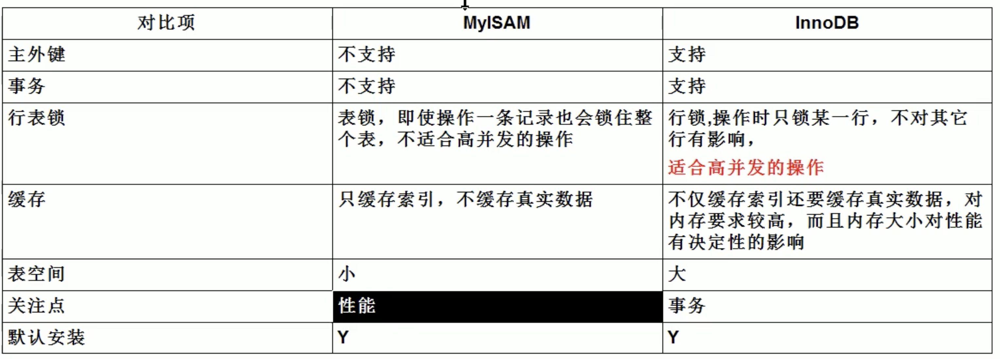

## InnoDB和MyISAM

#### 区别：

MyISAM一般用于多查询操作，InnoDB一般用于多更改操作重点是高并发和事务的支持，对于缓存中的缓存真实数据，是因为inndb的主索引会储存全部文件内容。

#### 操作：

在建表时更改存储引擎：

```sql
create table tb_name(
  ...
) ENGINE=MyISAM; 
```

查看所有的存储引擎：

```sql
mysql> show engines;
```

查看当前默认的存储引擎：

```sql
mysql> show variables like '%storage_engine%';
+----------------------------------+--------+
| Variable_name                    | Value  |
+----------------------------------+--------+
| default_storage_engine           | InnoDB |
| default_tmp_storage_engine       | InnoDB |
| disabled_storage_engines         |        |
| internal_tmp_disk_storage_engine | InnoDB |
+----------------------------------+--------+
4 rows in set (0.01 sec)
```

