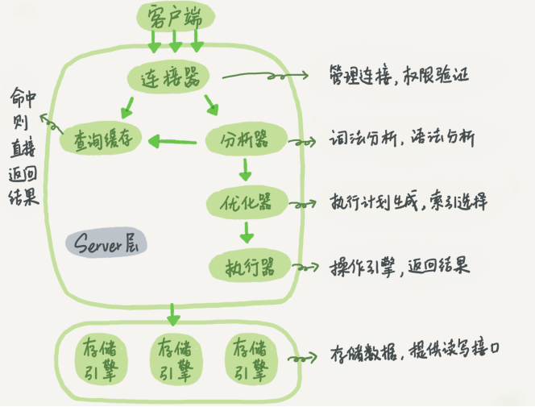

## sql的执行顺序

在我们平时开发过程中，代码性能下降可能是因为SQL慢执行时间长,等待时间长导致的，之前我们了解了mysql的逻辑架构，知道在分析器和优化器中mysql会解析你的sql，所以要调优你的sql就需要对sql在mysql中的机器执行顺序有所了解。



比如下面使我们手写的sql语句：

```sql
select 
	DISTINCT <select_list>
FROM
	<left_table> 
<join_type> JOIN
	<right_table>
ON 
	<join_condition>
WHERE
	<where_condition>
GROUP BY
	<group_by_list>
HAVING
	<having_condition>
ORDER BY
	<order_by_condition>
LIMIT 
	<limit_number>
```

这是分析器解析后的机读，注意这里没有提及union，union连接的select的执行顺序不是从上到下的，是由mysql的优化器来决定的。

```sql
FROM
	<left_table> 
  					ON 
    					<join_condition>
<join_type> JOIN
    					<right_table>	(笛卡尔积)
WHERE
	<where_condition>
GROUP BY
	<group_by_list>
HAVING
	<having_condition>
SELECT
	DISTINCT <select_list>
ORDER BY
	<order_by_condition>
LIMIT 
	<limit_number>
```

从这个顺序中我们不难发现，所有的查询语句都是从from开始执行的，不管是直接`from a,b`还是使用`a join b`都会返回a和b的笛卡尔积，在执行过程中，每个步骤都会为下一个步骤生成一个虚拟表，这个虚拟表将作为下一步执行的输入： 

- **第一步：**首先对from子句中的前两个表执行一个笛卡尔乘积，此时生成虚拟表 vt1（选择相对小的表做基础表） 
- **第二步**：接下来便是应用on筛选器，on 中的逻辑表达式将应用到 vt1 中的各个行，筛选出满足on逻辑表达式的行，生成虚拟表 vt2 
- **第三步：**如果是outer join 那么这一步就将添加外部行，left outer jion 就把左表在第二步中过滤的添加进来，如果是right outer join 那么就将右表在第二步中过滤掉的行添加进来，这样生成虚拟表 vt3 
- **第四步**：如果 from 子句中的表数目多余两个表，那么就将vt3和第三个表连接从而计算笛卡尔乘积，生成虚拟表，该过程就是一个重复1-3的步骤，最终得到一个新的虚拟表 vt3。 
- **第五步**：应用where筛选器，对上一步生产的虚拟表引用where筛选器，生成虚拟表vt4，在这有个比较重要的细节不得不说一下，对于包含outer join子句的查询，就有一个让人感到困惑的问题，到底在on筛选器还是用where筛选器指定逻辑表达式呢？on和where的最大区别在于，**如果在on应用逻辑表达式那么在第三步outer join中还可以把移除的行再次添加回来，而where的移除的最终的**。举个简单的例子，有一个学生表（班级,姓名）和一个成绩表(姓名,成绩)，我现在需要返回一个x班级的全体同学的成绩，但是这个班级有几个学生缺考，也就是说在成绩表中没有记录。为了得到我们预期的结果我们就需要在on子句指定学生和成绩表的关系（学生.姓名=成绩.姓名）那么我们是否发现在执行第二步的时候，对于没有参加考试的学生记录就不会出现在vt2中，因为他们被on的逻辑表达式过滤掉了,但是我们用left outer join就可以把左表（学生）中没有参加考试的学生找回来，因为我们想返回的是x班级的所有学生，如果在on中应用学生.班级='x'的话，left outer join会把x班级的所有学生记录找回（，所以只能在where筛选器中应用学生.班级='x' 因为它的过滤是最终的。 
- **第六步：**group by 子句将中的唯一的值组合成为一组，得到虚拟表vt5。如果应用了group by，那么后面的所有步骤都**只能得到的vt5的列或者是聚合函数（count、sum、avg等）。原因在于最终的结果集中只为每个组包含一行。这一点请牢记。** 
- **第七步：**应用having筛选器，生成vt7。having筛选器是第一个也是为唯一一个应用到已分组数据的筛选器。 
- **第八步：**处理select子句。将vt7中的在select中出现的列筛选出来。生成vt8. 
- **第九步：**应用distinct子句，vt8中移除相同的行，生成vt9。事实上如果应用了group by子句那么distinct是多余的，原因同样在于，分组的时候是将列中唯一的值分成一组，同时只为每一组返回一行记录，那么所以的记录都将是不相同的。 
- **第十步：**应用order by子句。按照order_by_condition排序vt9，此时返回的一个游标，而不是虚拟表。sql是基于集合的理论的，集合不会预先对他的行排序，它只是成员的逻辑集合，成员的顺序是无关紧要的。对表进行排序的查询可以返回一个对象，这个对象包含特定的物理顺序的逻辑组织。这个对象就叫游标。正因为返回值是游标，那么使用order by 子句查询不能应用于表表达式。排序是很需要成本的，除非你必须要排序，否则最好不要指定order by，最后，在这一步中是第一个也是唯一一个可以使用select列表中别名的步骤。 
- **第十一步：**应用top选项。此时才返回结果给请求者即用户。 

