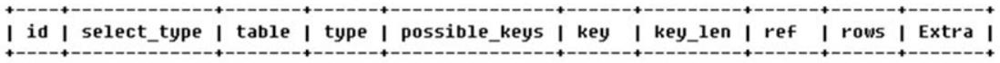
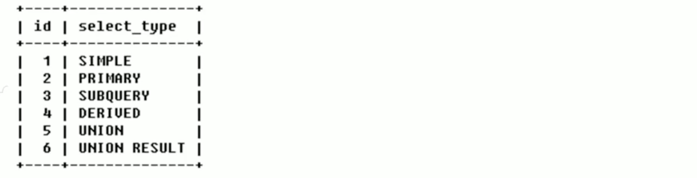
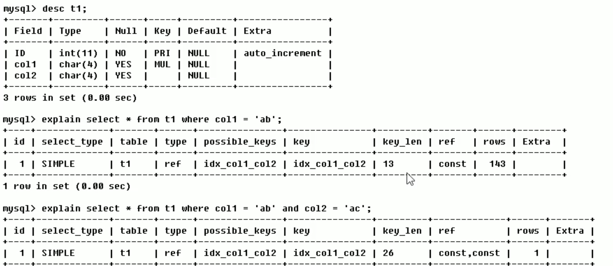
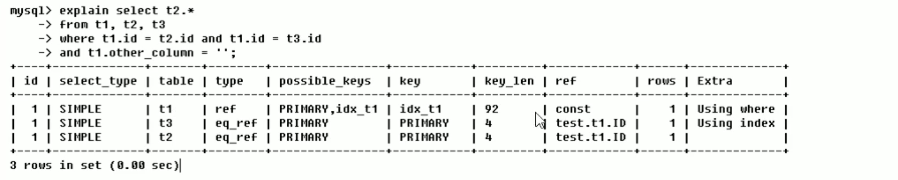
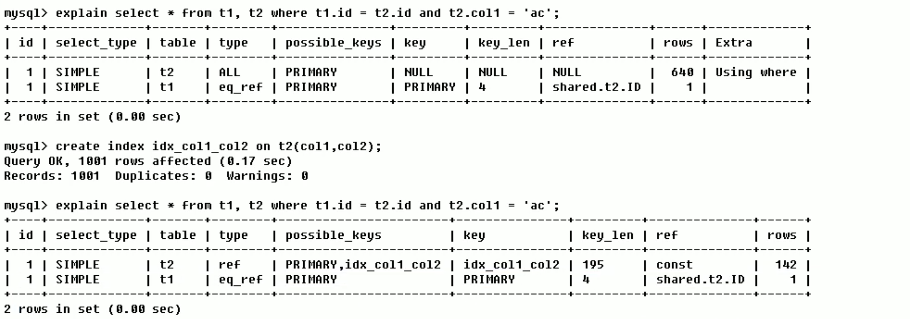

## 前言

MySQL常见瓶颈：

- CPU:CPU在饱和的时候一般发生在数据装入在内存或从磁盘上读取数据时候
- IO:磁盘I/O瓶颈发生在装入数据远大于内存容量时
- 服务器硬件的性能瓶颈：top,free,iostat和vmstat来查看系统的性能状态

对于服务器硬件的性能瓶颈与程序员无关，但是对于如果是sql的问题，需要程序员去自行优化。

## Explain

Mysql 中有负责优化 select 语句的优化器模块，Mysql会按照他认为最优的数据检索方式来查询检索内容，而比不一定是程序员认为的最优方案，当我们要对 sql 语句进行优化的时候，使用EXPLAIN关键字可以模拟优化器执行SQL语句，从而知道MySQL是如何处理你的SQL语句的。分析你的查询语句或是结构的性能瓶颈。

#### 使用方法：

explain + 要检查的sql语句：

```sql
mysql> explain select * from Kapi_group;
```

#### 返回结果：




#### 1. id：

select查询的序列号，包含一组数字，表示查询中执行select子句或操作表的顺序。

- **id相同时：**表的读取顺序从上到下，比如这里虽然我 Kapi_member 写在前面但是，Kapi_user的却先被读取，这是因为每一次sql都会选择比较小的表作为基础表。

```sql
mysql> explain select gid, username from Kapi_member, Kapi_user where Kapi_user.id = Kapi_member.uid;
+----+-------------+-------------+------------+------+---------------+------+-------
| id | select_type | table       | partitions | type | possible_keys | key  | ····                                           
+----+-------------+-------------+------------+------+---------------+------+-------
|  1 | SIMPLE      | Kapi_user   | NULL       | ALL  | PRIMARY       | NULL | ····
|  1 | SIMPLE      | Kapi_member | NULL       | ALL  | NULL          | NULL | ····    
+----+-------------+-------------+------------+------+---------------+------+-------
2 rows in set, 1 warning (0.00 sec)
```

- **id不同：**如果是子查询，id的序号会递增，id值越大优先级越高，越先被执行，括号内的子查询优先级高先执行。

```sql
mysql> explain select * from Kapi_user where id = 
							(select uid from Kapi_member where id = 3);
+----+-------------+-------------+------------+-------+---------------+---------+---
| id | select_type | table       | partitions | type  | possible_keys | ···
+----+-------------+-------------+------------+-------+---------------+---------+---
|  1 | PRIMARY     | Kapi_user   | NULL       | const | PRIMARY       | ···       
|  2 | SUBQUERY    | Kapi_member | NULL       | const | PRIMARY       | ···       
+----+-------------+-------------+------------+-------+---------------+---------+---
2 rows in set, 1 warning (0.00 sec)
```

- **id相同不同，同时存在：**id相同看作一组，从上到下。id不同比较大的组先执行。

#### 2. Select_type

查询的类型，主要用于区别普通查询、联合查询、子查询等的复杂查询。



1. **SIMPLE**:简单的select查询，查询中不包含子查询或者UNION。

2. **PRIMARY**：查询中若包含任何复杂的子部分，**最外层查询**则被标记为PRIMARY。

3. **SUBQUERY**：在SELECT或者WHERE列表中包含了子查询。

4. **DERIVED**：在FROM列表中包含的子查询被标记为DERIVED（衍生）MySQL会递归执行这些子查询，把结果放在临时表里，不过5.7之后from中会将产生衍生表的子查询合并到外层中，而且注意只有紧跟在from后面的子查询才会产生衍生表：

   ```sql
   mysql> explain select * from (select id from Kapi_user) as ku;
   +----+-------------+------------+------------+-------+---------------+---------+
   | id | select_type | table      | partitions | type  | possible_keys | key     | 
   +----+-------------+------------+------------+-------+---------------+---------+
   |  1 | PRIMARY     | <derived2> | NULL       | ALL   | NULL          | NULL    | 
   |  2 | DERIVED     | Kapi_user  | NULL       | index | NULL          | PRIMARY | 
   +----+-------------+------------+------------+-------+---------------+---------+
   2 rows in set, 1 warning (0.00 sec)
   ```

5. **UNION**：若**第二个SELECT出现在UNION之后，则被标记为UNION(不过第二个出现不代表第二个执行，执行顺序由优化器决定)**；若UNION包含在FROM子句的子查询中，外层SELECT将被标记为：DERIVED。

6. **UNION RESULT**：从UNION产生的临时表表获取结果的SELECT，这里如果使用的是union all 就不会产生临时表，也就不会有下面的最后一行。

   ```sql
   mysql> explain 
   select * from Kapi_user left outer join Kapi_member on Kapi_user.id = Kapi_member.uid 
   union 
   select * from Kapi_user right outer join Kapi_member on Kapi_user.id = Kapi_member.uid;
   +------+--------------+-------------+---------------------------------+
   |  id  | select_type  | table       | Extra 													|
   +------+--------------+-------------+---------------------------------+
   |   1  | PRIMARY      | Kapi_user   | NULL													  |
   |   1  | PRIMARY      | Kapi_member | Using where; Using join buffer 	| 
   |   2  | UNION        | Kapi_member | NULL        										|
   |  	2	 | UNION        | Kapi_user   | Using where; Using join buffer  |
   | NULL | UNION RESULT | <union1,2>  | Using temporary    							|
   +------+--------------+-------------+---------------------------------+
   5 rows in set, 1 warning (0.00 sec)
   ```

### 3.table

显示表名

#### 4.type

显示查询使用了何种类型，从最好到最差依次是：`system>const>eq_ref>ref>range>index>ALL`，到`range`或者`ref`级别足矣，当表的容量到达十万或是百万的时候急需要进行优化。


1. **system：****表只有一行记录**（等于系统表），这是const类型的特例，平时不会出现，这个也可以忽略不计。

2. **const：**表示通过索引一次就找到了，const用于比较primary key或者unique索引。只匹配一行数据，所以很快。如将主键至于where列表中，MySQL就能将该查询转换为一个常量

   ```sql
   mysql> explain select id, username from Kapi_user where id = 1;
   +----+-------------+-----------+------------+-------+---------------+---------+-
   | id | select_type | table     | partitions | type  | possible_keys | key     | 
   +----+-------------+-----------+------------+-------+---------------+---------+-
   |  1 | SIMPLE      | Kapi_user | NULL       | const | PRIMARY       | PRIMARY | 
   +----+-------------+-----------+------------+-------+---------------+---------+-
   1 row in set, 1 warning (0.00 sec)
   ```

3. **eq_ref**：唯一性索引，对于每个索引键，表中只有一条记录与之匹配，常见于主键或唯一索引扫描，说白了就是联结查询，每个表的一个索引都只对应另一个表的一个索引。虽然下面涉及到了一个ALL查询类型，但是他是基准表。

   ```sql
   mysql> explain select * from Kapi_user, Kapi_member where Kapi_user.id = Kapi_member.id;
   +----+-------------+-------------+------------+--------+---------------+--------
   | id | select_type | table       | partitions | type   | possible_keys | key     
   +----+-------------+-------------+------------+--------+---------------+--------
   |  1 | SIMPLE      | Kapi_user   | NULL       | ALL    | PRIMARY       | NULL    
   |  1 | SIMPLE      | Kapi_member | NULL       | eq_ref | PRIMARY       | PRIMARY 
   +----+-------------+-------------+------------+--------+---------------+--------
   2 rows in set, 1 warning (0.01 sec)
   ```

4. **ref**：非唯一索引扫描，返回匹配某个单独值的所有行。本质上也是一种索引访问，它返回所有匹配某个单独值的行，然而，它可能会找到多个符合条件的行，所以他应该属于查找和扫描的混合体。

   ```sql
   mysql> explain select col4 from c1 where col4 = 2;
   +----+-------------+-------+------------+------+---------------+------------+---
   | id | select_type | table | partitions | type | possible_keys | key        | 
   +----+-------------+-------+------------+------+---------------+------------+---
   |  1 | SIMPLE      | c1    | NULL       | ref  | index_col4    | index_col4 | 5       
   +----+-------------+-------+------------+------+---------------+------------+---
   1 row in set, 1 warning (0.00 sec)
   ```

5. **range**：只检索给定范围的行，使用一个索引来选择行。key列显示使用了哪个索引一般就是在你的where语句中出现了between、<、>、in等的查询这种范围扫描索引扫描比全表扫描要好，因为他只需要开始索引的某一点，而结束语另一点，不用扫描全部索引。**当然如果你的范围囊括所有的列那么你的效率还是ALL**。

   ```sql
   mysql> explain select id, username from Kapi_user where id between 1 and 6;
   +----+-------------+-----------+------------+-------+---------------+---------+-
   | id | select_type | table     | partitions | type  | possible_keys | key     | 
   +----+-------------+-----------+------------+-------+---------------+---------+-
   |  1 | SIMPLE      | Kapi_user | NULL       | range | PRIMARY       | PRIMARY | 
   +----+-------------+-----------+------------+-------+---------------+---------+-
   1 row in set, 1 warning (0.00 sec)
   ```

6. **Index**：Full Index Scan,index与ALL区别为index类型只遍历索引树。这通常比ALL快，因为索引文件通常比数据文件小（也就是说虽然all和index都是读全表，但index是从索引中读取的，而all是从硬盘中读的)。

   ```sql
   mysql> explain select id from Kapi_user;
   +----+-------------+-----------+------------+-------+---------------+---------+-
   | id | select_type | table     | partitions | type  | possible_keys | key     | 
   +----+-------------+-----------+------------+-------+---------------+---------+-
   |  1 | SIMPLE      | Kapi_user | NULL       | index | NULL          | PRIMARY | 
   +----+-------------+-----------+------------+-------+---------------+---------+-
   1 row in set, 1 warning (0.00 sec)
   ```

7. **all**：FullTable Scan,将遍历全表以找到匹配的行。

   ```sql
   mysql> explain select id, username from Kapi_user;
   +----+-------------+-----------+------------+------+---------------+------+-----
   | id | select_type | table     | partitions | type | possible_keys | key  | 
   +----+-------------+-----------+------------+------+---------------+------+-----
   |  1 | SIMPLE      | Kapi_user | NULL       | ALL  | NULL          | NULL | NULL    
   +----+-------------+-----------+------------+------+---------------+------+-----
   1 row in set, 1 warning (0.00 sec)
   ```

#### 5.possible_keys、key

**possible_keys**：显示可能应用在这张表中的索引,一个或多个。查询涉及的字段上若存在索引，则该索引将被列出，但不一定被查询实际使用。

**key：**实际使用的索引。如果为null则没有使用索引。

>  **注意：**查询中若使用了覆盖索引，则索引和查询的select字段重叠。

有`possible_keys`没有`key`：

```sql
mysql> explain select * from Kapi_user where id > 0;
+---------------+------+---------+------+------+----------+-------------+
| possible_keys | key  | key_len | ref  | rows | filtered | Extra       |
+---------------+------+---------+------+------+----------+-------------+
| PRIMARY       | NULL | NULL    | NULL |    5 |   100.00 | Using where |
+---------------+------+---------+------+------+----------+-------------+
1 row in set, 1 warning (0.00 sec)
```

有`key`没有`possible_key`，**覆盖索引：**

```sql
mysql> select * from c1;
+-----+-----+
| pk1 | pk2 |
+-----+-----+
|   1 |   1 |
|   2 |   2 |
+-----+-----+
2 rows in set (0.00 sec)

mysql> explain select * from c1;
+---------------+---------+---------+------+------+----------+-------------+
| possible_keys | key     | key_len | ref  | rows | filtered | Extra       |
+---------------+---------+---------+------+------+----------+-------------+
| NULL          | PRIMARY | 8       | NULL |    2 |   100.00 | Using index |
+---------------+---------+---------+------+------+----------+-------------+
1 row in set, 1 warning (0.00 sec)
```

#### 6.key_len

表示索引中使用的字节数，可通过该列计算查询中使用的索引的长度。在不损失精确性的情况下，长度越短越好。

key_len显示的值为索引最大可能长度，并非实际使用长度，即key_len是根据表定义计算而得，不是通过表内检索出的。

#### 7.ref

显示索引那一列被使用了，如果可能的话，是一个常数。那些列或常量被用于查找索引列上的值。



#### 8.rows

根据表统计信息及索引选用情况，大致估算出找到所需的记录所需要读取的行数，越少越好。



#### 9.Extra

包含不适合在其他列中显示但十分重要的额外信息。

1. **Using filesort**：说明mysql会对数据使用一个外部的索引排序，而不是按照表内的索引顺序进行读取。
   **MySQL中无法利用索引完成排序操作成为“文件排序”**。

2. **Using temporary**：使用了临时表保存中间结果，MySQL在对查询结果排序时使用临时表。常见于排序order by 和分组查询 group by，这个在4-2中有详细的介绍。

3. USING index：表示相应的select操作中使用了覆盖索引（Coveing Index）,避免访问了表的数据行，效率不错！
   如果同时出现using where，表明索引被用来执行索引键值的查找；
   如果没有同时出现using where，表面索引用来读取数据而非执行查找动作。

   ```sql
   mysql> explain select * from c2 ;
   +--------------------+---------+------+------+----------+-------------+
   | key                | key_len | ref  | rows | filtered | Extra       |
   +--------------------+---------+------+------+----------+-------------+
   | idx_col1_col2_col3 | 15      | NULL |    5 |   100.00 | Using index |
   +--------------------+---------+------+------+----------+-------------+
   1 row in set, 1 warning (0.00 sec)
   ```

4. Using where：表面使用了where过滤。

5. using join buffer：使用了连接缓存。

6. **impossible where**：where子句的值总是false，不能用来获取任何元组。

   ```sql
   mysql> explain select distinct * from c2 where col1 = 2 and col1 = 3;
   ```

7. select tables optimized away：在没有GROUPBY子句的情况下，基于索引优化MIN/MAX操作或者对于MyISAM存储引擎优化COUNT(*)操作，不必等到执行阶段再进行计算，查询执行计划生成的阶段即完成优化。

8. distinct：优化distinct，在找到第一匹配的元组后即停止找同样值的工作

