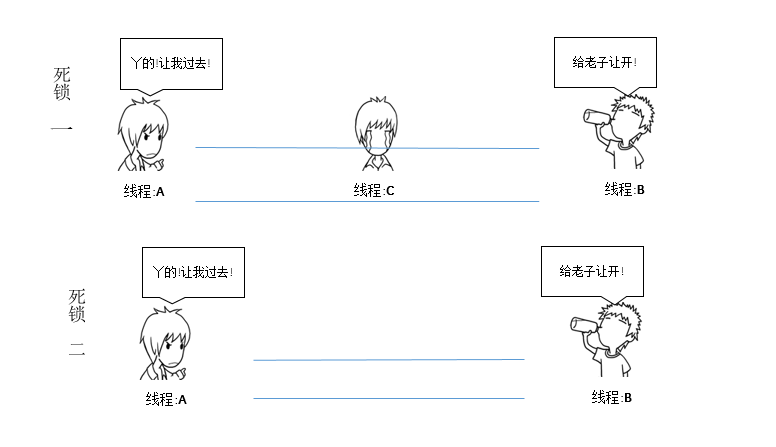

下面的独木桥我们看作系统的某个资源的使用时间轴，同一时间只能被一个线程占用。

## 死锁

线程A或者B需要过独木桥(使用该进程),而C还没有走完(进程还在占用),于是三方僵死；
也可以是没有C 的情况下,A和B互不礼让僵死。 A和B都认为自己优先级最高应该使用该进程；

这里形容的不是很清晰，应该是线程A已经占有a资源，而线程 B已经占有b资源，而A在占有a的同时向B所求b，B在占有b的同时向A所求a，这样就会形成死锁。

## 活锁

线程A和B都需要过桥(都需要使用进程),而都礼让不走(那到的系统优先级相同,都认为不是自己优先级高),就这么僵持下去。

## 饿死

这是个独木桥(单进程),桥上只能走一个人,B来到时A在桥上,B等待；而此时比B年龄小的C来了,B让C现行(A走完后系统把进程分给了C)，C上桥后,D又来了,B又让D现行(C走完后系统把进程分个了D)以此类推B一直是等待状态.

## 阻塞

## 总结

#### **死锁:**

死锁的产生需要同时满足四个条件：

1. 互斥条件：指进程对所分配到的资源进行排它性使用，即在一段时间内某资源只由一个进程占用。如果此时还有其它进程请求资源，则请求者只能等待，直至占有资源的进程用毕释放。

2. 请求和保持条件：指进程已经保持至少一个资源，但又提出了新的资源请求，而该资源已被其它进程占有，此时请求进程阻塞，但又对自己已获得的其它资源保持不放。

3. 不剥夺条件：指进程已获得的资源，在未使用完之前，不能被剥夺，只能在使用完时由自己释放。

4. 环路等待条件：指在发生死锁时，必然存在一个进程——资源的环形链，即进程集合{P0，P1，P2，···，Pn}中的P0正在等待一个P1占用的资源；P1正在等待P2占用的资源，……，Pn正在等待已被P0占用的资源。

#### **活锁:**

活锁指的是任务或者执行者没有被阻塞，由于某些条件没有满足，导致一直重复尝试，失败，尝试，失败。 活锁和[死锁](https://link.jianshu.com?t=http://baike.baidu.com/view/121723.htm)的区别在于，处于活锁的实体是在不断的改变状态，所谓的“活”， 而处于死锁的实体表现为等待；活锁有可能自行解开，死锁则不能。活锁可以认为是一种特殊的饥饿。 下面这个例子在有的文章里面认为是活锁。实际上这只是一种饥饿。因为没有体现出“活”的特点。 假设事务T2再不断的重复尝试获取锁R，那么这个就是活锁。

#### **饥饿:**

饥饿 ，与死锁和活锁非常相似。是指一个可运行的进程尽管能继续执行，但被调度器无限期地忽视，而不能被调度执行的情况。[1] 饥饿可以通过先来先服务资源分配策略来避免。