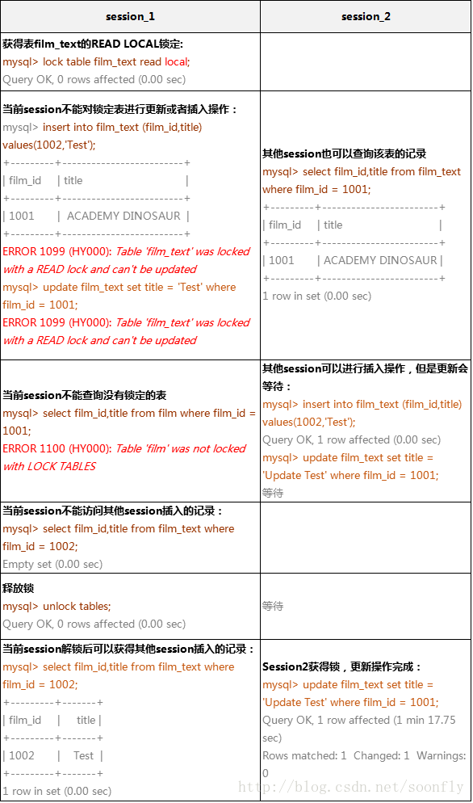

**锁是计算机协调多个进程或线程并发访问某一资源的机制。**在数据库中，除传统的 计算资源（如CPU、RAM、I/O等）的争用以外，数据也是一种供许多用户共享的资源。如何保证数据并发访问的一致性、有效性是所有数据库必须解决的一 个问题，锁冲突也是影响数据库并发访问性能的一个重要因素。从这个角度来说，锁对数据库而言显得尤其重要，也更加复杂。本章我们着重讨论MySQL锁机制 的特点，常见的锁问题，以及解决MySQL锁问题的一些方法或建议。

Mysql用到了很多这种锁机制，比如行锁，表锁等，读锁，写锁等，都是在做操作之前先上锁。这些锁统称为悲观锁(Pessimistic Lock)。

## 概述

相对其他数据库而言，MySQL的锁机制比较简单，其最显著的特点是不同的存储引擎支持不同的锁机制。比如，MyISAM和MEMORY存储引擎采用的是表级锁（table-level locking）；BDB存储引擎采用的是页面锁（page-level locking），但也支持表级锁；InnoDB存储引擎既支持行级锁（row-level locking），也支持表级锁，但默认情况下是采用行级锁。按照粒度来区分有这三种锁：

- 表级锁：开销小，加锁快；不会出现死锁；**锁定粒度大，发生锁冲突的概率最高，并发度最低。**

- 行级锁：开销大，加锁慢；会出现死锁；**锁定粒度最小，发生锁冲突的概率最低，并发度也最高。**

- 页面锁：开销和加锁时间界于表锁和行锁之间；会出现死锁；锁定粒度界于表锁和行锁之间，并发度一般

从上述特点可见，很难笼统地说哪种锁更好，只能就具体应用的特点来说哪种锁更合适！仅从锁的角度来说：表级锁更适合于以查询为主，只有少量按索引条件更新数据的应用，如Web应用；而行级锁则更适合于有大量按索引条件并发更新少量不同数据，同时又有并发查询的应用，如一些在线事务处理（OLTP）系统。

# MyISAM表锁

MySQL的表级锁有两种模式：

- **共享锁（Table Read Lock）**：对MyISAM表的读操作，不会阻塞其他用户对同一表的读请求，但会阻塞对同一表的写请求，也可以叫做读锁。

- **排他锁（Table Write Lock）**：对 MyISAM表的写操作，则会阻塞其他用户对同一表的读和写操作，也可以叫做读写锁。

MyISAM表的读操作与写操作之间，以及写操作之间是串行的！根据如表所示的例子可以知道，当一个线程获得对一个表的写锁后，**只有持有锁的线程可以对表进行更新操作**。其他线程的读、写操作都会等待，直到锁被释放为止。

**MyISAM存储引擎的写锁阻塞读例子：** 
当一个线程获得对一个表的写锁后，只有持有锁的线程可以对表进行更新操作。其他线程的读、写操作都会等待，直到锁被释放为止。 


**MyISAM存储引擎的读锁阻塞写例子:** 
一个session使用LOCK TABLE命令给表film_text加了读锁，这个session可以查询锁定表中的记录，但更新或访问其他表都会提示错误；同时，另外一个session可以查询表中的记录，但更新就会出现锁等待。


## 如何加MyISAM表锁

MyISAM在执行查询语句`(SELECT)`前，会自动给涉及的所有表加读锁，在执行更新操作` (UPDATE、DELETE、INSERT等)`前，会自动给涉及的表加写锁，这个过程并不需要用户干预，因此，用户一般不需要直接用`LOCK TABLE`命令给MyISAM表显式加锁。在示例中，显式加锁基本上都是为了演示而已，并非必须如此。 

#### MyISAM模拟事务

给MyISAM表显示加锁，一般是为了在一定程度模拟事务操作，实现对某一时间点多个表的一致性读取。例如， 有一个订单表orders，其中记录有各订单的总金额total，同时还有一个订单明细表order_detail，其中记录有各订单每一产品的金额小计 subtotal，假设我们需要检查这两个表的金额合计是否相符，可能就需要执行如下两条SQL：

```sql
Select sum(total) from orders;
Select sum(subtotal) from order_detail;
```

这时，如果不先给两个表加锁，就可能产生错误的结果，因为第一条语句执行过程中，order_detail表可能已经发生了改变。因此，正确的方法应该是：

```sql
Lock tables orders read local, order_detail read local;
Select sum(total) from orders;
Select sum(subtotal) from order_detail;
Unlock tables;
```

> **要特别说明以下两点内容：** 
>
> **1、**上面的例子在LOCK TABLES时加了**“local”**选项，其作用就是在满足MyISAM表并发插入条件的情况下，允许其他用户在表尾并发插入记录，有关MyISAM表的并发插入问题，在后面还会进一步介绍。 
>
> **2、**在用LOCK TABLES给表显式加表锁时，必须同时取得所有涉及到表的锁，并且MySQL不支持锁升级。也就是说，在执行LOCK TABLES后，只能访问显式加锁的这些表，不能访问未加锁的表；同时，如果加的是读锁，那么只能执行查询操作，而不能执行更新操作。其实，在自动加锁的情况下也基本如此。
>
> **3、**MyISAM总是一次获得SQL语句所需的全部锁。在锁没有被释放时，不会再去获取新的锁，**这也正是MyISAM表不会出现死锁（Deadlock Free）的原因。**

#### 表别名和锁

当使用LOCK TABLES时，不仅需要一次锁定用到的所有表，而且，同一个表在SQL语句中出现多少次，就要通过与SQL语句中相同的别名锁定多少次，否则也会出错！举例说明如下。 

对actor表获得读锁：

```sql
mysql> lock table actor read; 
```

> Query OK, 0 rows affected (0.00 sec)

但是通过别名访问会提示错误：

```sql
mysql> select a.first_name,a.last_name,b.first_name,b.last_name 
from actor a,actor b 
where a.first_name = b.first_name and a.first_name = 'Lisa' and a.last_name = 'Tom';
```

> ERROR 1100 (HY000): Table ‘a’ was not locked with LOCK TABLES

（3）需要对别名分别锁定：

```sql
mysql> lock table actor as a read,actor as b read;
```

> Query OK, 0 rows affected (0.00 sec)

（4）按照别名的查询可以正确执行：

```sql
mysql> select a.first_name,a.last_name,b.first_name,b.last_name 
from actor a,actor b where a.first_name = b.first_name 
and a.first_name = 'Lisa' and a.last_name = 'Tom' 
```

> 1 row in set (0.00 sec)

## 查询表级锁争用情况

可以通过检查table_locks_waited和table_locks_immediate状态变量来分析系统上的表锁定争夺：

```sql
mysql> show status like 'table%';
```

> **Variable_name | Value** 
> *Table_locks_immediate | 2979* 
> *Table_locks_waited | 0* 
> 2 rows in set (0.00 sec))

## 并发插入（Concurrent Inserts）

上文提到过MyISAM表的读和写是串行的，但这是就总体而言的。在一定条件下，MyISAM表也支持查询和插入操作的并发进行。 
MyISAM存储引擎有一个系统变量concurrent_insert，专门用以控制其并发插入的行为，其值分别可以为0、1或2。

- 当concurrent_insert设置为0时，不允许并发插入。
- 当concurrent_insert设置为1时，如果MyISAM表中没有空洞（即表的中间没有被删除的行），MyISAM允许在一个进程读表的同时，另一个进程从表尾插入记录。这也是MySQL的默认设置。
- 当concurrent_insert设置为2时，无论MyISAM表中有没有空洞，都允许在表尾并发插入记录。

在下面的例子中，session_1获得了一个表的READ LOCAL锁，该线程可以对表进行查询操作，但不能对表进行更新操作；其他的线程（session_2），虽然不能对表进行删除和更新操作，但却可以对该表进行并发插入操作，这里假设该表中间不存在空洞。

**MyISAM存储引擎的读写（INSERT）并发例子：** 
 
可以利用MyISAM存储引擎的并发插入特性，来解决应 用中对同一表查询和插入的锁争用。例如，将concurrent_insert系统变量设为2，总是允许并发插入；同时，通过定期在系统空闲时段执行 OPTIMIZE TABLE语句来整理空间碎片，收回因删除记录而产生的中间空洞。

## MyISAM的锁调度

前面讲过，MyISAM存储引擎的读锁和写锁是互斥的，读写操作是串行的。那么，一个进程请求某个 MyISAM表的读锁，同时另一个进程也请求同一表的写锁，MySQL如何处理呢？答案是写进程先获得锁。不仅如此，即使读请求先到锁等待队列，写请求后 到，写锁也会插到读锁请求之前！这是因为MySQL认为写请求一般比读请求要重要。这也正是MyISAM表不太适合于有大量更新操作和查询操作应用的原 因，因为，大量的更新操作会造成查询操作很难获得读锁，从而可能永远阻塞。这种情况有时可能会变得非常糟糕！幸好我们可以通过一些设置来调节MyISAM 的调度行为。

- 通过指定启动参数low-priority-updates，使MyISAM引擎默认给予读请求以优先的权利。
- 通过执行命令`SET LOW_PRIORITY_UPDATES=1`，使该连接发出的更新请求优先级降低。
- 通过指定INSERT、UPDATE、DELETE语句的LOW_PRIORITY属性，降低该语句的优先级。

虽然上面3种方法都是要么更新优先，要么查询优先的方法，但还是可以用其来解决查询相对重要的应用（如用户登录系统）中，读锁等待严重的问题。 
另外，MySQL也提供了一种折中的办法来调节读写冲突，即给系统参数`max_write_lock_count`设置一个合适的值，当一个表的读锁达到这个值后，MySQL就暂时将写请求的优先级降低，给读进程一定获得锁的机会。

上面已经讨论了写优先调度机制带来的问题和解决办法。这 里还要强调一点：一些需要长时间运行的查询操作，也会使写**进程“饿死”（饥饿）**！因此，应用中应尽量避免出现长时间运行的查询操作，不要总想用一条SELECT语 句来解决问题，因为这种看似巧妙的SQL语句，往往比较复杂，执行时间较长，在可能的情况下可以通过使用中间表等措施对SQL语句做一定的“分解”，使每 一步查询都能在较短时间完成，从而减少锁冲突。如果复杂查询不可避免，应尽量安排在数据库空闲时段执行，比如一些定期统计可以安排在夜间执行。

