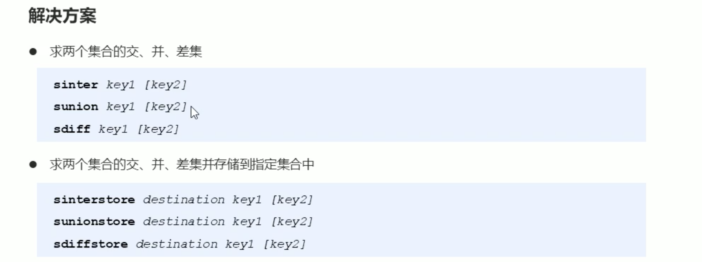

​	





```bash
127.0.0.1:6379> sadd uid:001 getAll insert updateone
(integer) 3
127.0.0.1:6379> smembers uid:001
1) "updateone"
2) "insert"
3) "getAll"
# 取出数据，将校验交给业务。
127.0.0.1:6379> sismember uid:001 getAll
(integer) 1
# 将校验交给数据。
```


```bash
127.0.0.1:6379> sadd ips 0.0.0.0 1.1.1.1 3.3.3.3
(integer) 3
127.0.0.1:6379> scard ips
(integer) 3  
```


