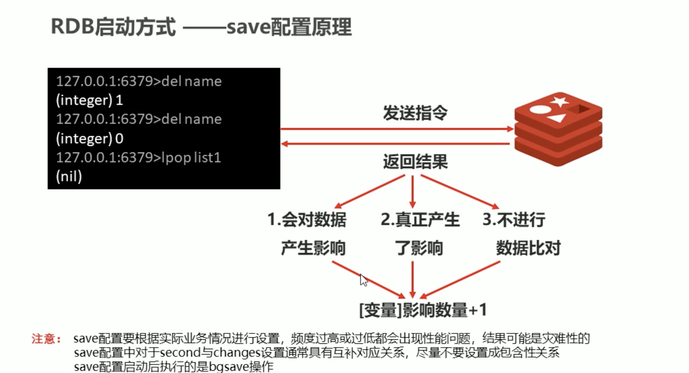

> **Redis** 是内存服务器，一旦进程退出在内存中存储的数据也就会消失，所以在线上环境中一旦服务器宕机，就会带来无法挽回的损失，所以说reids本身为我们提供了数据持久化的解决方案。
>
> **注意：**比如说你有的数据需要持久化，有的数据不需要持久化。对不同的数据开不同的服务器，进行不同的持久化配置。


> **rdb**的数据恢复方式会在服务启动的时候将.rdb文件中的数据恢复到内存中。


```bash
127.0.0.1:6379> set kill you
OK
127.0.0.1:6379> bgsave
Background saving started

local/redis/data
➜ ll
-rw-r--r--  1 inno  wheel   117B  2 28 03:25 dump-6379.rdb

local/redis/data
➜ ll
-rw-r--r--  1 inno  wheel   136B  2 28 03:26 dump-6379.rdb
```

 





```go
/usr/local/redis took 15s
➜ redis-cli
127.0.0.1:6379> set yy yy
OK
127.0.0.1:6379> shutdown save
not connected> exit

local/redis/data
➜ ll
-rw-r--r--  1 inno  wheel   170B  2 28 03:36 dump-6379.rdb

local/redis/data
➜ ll
-rw-r--r--  1 inno  wheel   177B  2 28 03:56 dump-6379.rdb
```


