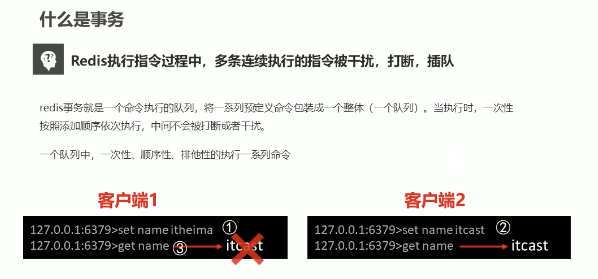
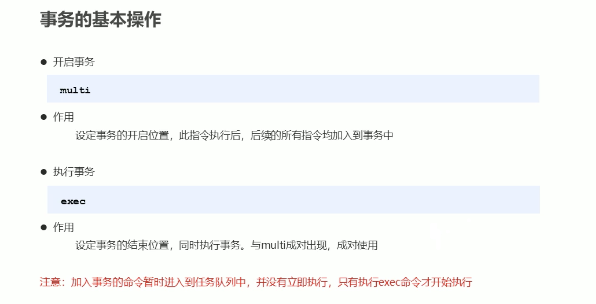
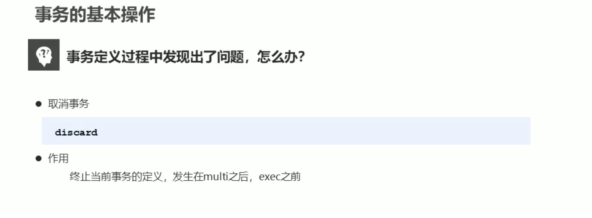
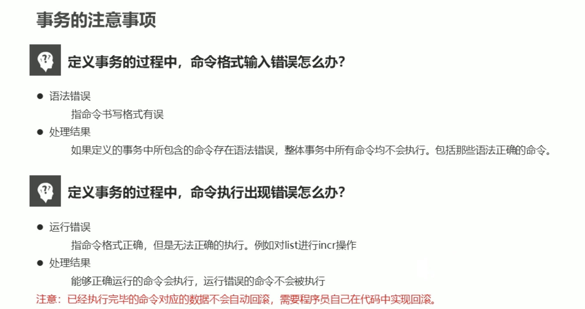
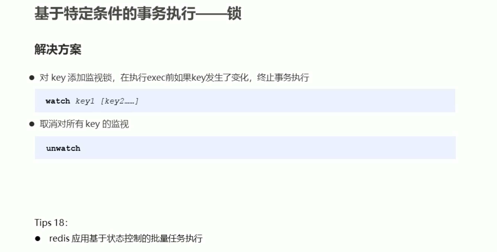
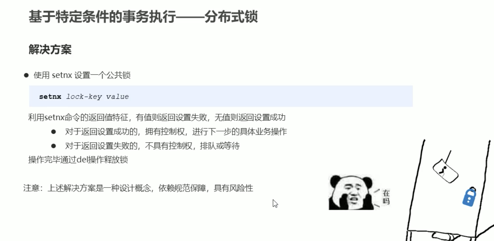
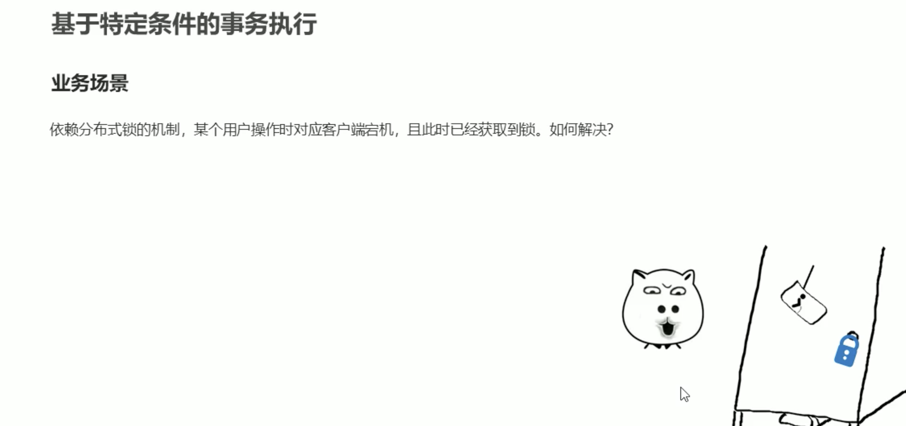
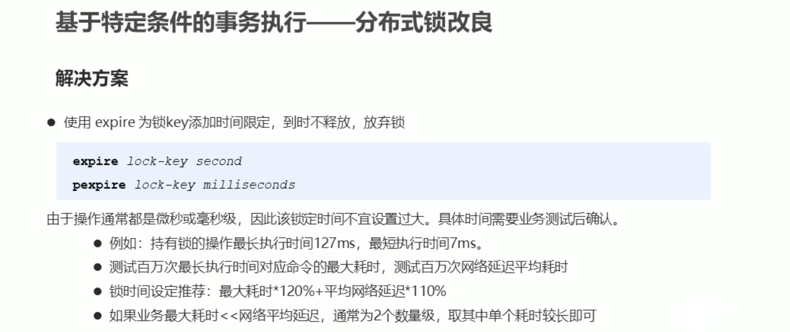
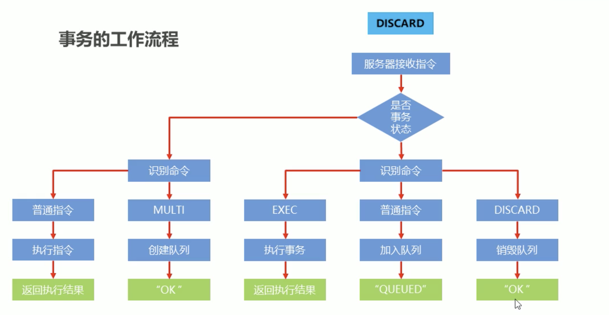

```bash
~
➜ redis-cli
# 不使用事务出现的问题。
127.0.0.1:6379> set name wangbo
OK
127.0.0.1:6379> get name
"json"

# 使用事务
127.0.0.1:6379> multi
OK
127.0.0.1:6379> set name wangbo
QUEUED
127.0.0.1:6379> get name
QUEUED
127.0.0.1:6379> set age 66
QUEUED
127.0.0.1:6379> exec
1) OK
2) "wangbo"
3) OK

# 事务回滚
127.0.0.1:6379> multi
OK
127.0.0.1:6379> set name jingong
QUEUED
127.0.0.1:6379> discard
OK
127.0.0.1:6379> exec
(error) ERR EXEC without MULTI

# 命令语法错误，队列直接销毁
127.0.0.1:6379> multi
OK
127.0.0.1:6379> tes name wa
(error) ERR unknown command `tes`, with args beginning with: `name`, `wa`,
127.0.0.1:6379> exec
(error) EXECABORT Transaction discarded because of previous errors.

# 命令逻辑错误
127.0.0.1:6379> multi
OK
127.0.0.1:6379> set name json
QUEUED
127.0.0.1:6379> incr name
QUEUED
127.0.0.1:6379> exec
1) OK
2) (error) ERR value is not an integer or out of range

# 事务锁 执行事务的过程中，一些资源可能被外部修改，比如说库存之类的，所以说需要事先监视变量。
# 客户端
127.0.0.1:6379> set apple 20
OK
127.0.0.1:6379> watch apple
OK
127.0.0.1:6379> multi
OK
# 管理端
127.0.0.1:6379> set apple 10
OK
# 管理端结束
127.0.0.1:6379> incrby apple -1
QUEUED
127.0.0.1:6379> exec
(nil)

# 分布式锁
# 客户端 1
127.0.0.1:6379> set apple 20
OK
127.0.0.1:6379> set lock-apple 1 # 取锁
OK
# 客户端 2
127.0.0.1:6379> setnx lock-apple 1	# 客户端 1 解锁之前取不到锁
(integer) 0
# 客户端 2 结束
127.0.0.1:6379> INCRBY apple -1
(integer) 19
127.0.0.1:6379> del lock-apple	# 解锁
(integer) 1

```

