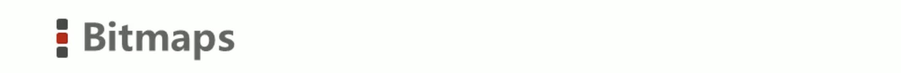
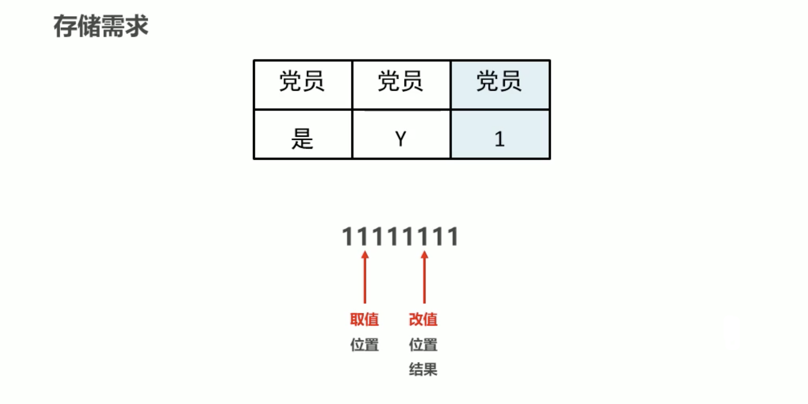
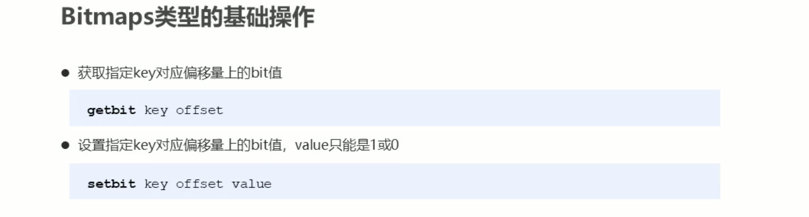
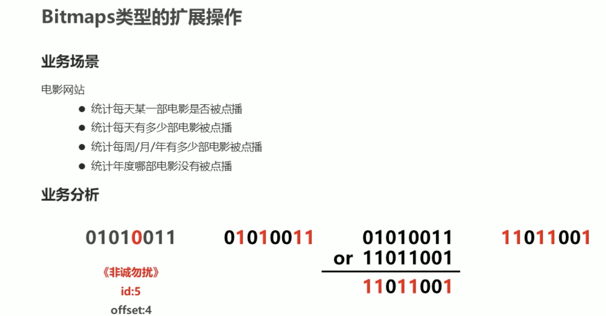
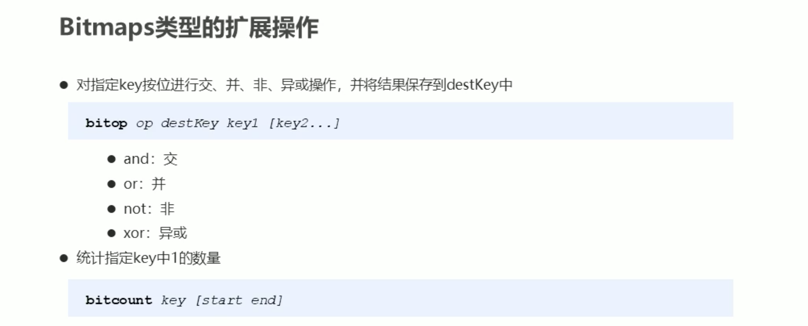
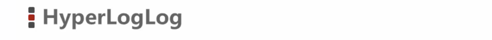
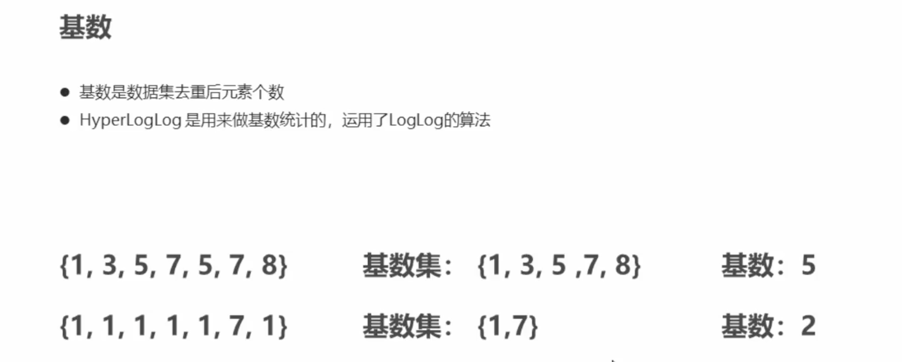
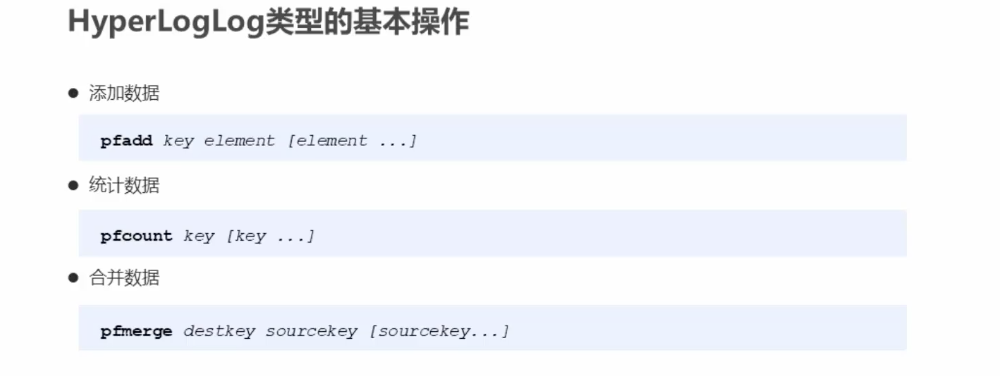
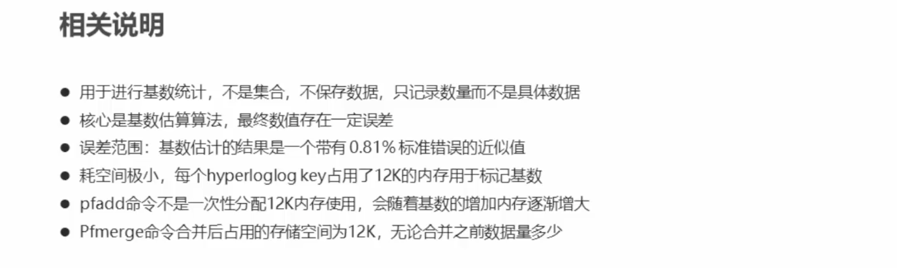

```bash
# 当编号数据偏移量比较大且连续的时候，让所有数据都减去最大公共偏移量。
# bitmaps可以说是真正的0/1存储，榨取了每一块存储空间。
# bitmaps的底层数据结构是string。
# bitmaps适合于大序列统计，且每个序号对应的值或为0，或为1.
➜ redis-cli
127.0.0.1:6379> setbit 20200303 0 1
(integer) 0
127.0.0.1:6379> setbit 20200303 1 1
(integer) 0
127.0.0.1:6379> getbit 20200303 1
(integer) 1
127.0.0.1:6379> getbit 20200303 0
(integer) 1
127.0.0.1:6379> setbit 20200303 5 1
(integer) 0
127.0.0.1:6379> setbit 20200303 3 1
(integer) 0
127.0.0.1:6379> setbit 20200304 4 1
(integer) 0
127.0.0.1:6379> setbit 20200304 0 1
(integer) 0
127.0.0.1:6379> setbit 20200304 1 1
(integer) 0
127.0.0.1:6379> bitcount 20200303
(integer) 4
127.0.0.1:6379> bitcount 20200304
(integer) 3
127.0.0.1:6379> bitop or 03-04 20200303 20200304
(integer) 1
127.0.0.1:6379> bitcount 03-04
(integer) 5
```









