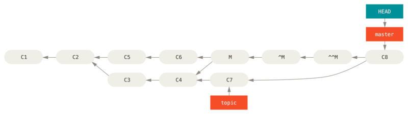

## 高级合并

在 Git 中合并是相当容易的。 因为 Git 使多次合并另一个分支变得很容易，这意味着你可以有一个始终保持最新的长期分支， 经常解决小的冲突，比在一系列提交后解决一个巨大的冲突要好。

然而，有时也会有棘手的冲突。 不像其他的版本控制系统，Git 并不会尝试过于聪明的合并冲突解决方案。 Git 的哲学是聪明地决定无歧义的合并方案，但是如果有冲突，它不会尝试智能地自动解决它。 因此，如果很久之后才合并两个分叉的分支，你可能会撞上一些问题。

在本节中，我们将会仔细查看那些问题是什么以及 Git 给了我们什么工具来帮助我们处理这些更难办的情形。 我们也会了解你可以做的不同的、非标准类型的合并，也会看到如何后退到合并之前。

## 合并冲突

我们在 [遇到冲突时的分支合并](https://git-scm.com/book/zh/v2/ch00/_basic_merge_conflicts) 介绍了解决合并冲突的一些基础知识， 对于更复杂的冲突，Git 提供了几个工具来帮助你指出将会发生什么以及如何更好地处理冲突。

首先，在做一次可能有冲突的合并前尽可能保证工作目录是干净的。 如果你有正在做的工作，要么提交到一个临时分支要么储藏它。 这使你可以撤消在这里尝试做的 **任何事情** 。 如果在你尝试一次合并时工作目录中有未保存的改动，下面的这些技巧可能会使你丢失那些工作。

让我们通过一个非常简单的例子来了解一下，下面是一个简单的 `txt` 文本：

```txt
git
```

我们先切换到一个 `dev` 分支，之后修改一下内容：

```txt
github
```

再切换回主分支继续修改：

```txt
gitlab
```

之后尝试一次合并，因为修改了字符，所以合并会出现冲突。

```bash
$ git merge dev
Auto-merging txt
CONFLICT (content): Merge conflict in txt
Automatic merge failed; fix conflicts and then commit the result.
```

### 中断一次合并

我们现在有几个选项。 首先，让我们介绍如何摆脱这个情况。 你可能不想处理冲突这种情况，完全可以通过 `git merge --abort` 来简单地退出合并。

```console
$ git status -sb
## master
UU hello.rb

$ git merge --abort

$ git status -sb
## master
```

`git merge --abort` 选项会尝试恢复到你运行合并前的状态。 但当运行命令前，在工作目录中有未储藏、未提交的修改时它不能完美处理，除此之外它都工作地很好。

如果出于某些原因你想要重来一次，也可以运行 `git reset --hard HEAD` 回到上一次提交的状态。 请牢记此时任何未提交的工作都会丢失，所以请确认你不需要保留任何改动。

### 撤消合并

虽然你已经知道如何创建一个合并提交，但有时出错是在所难免的。 使用 Git 最棒的一件事情是犯错是可以的，因为有可能（大多数情况下都很容易）修复它们。

合并提交并无不同。 假设现在在一个主题分支上工作，不小心将其合并到 `master` 中，现在提交历史看起来是这样：


Figure 138. 意外的合并提交

有两种方法来解决这个问题，这取决于你想要的结果是什么。

#### 修复引用

如果这个不想要的合并提交只存在于你的本地仓库中，最简单且最好的解决方案是移动分支到你想要它指向的地方。 大多数情况下，如果你在错误的 `git merge` 后运行 `git reset --hard HEAD~`，这会重置分支指向所以它们看起来像这样：


Figure 139. 在 `git reset --hard HEAD~` 之后的历史

我们之前在 [重置揭密](https://git-scm.com/book/zh/v2/ch00/_git_reset) 已经介绍了 `reset`，所以现在指出这里发生了什么并不是很困难。 让我们快速复习下：`reset --hard` 通常会经历三步：

1. 移动 HEAD 指向的分支。 在本例中，我们想要移动 `master` 到合并提交（`C6`）之前所在的位置。
2. 使索引看起来像 HEAD。
3. 使工作目录看起来像索引。

这个方法的缺点是它会重写历史，在一个共享的仓库中这会造成问题的。 查阅 [变基的风险](https://git-scm.com/book/zh/v2/ch00/_rebase_peril) 来了解更多可能发生的事情； 用简单的话说就是如果其他人已经有你将要重写的提交，你应当避免使用 `reset`。 如果有任何其他提交在合并之后创建了，那么这个方法也会无效；移动引用实际上会丢失那些改动。

#### 还原提交

如果移动分支指针并不适合你，Git 给你一个生成一个新提交的选项，提交将会撤消一个已存在提交的所有修改。 Git 称这个操作为“还原”，在这个特定的场景下，你可以像这样调用它：

```console
$ git revert -m 1 HEAD
[master b1d8379] Revert "Merge branch 'topic'"
```

`-m 1` 标记指出 “mainline” 需要被保留下来的父结点。 当你引入一个合并到 `HEAD`（`git merge topic`），新提交有两个父结点：第一个是 `HEAD`（`C6`），第二个是将要合并入分支的最新提交（`C4`）。 在本例中，我们想要撤消所有由父结点 #2（`C4`）合并引入的修改，同时保留从父结点 #1（`C6`）开始的所有内容。

有还原提交的历史看起来像这样：


Figure 140. 在 `git revert -m 1` 后的历史

新的提交 `^M` 与 `C6` 有完全一样的内容，所以从这儿开始就像合并从未发生过，除了“现在还没合并”的提交依然在 `HEAD` 的历史中。 如果你尝试再次合并 `topic` 到 `master` Git 会感到困惑：

```console
$ git merge topic
Already up-to-date.
```

`topic` 中并没有东西不能从 `master` 中追踪到达。 更糟的是，如果你在 `topic` 中增加工作然后再次合并，Git 只会引入被还原的合并 *之后* 的修改。


Figure 141. 含有坏掉合并的历史

解决这个最好的方式是撤消还原原始的合并，因为现在你想要引入被还原出去的修改，**然后** 创建一个新的合并提交：

```console
$ git revert ^M
[master 09f0126] Revert "Revert "Merge branch 'topic'""
$ git merge topic
```



Figure 142. 在重新合并一个还原合并后的历史

在本例中，`M` 与 `^M` 抵消了。 `^^M` 事实上合并入了 `C3` 与 `C4` 的修改，`C8` 合并了 `C7` 的修改，所以现在 `topic` 已经完全被合并了。