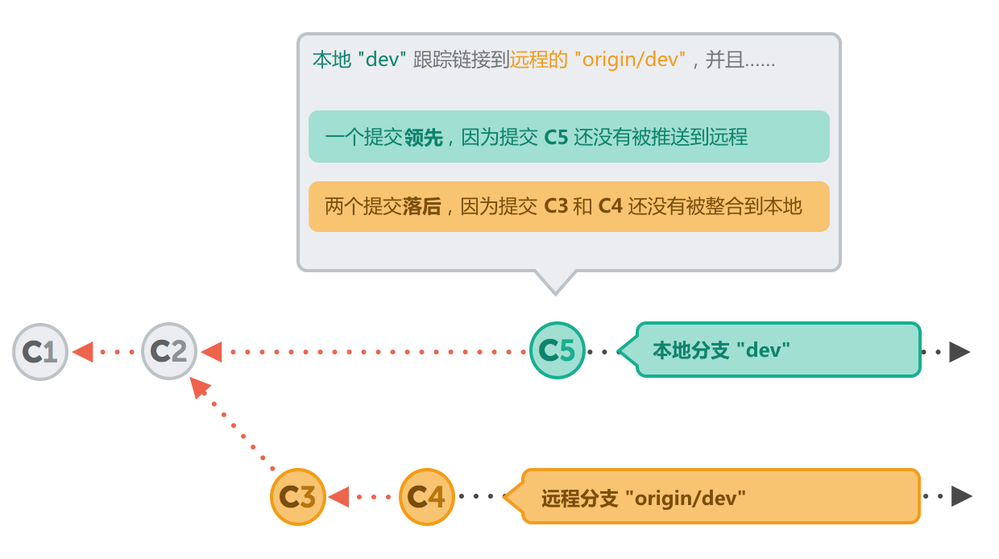

## 连接一个远程仓库

当你克隆一个远程仓库的同时，Git 会自动为你的记录下它的链接。默认使用这个名字 “origin” 来标识你所克隆的原始仓库。
如果你是直接在计算机上创建了一个本地仓库，这样就没有任何一个远程链接被记录下来。这种情况下，当你尝试做任何远程操作之前你就必须先把它连接到一个远程仓库上去：

```bash
$ git remote add crash-course-remote
    https://github.com/gittower/git-crash-course-remote.git
```

来让我们来看看它的结果：

```bash
$ git remote -v
crash-course-remote   https://github.com/gittower/git-crash-course-remote.git (fetch)
crash-course-remote   https://github.com/gittower/git-crash-course-remote.git (push)
```

请注意，每个远程仓库包含两行，第一个是用来进行抓取的 “``fetch URL``”，第二个是用来把本地仓库中的数据推送到远程仓库 “``push URL``”。很多情况下这两个 ``URLs`` 都是相同的。然而你当然也可以对抓取（``fetch``）和推送（``push``）使用两个不同的 ``URLs``（例如出于安全和性能方面的考虑）。

此外还要注意到，你可以对一个本地仓库设置很多个远程链接，这是没有数量限制的。在上面的例子中你已经看到了一个已经存在的链接 “``origin``” ，其实我们从来也没有设置过它！在完成某个远程仓库的克隆之后，``Git`` 会默认的建立一个名为 “``origin``” 的远程仓库链接（还记得吗？我们曾在本书的开始部分做过这个操作）。和被命名为 “``master``” 的分支一样的道理，“``origin``” 这个名字是默认的。它和其他的远程仓库并没有什么区别。

## 查看远程数据

在我们新建了与某个远程仓库的连接之后，它到底改变了什么？现在让我们来看看分支列表：

```bash
$ git branch -va
  contact-form           56eddd1 Add new contact form page
* master                 56eddd1 Add new contact form page
```

显然并没有太大的变化，始终是我们那两个本地分支（“`master`” 和 “`contact-form`”）。为什么我们没有看到那个新的远程链接 “`crash-course-remote`” 呢？因为通过命令 “`git remote add`”，我们仅仅建立了一种关系，还没有进行任何数据交换。

要更新有关远程的信息，你必须明确地请求这个数据。在这里可以使用最为常用的，“抓取（Fetch）” 操作来完成：

```
$ git fetch crash-course-remote
From https://github.com/gittower/git-crash-course-remote
 * [new branch]     faq-content -> crash-course-remote/faq-content
 * [new branch]     master -> crash-course-remote/master
```

“抓取” 操作不会改动你任何的本地分支或是在你工作副本中的文件。这个操作仅仅为你从一个特定远程仓库下载你所需要的数据，并设置为可见。你可以在之后决定是否需要整合这些新的改动本地项目中来。

在我们完成了关于 “`crash-course-remote`” 升级后，让我们一起来看一下现在发生了什么变化：

```
$ git branch -va
  contact-form           56eddd1 Add new contact form page
* master                 56eddd1 Add new contact form page
  remotes/crash-course-remote/faq-content  e29fb3f Add FAQ questions
  remotes/crash-course-remote/master       2b504be Change headlines f...
```

很好，我们看到了这个远程分支的 “crash-course-remote” 的信息了。

现在准备开始在分支 “`faq-content`” 上工作吧！但是现在它只是一个远程分支的指针。为了能够真正地在这个分支上工作，并且切换当前工作副本（`working copy`）的内容，我们需要创建一个基于这个远程的本地分支。执行 “`git checkout`” 命令来切换到这个远程分支：

```bash
$ git checkout --track crash-course-remote/faq-content
Branch faq-content set up to track remote branch faq-content from crash-course-remote.
Switched to a new branch 'faq-content'

$ git branch -va
  contact-form           56eddd1 Add new contact form page
* faq-content            e29fb3f Add FAQ questions
  master                 56eddd1 Add new contact form page
  remotes/crash-course-remote/faq-content  e29fb3f Add FAQ questions
  remotes/crash-course-remote/master       2b504be Change headlines f...
```

这个命令完成了一系列的操作：

+ 它创建了一个同名的本地分支（“faq-content”）。
+ 它签出（check out）了这个新建的的分支，把它设置成当前的本地 HEAD ，然后更新了你的工作副本，并且关联到分支文件的最新版本上去。
+ 由于我们使用了 “--track” 参数，它会在新的本地分支和它所位于的远程分支之间创建一个跟踪联系 “tracking relationship”。

> #### 跟踪分支
>
> 一般来说，分支之间并无任何关系。然而我们可以定义一个本地分支去 “跟踪 （track）” 一个远程分支。这样 Git 就会通知你，如果那个被跟踪的远程分支发生了一些新的提交，而它们并不存在于这个关联的本地分支中时：
>
> + 如果在你的本地分支上提交了一些改动，而且你也并没有发布它和推送到远程仓库中。相对于这些提交来说你的本地分支就 “**领先（ahead）**” 于那些它所对应的远程分支。
> + 如果团队的其他开发人员提交并且发布了一些改动到远程仓库中，这时远程仓库就拥有了那些你还没有下载到本地仓库的提交。你的本地仓库就 “**落后（behind）**” 于它所关联的远程仓库。
>
> 
>
> 如果分支间存在 “跟踪” 联系，当你使用 “git status” 命令时，Git 显示出所有关联分支上的差异：
>
> ```
> $ git status
> # On branch dev
> # Your branch and 'origin/dev' have diverged,
> # and have 1 and 2 different commits each, respectively.
> #
> nothing to commit (working directory clean)
> ```
>
> 当在一个已存在的远程分支的基础上来建立本地分支时，创建这个 “跟踪” 联系是很简单的，可以使用 “git checkout” 命令加 “--track” 参数来完成。

在切换到那个新创建的本地分支 “`faq-content`” 后， 我们已经自动拥有了这个 “跟踪” 联系。来让我们对这个工作副本中的文件 “`faq.html`” 进行一些修改吧！（如何更改这个文件就不详细介绍了，发挥你的想象力吧）：

```bash
$ git status
# On branch faq-content
# Changes not staged for commit:
#   (use "git add <file>..." to update what will be committed)
#   (use "git checkout -- <file>..." to discard changes in working
#    directory)
#
#       modified:   faq.html
#
no changes added to commit (use "git add" and/or "git commit -a")

$ git add faq.html

$ git commit -m "Add new question"
[faq-content 814927a] Add new question
 1 file changed, 1 insertion(+)
```

现在，是时候把这些新的改动共享给其他开发人员了：

```bash
$ git push
```

“`git push`” 命令将会把当前 `HEAD` 分支上所有新的提交上传到它所关联的远程分支上去。

“git push” 命令默认地要求我们为它提供两个信息：

+ 你想要推送到哪一个远程仓库上去？
+ 你想要推送到那个远程仓库上的哪一个分支上去？

这个完整的命令应该是这样的：

```bash
$ git push crash-course-remote faq-content
```

我们已经设置了 “跟踪” 联系，也就是说我们已经为那个本地分支定义了一个 “ 远程对应的（`remote counterpart`）” 分支。在我们使用 “`git push`” `and` “`git pull`” 命令时，我们不需要特别地给出那些参数， `Git` 会自动地使用这些已经定义好的 “跟踪” 信息。

## 整合远程的改动

开发团队的其他成员在你们共同的远程仓库上共享了他的改动，在这些改动被整合到你的本地副本之前，你需要首先要检查一下这些改动：

```bash
$ git fetch origin
$ git log origin/master
```

现在使用 “`git log`” 命令来查看最近在 “`origin`” 的 “`master`” 分支上所有改动。

如果你决定要整合这些改动到你的本地副本中来， 你就可以使用 “`git pull`” 命名来完成这个操作：

```bash
$ git pull
```

这个命令将会从远程分支下载所有的新的提交到你的本地副本中来。它实际上就是一个 “抓取（`fetch`）” 命令（下载数据） 和 一个 “ 合并（`merge`）” 命令（整合那些下载的数据到你的本地副本）的组合。

和 “`git push`” 命令一样，如果你本地的 `HEAD` 分支还没有创建任何一个 “跟踪” 链接，你就必须告诉 `Git`，你要从哪一个远程仓库上的哪一分支中抓取数据（例如 “`git pull origin master`”）。如果已经存在了一个链接，只需要简单键入 “`git pull`” 就足够了.

整合的目标并不基于存在什么样的跟踪链接，它总是会被整合到你的本地 `HEAD` 分支中，也就是你的工作副本。

## 发布一个本地分支

在你明确地决定将一个本地分支发布到远程仓库之前，这些在你本地计算机上创建的分支是不能被其他的团队成员看到的，它只是你的私有分支。这就意味着，你可以保留某些改动仅仅在你私有的本地分支上，而与其他团队成员分享一些其它分支上的改动。

现在让我们来分享 “contact-form” 分支（它直到现在还仅仅是个私有的本地分支）到 “origin” 远程上：

```bash
$ git checkout contact-form
Switched to branch 'contact-form'

$ git push -u origin contact-form
Counting objects: 36, done.
Delta compression using up to 4 threads.
Compressing objects: 100% (31/31), done.
Writing objects: 100% (36/36), 90.67 KiB, done.
Total 36 (delta 12), reused 0 (delta 0)
Unpacking objects: 100% (36/36), done.
To file://Users/tobidobi/Desktop/GitCrashkurs/remote-test.git
 * [new branch]    contact-form -> contact-form
Branch contact-form set up to track remote branch contact-form from origin.
```

这个命令会告诉 `Git` 来发布你当前本地的 `HEAD` 分支到 “`origin`”上，并命名为 “`contact-form`”（保持相同的分支名在本地和其对应的远程分支是非常有必要的）。

这个 “`-u`” 参数会自动地在你本地的 “`contact-form`” 分支和新建的远程分支之间创建一个 “跟踪” 链接。执行 “`git branch`” 命令来显示分支信息，并且附带上一些特定的参数，在方括号中就会显示出这个建立的跟踪联系：

```bash
$ git branch -vva
* contact-form           56eddd1 [origin/contact-form] Add new contact..
  faq-content            814927a [crash-course-remote/faq-content: ahead
                                    1] Add new question
  master                 2dfe283 Implement the new login box
  remotes/crash-course-remote/faq-content e29fb3f Add FAQ questions
  remotes/crash-course-remote/master      2b504be Change headlines f...
```

当创建了这个新的远程分支后，发布新的本地提交将会非常简单，执行 “`git push`” 命令就完成这个操作。

## 删除分支

假设我们在 “`contact-form`” 分支上的工作已经完成了。并且我们也已经把最终的改动整合到了 “`master`” 分支。现在我们就不再需要这个分支了。把它删除掉吧：

```bash
$ git branch -d contact-form
```

为了保持一致，我们也有必要删除它所对应的远程分支。附加上一个 “-r” 参数就可以了：

```bash
$ git branch -dr origin/contact-form
```