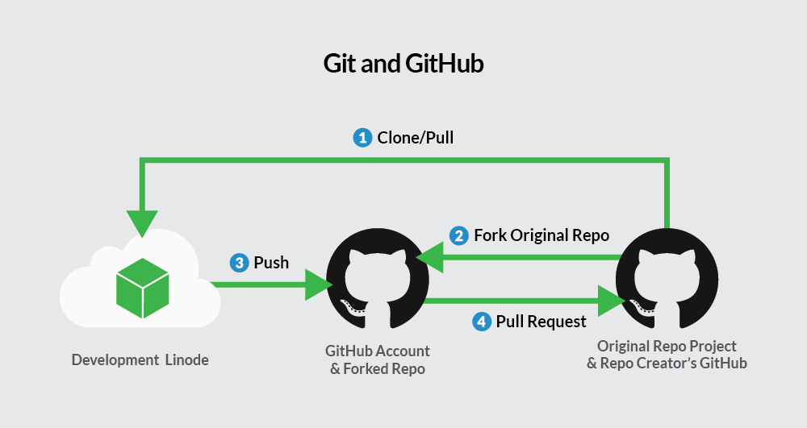
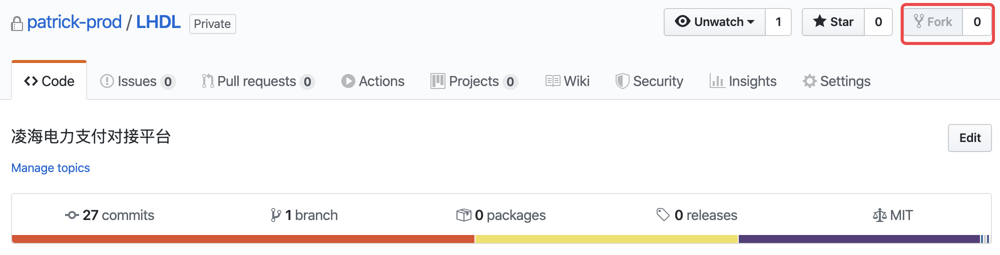
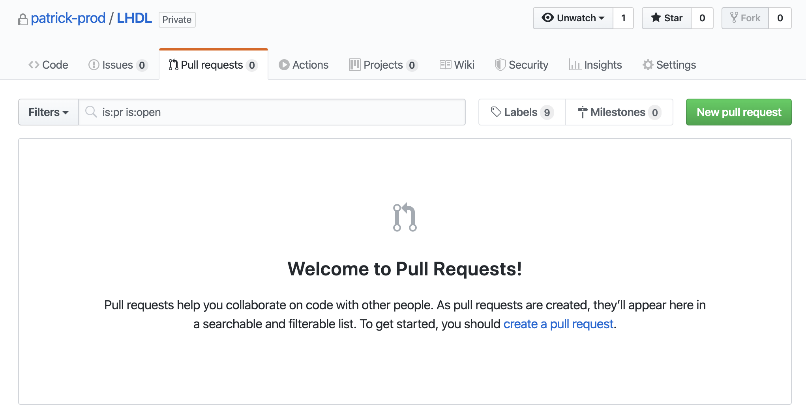
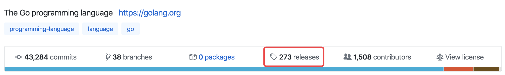
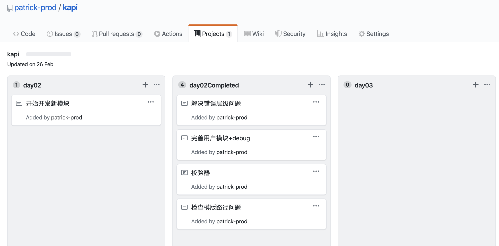

## GitHub

GitHub brings the world’s largest community of developers to discover, share, and build better software. From open source projects to private team repositories, we’re your all-in-one platform for collaborative dev.

> 基于git版本管理仓库的开源项目交流平台，托管代码。

#### 仓库 (Repository)

仓库用来存放代码，一个仓库一个项目相关代码。

#### 收藏 (Star)

收藏项目

#### 复制克隆项目 (Fork)

开源的目的就是大家一起做改进，你可以复制别人仓库中的代码到自己仓库形成一模一样的映射吗，并且对其进行修改。

#### 发送请求 (Pull Rqquest）

开源的途径，将你本地的分支推上去。

#### 关注 (Watch)

看到开源项目的实时更新。

#### 事务卡片 (issue)

开源项目出项bug，发送提醒给项目发出人。

#### 项目发布的版本 (release)

一般用于下载。

#### 项目日历 (projects)

