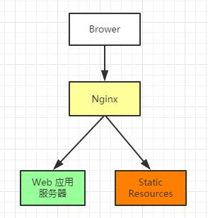

## **正向代理**

正向代理类似一个跳板机，代理访问外部资源。举个例子：我是一个用户，我访问不了某网站，但是我能访问一个代理服务器，这个代理服务器能访问那个我不能访问的网站，于是我先连上代理服务器，告诉他我需要那个无法访问网站的内容，代理服务器去取回来，然后返回给我。从网站的角度，只在代理服务器来取内容的时候有一次记录，有时候并不知道是用户的请求，也隐藏了用户的资料，这取决于代理告不告诉网站。

正向代理在我们的生活中是很常见的，作为一个当代好青年掌握科学上网的手段是必不可少的，而科学上网的背后就是正向代理。

#### 正向代理的特点：

**客户端必须设置正向代理服务器，当然前提是要知道正向代理服务器的IP地址，还有代理程序的端口。**chrome可以读取电脑对于代理服务器的配置。

#### 正向代理的用途：

1. 访问原来无法访问的资源，如google。

2. 可以做缓存，加速访问资源。

3. 对客户端访问授权，上网进行认证。

4. 代理可以记录用户访问记录（上网行为管理），对外隐藏用户信息。

## 反向代理

初次接触方向代理的感觉是，客户端是无感知代理的存在的，反向代理对外都是透明的，访问者者并不知道自己访问的是一个代理。因为客户端不需要任何配置就可以访问。

反向代理（Reverse Proxy）实际运行方式是指以代理服务器来接受internet上的连接请求，然后将请求转发给内部网络上的服务器，并将从服务器上得到的结果返回给internet上请求连接的客户端，此时代理服务器对外就表现为一个服务器。

#### 反向代理的作用：

1. 保证内网的安全，可以使用反向代理提供WAF功能，阻止web攻击
2. 均衡负载

## 均衡负载

客户端发送多个请求到服务器，服务器处理请求，有一些可能要与数据库进行交互，服务器处理完毕后，再将结果返回给客户端。

这种架构模式对于早期的系统相对单一，并发请求相对较少的情况下是比较适合的，成本也低。但是随着信息数量的不断增长，访问量和数据量的飞速增长，系统业务的复杂度增加，这种架构会造成服务器相应客户端的请求日益缓慢，并发量特别大的时候，还容易造成服务器直接崩溃。很明显这是由于服务器性能的瓶颈造成的问题，那么如何解决这种情况呢？

我们首先想到的可能是升级服务器的配置，比如提高 CPU 执行频率，加大内存等提高机器的物理性能来解决此问题，但是我们知道摩尔定律的日益失效，硬件的性能提升已经不能满足日益提升的需求了。最明显的一个例子，天猫双十一当天，某个热销商品的瞬时访问量是极其庞大的，那么类似上面的系统架构，将机器都增加到现有的顶级物理配置，都是不能够满足需求的。那么怎么办呢？

上面的分析我们去掉了增加服务器物理配置来解决问题的办法，也就是说纵向解决问题的办法行不通了，那么横向增加服务器的数量呢？这时候集群的概念产生了，单个服务器解决不了，我们增加服务器的数量，然后将请求分发到各个服务器上，将原先请求集中到单个服务器上的情况改为将请求分发到多个服务器上，将负载分发到不同的服务器，也就是我们所说的**负载均衡**，负载均衡本身是属于反向代理功能的范畴。

## 动静分离

对于我们的web服务器不管是对静态资源的访问还是webApi的访问都是一样的tcp都是一样的开销，这样对于服务器的性能会产生不必要的压力，因为不管是协程，线程还是进程的开销都要比nginx的队列要大，所以为了加快网站的解析速度，可以把动态页面和静态页面由不同的服务器来解析，加快解析速度。降低原来单个服务器的压力。

