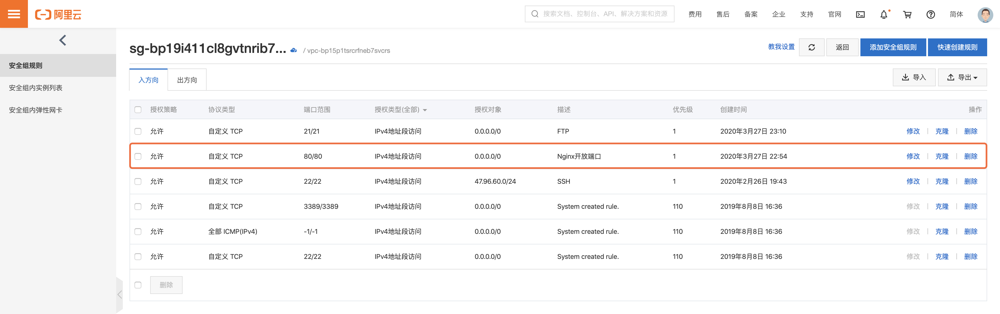

## nginx 安装

### 1.安装pcre

第一步 联网下载 pcre 压缩文件依赖

```bash
1 wget http://downloads.sourceforge.net/project/pcre/pcre/8.37/pcre-8.37.tar.gz
```

第二步 解压压缩文件

```bash
2  tar –xvf pcre-8.37.tar.gz
```

第三步 `./configure`配置安装

```bash
3 ./configure
```

第四步 `make`，最后执行 `make install`

```bash
4 make & make install
```

### 2.安装 openssl 、zlib 、 gcc 依赖

```bash
1 yum -y install make zlib zlib-devel gcc-c++ libtool openssl openssl-devel
```

### 3. 安装 nginx

第一步使用命令解压

```bash
1 tar -zxvf nginx压缩包
```

第二步 `./configure`配置安装

```bash
2 ./configure
```

第三步 `make`，最后执行 `make install`

```bash
3 make & make install
```

第四步 启动服务并且测试

```bash
4 cd /usr/local/nginx/sbin/nginx 
5 ./nginx
```


### 0.注意：

如果是虚拟机那么在 windows 系统中访问 linux 中 nginx，默认不能访问的，因为防火墙问题可以：

1. 关闭防火墙
2. 开放访问的端口号，80 端口

```bash
# 查看开放的端口号
1 firewall-cmd --list-all
# 设置开放的端口号
2 firewall-cmd --add-service=http –permanent
3 firewall-cmd --add-port=80/tcp --permanent
# 重启防火墙
4 firewall-cmd –reload
```

如果是阿里云那么需要配置安全组，开启外网对80端口的访问权限:



