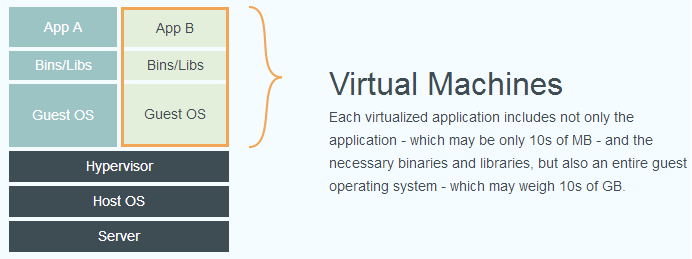
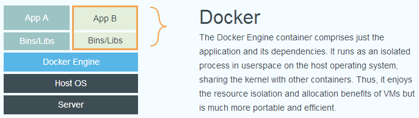

## Background

一款产品从开发到上线，从操作系统，到运行环境，再到应用配置。作为开发+运维之间的协作我们需要关心很多东西，这也是很多互联网公司都不得不面对的问题，特别是各种版本的迭代之后，不同版本环境的兼容，对运维人员都是考验。

`Docker`之所以发展如此迅速，也是因为它对此给出了一个标准化的解决方案。

## Docker

`Docker`是基于`Go`语言实现的云开源项目。

`Docker`的主要目标是`Build，Ship and Run Any App,Anywhere`，也就是通过对应用组件的封装、分发、部署、运行等生命周期的管理，使用户的`APP`（可以是一个`WEB`应用或数据库应用等等）及其运行环境能够做到“一次封装，到处运行”。

`Linux` 容器技术的出现就解决了这样一个问题，而 `Docker` 就是在它的基础上发展过来的。将应用运行在 `Docker` 容器上面，而 `Docker` 容器在任何操作系统上都是一致的，这就实现了跨平台、跨服务器。只需要一次配置好环境，换到别的机子上就可以一键部署好，大大简化了操作。

## VM | LXC

虚拟机`（virtual machine）`就是带环境安装的一种解决方案。

它可以在一种操作系统里面运行另一种操作系统，比如在`Windows `系统里面运行`Linux`系统。应用程序对此毫无感知，因为虚拟机看上去跟真实系统一模一样，而对于底层系统来说，虚拟机就是一个普通文件，不需要了就删掉，对其他部分毫无影响。这类虚拟机完美的运行了另一套系统，能够使应用程序，操作系统和硬件三者之间的逻辑不变。

由于虚拟机存在这些缺点，`Linux` 发展出了另一种虚拟化技术：`Linux` 容器`Linux Containers，缩写为 LXC`。

`Linux` 容器不是模拟一个完整的操作系统，而是对进程进行隔离。有了容器，就可以将软件运行所需的所有资源打包到一个隔离的容器中。容器与虚拟机不同，不需要捆绑一整套操作系统，只需要软件工作所需的库资源和设置。系统因此而变得高效轻量并保证部署在任何环境中的软件都能始终如一地运行。

`docker`有着比虚拟机更少的抽象层。由于`docker`不需要`Hypervisor`实现硬件资源虚拟化,运行在`docker`容器上的程序直接使用的都是实际物理机的硬件资源。因此在`CPU`、内存利用率上`docker`将会在效率上有明显优势。 

`docker`利用的是宿主机的内核，而不需要`Guest OS`。因此,当新建一个容器时，`docker`不需要和虚拟机一样重新加载一个操作系统内核。仍而避免引寻、加载操作系统内核返个比较费时费资源的过程，当新建一个虚拟机时，虚拟机软件需要加载`Guest OS`，返个新建过程是分钟级别的。而`docker`由于直接利用宿主机的操作系统，则省略了返个过程,因此新建一个`docker`容器只需要几秒钟。

