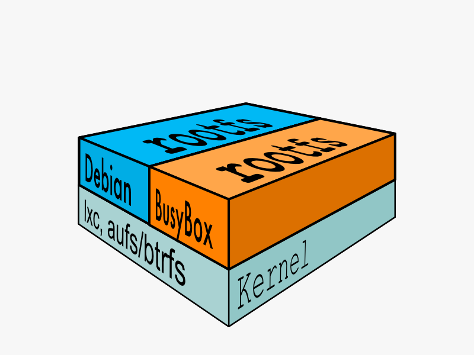

## 文件系统

为了运行 `Linux` 系统，通常需要两个[文件系统](http://en.wikipedia.org/wiki/Filesystem)：

1. 引导文件系统 `bootfs`
2. 根文件系统 `rootfs`

`boot file system`主要包含`bootloader`和`kernel`，` bootloader`主要是引导加载系统内核，` Linux`刚启动时会加载`bootfs`文件系统，`Docker`镜像的最底层是`bootfs`。这一层与我们典型的`Linux/Unix`系统是一样的，包含`boot`加载器和内核。当`boot`加载完成之后整个内核就都在内存中了，此时内存的使用权已由`bootfs`转交给内核，此时系统也会卸载`bootfs`。

`root file system`在`bootfs`之上。包含的就是典型 `Linux` 系统中的 `/dev, /proc, /bin, /etc` 等标准目录和文件。`rootfs`就是各种的操作系统发行版，比如`Centos`等等。 

对于一个精简的`OS`，`rootfs`可以很小，只需要包括最基本的命令、工具和程序库就可以了，因为底层直接用`Host`的`kernel`，自己只需要提供 `rootfs` 就行了。由此可见对于不同的`linux`发行版，`bootfs`基本是一致的，`rootfs`会有差别，因此不同的发行版可以公用`bootfs`。

## 联合文件系统

`Union`文件系统`UnionFS`是一种分层、轻量级并且高性能的文件系统，它支持对文件系统的修改作为一次提交来一层层的叠加，同时可以将不同目录挂载到同一个虚拟文件系统 `vfs`。`Union` 文件系统是 `Docker` 镜像的基础。镜像可以通过分层来进行继承，基于基础镜像，可以制作各种具体的应用镜像。

> 一次同时加载多个文件系统，但从外面看起来，只能看到一个文件系统，联合加载会把各层文件系统叠加起来，这样最终的文件系统会包含所有底层的文件和目录。

当`Docker`挂载`rootfs`时，它像传统的`Linux`引导一样以只读方式启动，但是随后，它代替了将文件系统更改为读写模式，而是利用[联合挂载的](http://en.wikipedia.org/wiki/Union_mount)优势在其上添加了一个读写文件系统*。*只读文件系统。实际上，可能有多个只读文件系统相互堆叠。我们将这些文件系统中的每一个视为一个**层**。

其中只有最顶层是可写层，下层都是只读层，如果需要更新较低层中的现有文件，则该文件将被复制到较高层，并且更改将进入副本。应用程序不再能够看到较低层的文件版本，但是该文件的位置没有变化。

## 镜像

在`Docker`术语中，只读层称为 `image`，也称镜像。镜像永远不变。

由于Docker使用[*联合文件系统*](https://docker-doc.readthedocs.io/zh_CN/latest/terms/layer.html#ufs-def)（[Union File System](https://docker-doc.readthedocs.io/zh_CN/latest/terms/layer.html#ufs-def))，因此进程认为整个文件系统以读写方式安装。但是所有更改都进入了最顶层的可写层，并且在下面，只读映像中的原始文件未更改。

### 镜像编号

所有图像均由`64`个十六进制数字字符串（内部为`256`位值）标识。为了简化使用，可以在命令行上使用前`12`个字符的简短ID。短`ID`冲突可能性很小，但是`Docker`服务器将始终返回长`ID`。

