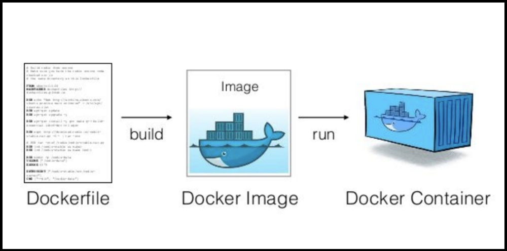

## Dockerfile

为了能够直接通过项目构建`Docker`镜像，`Docker`提供了`Dockerfile`，`Dockerfile` 是一个用来构建镜像的文本文件，文本内容包含了一条条构建镜像所需的指令和说明。



`Dockerfile` 由一行行命令语句组成，并且支持以 `#` 开头的注释行。一般的，`Dockerfile` 分为四部分：

1. 基础镜像信息
2. 维护者信息
3. 镜像操作指令
4. 容器启动时执行指令

比如下面的这个`Dockerfile`：

```dockerfile
# This dockerfile uses the ubuntu image
# VERSION 2 - EDITION 1
# Author: docker_user
# Command format: Instruction [arguments / command] ..

# Base image to use, this must be set as the first line
FROM ubuntu

# Maintainer: docker_user <docker_user at email.com> (@docker_user)
MAINTAINER docker_user docker_user@email.com

# Commands to update the image
RUN echo "deb http://archive.ubuntu.com/ubuntu/ raring main universe" >> /etc/apt/sources.list
RUN apt-get update && apt-get install -y nginx
RUN echo "\ndaemon off;" >> /etc/nginx/nginx.conf

# Commands when creating a new container
CMD /usr/sbin/nginx
```

其中，一开始必须指明所基于的镜像名称，接下来推荐说明维护者信息。

后面则是镜像操作指令，例如 `RUN` 指令，`RUN` 指令将对镜像执行跟随的命令。每运行一条 `RUN` 指令，镜像添加新的一层，并提交。

最后是 `CMD` 指令，来指定运行容器时的操作命令。

## Build

每个 `Dockerfile` 中只能有一个 `ENTRYPOINT`，当指定多个时，只有最后一个起效。

```bash
$ docker build [options] [path] [NEW_IMAGE:NEW_TAG]
```

该命令将读取指定路径下的 `Dockerfile`，并将该路径下所有内容发送给 Docker 服务端，由服务端来创建镜像。

```bash
$ docker build .

Sending build context to Docker daemon  6.51 MB
...
```

因此一般建议放置 `Dockerfile` 的目录为空目录。也可以通过 `.dockerignore` 文件（每一行添加一条匹配模式）来让 `Docker` 忽略路径下的目录和文件。

要指定镜像的标签信息，可以通过 `-t` 选项，例如

```bash
$ sudo docker build -t myrepo/myapp /tmp/test1/
```

## .dockerignore

在`docker CLI`将上下文发送到`docker`守护程序之前，它会在上下文的根目录中查找名为`.dockerignore`的文件。如果文件存在，`CLI`会修改上下文以排除与其中的模式匹配的文件和目录。

这是一个示例`.dockerignore`文件：

```gitignore
# comment
*/temp*
*/*/temp*
temp?
```

此文件生成以下规则：

| 规则        | 行为                                                         |
| :---------- | :----------------------------------------------------------- |
| `# comment` | 忽略                                                         |
| `*/temp*`   | 排除名称以`temp`根的任何直接子目录开头的文件和目录。例如，`/somedir/temporary.txt`排除了普通文件，也排除了目录`/somedir/temp`。 |
| `*/*/temp*` | 排除`temp`从根以下两个级别的任何子目录开始的文件和目录。例如，`/somedir/subdir/temporary.txt`被排除。 |
| `temp?`     | 排除根目录中名称为的一个字符扩展名的文件和目录`temp`。例如，`/tempa`和`/tempb`被排除。 |

## COMMAND

指令的一般格式为 `INSTRUCTION arguments`，指令包括 `FROM`、`MAINTAINER`、`RUN` 等。

### FROM

```dockerfile
FROM [--platform=<platform>] <image>[:<tag>] [AS <name>]
```

`FROM`指令初始化一个新的构建阶段，为后续指令指定基本映像。

第一条指令必须为 `FROM` 指令。并且，如果在同一个`Dockerfile`中创建多个镜像时，可以使用多个 `FROM` 指令（每个镜像一次）。

- `AS <name> `：用于这个构建阶段起一个别名，该名称可以在后续版本`FROM`和 `COPY --from=<name>`说明中使用，以引用此阶段中构建的映像。
- `--platform=<platform>`：在`FROM`引用多平台镜像的情况下，可选标志可用于指定镜像的平台。例如，`linux/amd64`， `linux/arm64`，或`windows/amd64`。

### LABEL

```dockerfile
LABEL <key>=<value> <key>=<value> <key>=<value> ...
```

`LABEL`以键值对的形式给项目添加元数据，有以下两种书写形式：

```dockerfile
LABEL multi.label1="value1" multi.label2="value2" other="value3"
LABEL multi.label1="value1" \
      multi.label2="value2" \
      other="value3"
```

通过`docker image inspect`命令可以查看镜像的标签，添加 `--format` 过滤输出：

```bash
$ docker image inspect --format='' myimage
{
  "com.example.vendor": "ACME Incorporated",
  "com.example.label-with-value": "foo",
  "version": "1.0",
  "description": "This text illustrates that label-values can span multiple lines.",
  "multi.label1": "value1",
  "multi.label2": "value2",
  "other": "value3"
}
```

### RUN

每条 `RUN` 指令将在当前镜像基础上执行指定命令，并提交为新的镜像。该指令有两种执行方式：

```dockerfile
RUN <command>
```

`shell`形式，命令在`shell`中运行，默认情况下`/bin/sh -c`在`Linux`或`cmd /S /C`在`Windows`上运行。

```dockerfile
RUN ["executable", "param1", "param2"]
```

指定使用其它终端可以通过第二种方式实现，例如 `RUN ["/bin/bash", "-c", "echo hello"]`。

与`shell`形式不同的是，`exec`形式不会调用`shell`，外壳处理程序不会发生，`docker deamon`会直接系统调用启动进程。

> `EXEC`形式会被解析成一个`json`序列，所以我们需要使用双引号。

### CMD

指定启动容器时执行的命令，每个 `Dockerfile` 只能有一条 `CMD` 命令。如果指定了多条命令，只有最后一条会被执行。

`CMD` 指令有三种执行方式：

- `CMD ["executable","param1","param2"]` ：`exec`，首选形式。
- `CMD ["param1","param2"]` ：作为`ENTRYPOINT`的默认参数
- `CMD command param1 param2` ：`shell` 形式。

与`shell`形式不同的是，`exec`形式不会调用`shell`，外壳处理程序不会发生，`docker deamon`会直接系统调用启动进程。

> **注意：**如果用户启动容器时候指定了运行的命令`docker run`，则会覆盖掉 `CMD` 指定的命令。

### ENTRYPOINT

```dockerfile
ENTRYPOINT ["executable", "param1", "param2"]
ENTRYPOINT command param1 param2
```

其作用和`CMD`指令相同用于指定初始化命令，每个 Dockerfile 中只能有一个 `ENTRYPOINT`，当指定多个时，只有最后一个起效。

### EXPOSE

```dockerfile
EXPOSE <port> [<port>/<protocol>...]
```

`EXPOSE`指令通知`Docker`容器在运行时监听指定的网络端口。您可以指定端口监听`TCP`还是`UDP`，如果未指定协议，则默认值为`TCP`。

默认情况下，`EXPOSE`假定为TCP。您还可以指定UDP：

```dockerfile
EXPOSE 80/udp
```

该`EXPOSE`指令实际上并未映射端口。它充当构建映像的人员和运行容器的人员之间的一种文档类型，有关打算发布哪些端口的信息。

要在运行容器时实际发布端口，请使用`-p`标记通过 `docker run` 映射一个或多个端口，或者使用`-P`标记映射到高阶端口。

无论`EXPOSE`设置如何，都可以在运行时使用该`-p`标志覆盖它们。例如

```bash
docker run -p 80:80/tcp -p 80:80/udp ...
```

### ENV

```dockerfile
ENV <key>=<value> ...
```

格式为 `ENV <key> <value>`。 指定一个环境变量，会被后续 `RUN` 指令使用，**并在容器运行时保持。**可以使用`docker inspect`查看，并使用`docker run --env <key>=<value>`更改。

```dockerfile
ENV GOPROXY https://goproxy.cn/
```

###    ADD

```dockerfile
ADD [--chown=<user>:<group>] <src>... <dest>
ADD [--chown=<user>:<group>] ["<src>",... "<dest>"]
```

该命令将复制指定的 `<src>` 到容器中的 `<dest>`。 其中 `<src>` 可以是Dockerfile所在目录的一个相对路径；也可以是一个 URL；还可以是一个 tar 文件（自动解压为目录）。

- `--chown`：选项用于将更改文件用户组。

> 该`--chown`功能仅在用于构建Linux容器的Dockerfiles上受支持，而在Windows容器上不起作用。由于用户和组所有权概念不会在Linux和Windows之间转换，

### COPY

`COPY`有两种形式：

```dockerfile
COPY [--chown=<user>:<group>] [--from=ASNAME] <src>... <dest>
COPY [--chown=<user>:<group>] [--from=ASNAME] ["<src>",... "<dest>"]
```

复制本地主机的 `<src>`（为 Dockerfile 所在目录的相对路径）到容器中的 `<dest>`，当使用本地目录为源目录时，推荐使用 `COPY`。

`COPY`接受一个标志`--from=<name>`，该标志可用于将源位置设置为`FROM .. AS <name>`。

### VOLUME

```dockerfile
VOLUME ["/data"...]
```

创建一个可以从本地主机或其他容器挂载的挂载点，一般用来存放数据库和需要保持的数据等。

出于可移植和分享的考虑，用 `-v 主机目录:容器目录` 这种方法不能够直接在 `Dockerfile` 中实现。由于宿主机目录是依赖于特定宿主机的，并不能保证在所有的宿主机上都存在这样的特定目录。

所以最后我们需要在`docker run`创建容器的时候指定：

```bash
$  docker run -it -v /host_dir:/data centos /bin/bash
```

### WORKDIR

```dockerfile
WORKDIR /path/to/workdir
```

为后续的 `RUN`、`CMD`、`ENTRYPOINT` 指令配置工作目录。

可以使用多个 `WORKDIR` 指令，后续命令如果参数是相对路径，会基于之前命令指定路径。例如：

```
WORKDIR /a
WORKDIR b
WORKDIR c
RUN pwd
```

则最终路径为 `/a/b/c`。

该`WORKDIR`指令可以解析先前使用设置的环境变量 `ENV`。

```dockerfile
ENV DIRPATH=/path
WORKDIR $DIRPATH/$DIRNAME
RUN pwd
```

最终`pwd`命令的输出`Dockerfile`是 `/path/$DIRNAME`

### USER

```dockerfile
USER <user>[:<group>] 
USER <UID>[:<GID>]
```

运行容器时的用户名或 UID，后续的 `RUN` 也会使用指定用户。

当服务不需要管理员权限时，可以通过该命令指定运行用户。并且可以在之前创建所需要的用户，例如：`RUN groupadd -r postgres && useradd -r -g postgres postgres`。要临时获取管理员权限可以使用 `gosu`，而不推荐 `sudo`。

## go web example

```dockerfile
FROM golang:alpine as builder

MAINTAINER xxx

ENV GOPROXY https://goproxy.cn/

WORKDIR /go/release
RUN sed -i 's/dl-cdn.alpinelinux.org/mirrors.aliyun.com/g' /etc/apk/repositories
RUN apk update && apk add tzdata

COPY ./go.mod ./go.mod
RUN go mod download
COPY . .
RUN pwd && ls

RUN CGO_ENABLED=0 GOOS=linux go build -ldflags="-w -s" -a -installsuffix cgo -o go-admin .

FROM alpine

COPY --from=builder /go/release/go-admin /
COPY --from=builder /go/release/config/ /config/

COPY --from=builder /usr/share/zoneinfo/Asia/Shanghai /etc/localtime

EXPOSE 8000

CMD ["/go-admin","server","-c", "/config/settings.yml"]
```

