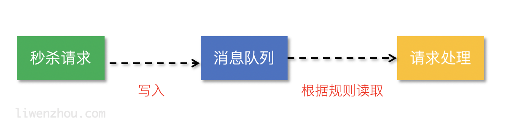

## 什么叫消息队列💩

消息（`Message`）是指在应用间传送的数据。消息可以非常简单，比如只包含文本字符串，也可以更复杂，可能包含嵌入对象。

消息队列（`Message Queue`）是一种应用间的通信方式，消息发送后可以立即返回，由消息系统来确保消息的可靠传递。消息发布者只管把消息发布到 `MQ` 中而不用管谁来取，消息使用者只管从 MQ 中取消息而不管是谁发布的。这样发布者和使用者都不用知道对方的存在，他们共享的只是消息队列的名称而已。

## 应用场景🗾

### 异步处理

参照下图利用消息队列把业务流程中的非关键流程异步化，从而显著降低业务请求的响应时间。

### 应用解耦

通过使用消息队列将不同的业务逻辑解耦，降低系统间的耦合，提高系统的健壮性。后续有其他业务要使用订单数据可直接订阅消息队列，提高系统的灵活性。

### 流量削峰

类似秒杀（大秒）等场景下，某一时间可能会产生大量的请求，使用消息队列能够为后端处理请求提供一定的缓冲区，保证后端服务的稳定性。

## 术语

**Topic**: 一个可供订阅的话题，是消息的分类概念。
**channel**: 一个通道`channel`是消费者订阅了某个话题的逻辑分组. 一个`Topic`有可以分为多个`Channel`，每当一个发布者发送一条消息到一个`topic`，消息会被复制到所有消费者连接的`channel`上，从而实现多播分发，而`channel`上的每个消息被分发给它的订阅者，从而实现负载均衡。实际上，在消费者第一次订阅时就会创建`channel`。`Channel`会将消息进行排列，如果没有消费者读取消息，消息首先会在内存中排队，当量太大时就会被保存到磁盘中。

## NSQ

Nsq是一个消息队列，它一个采用去中心化的拓扑结构的分布式实时消息平台。NSQ框架具有高可用性、无单点故障、和低延迟、可靠性的消息传递等特性。它基于Go语言开发，能够为高吞吐量的网络服务器带来性能的优化，稳定性和鲁棒性。

NSQ是一个**简单**的队列，基本核心就是**简单性**，这意味着它很容易进行故障推理和很容易发现bug。消费者可以自行处理故障事件而不会影响系统剩下的其余部分。根据[官网](http://nsq.io/overview/features_and_guarantees.html)的介绍, NSQ具有以下几个主要特点:

- 具有分布式且无单点故障(SPOF)的拓扑结构
- 支持水平扩展，在无中断情况下能够无缝地添加集群节点
- 低延迟的消息推送，参见[官方性能文档](http://nsq.io/overview/performance.html)
- 具有组合式的负载均衡和多播形式的消息路由
- 既擅长处理面向流（高吞吐量）的工作负载，也擅长处理面向Job的（低吞吐量）工作负载
- 消息数据既可以存储于内存中，也可以存储在磁盘中
- 实现了生产者、消费者自动发现和消费者自动连接生产者，参见nsqlookupd
- 支持安全传输层协议（TLS），从而确保了消息传递的安全性
- 具有与数据格式无关的消息结构，支持JSON、Protocol Buffers、MsgPacek等消息格式
- 非常易于部署（几乎没有依赖）和配置（所有参数都可以通过命令行进行配置）
- 使用了简单的TCP协议且具有多种语言的客户端功能库
- 具有用于信息统计、管理员操作和实现生产者等的HTTP接口
- 为实时检测集成了统计数据收集器StatsD
- 具有强大的集群管理界面，参见nsqadmin

## 整体架构

NSQ主要有三个后台进程组成：

- `nsqd`：一个负责接收、排队、转发消息到客户端的守护进程
- `nsqlookupd`：管理拓扑信息并提供最终一致性的发现服务的守护进程
- `nsqadmin`：一套Web用户界面，可实时查看集群的统计数据和执行各种各样的管理任务

另外还有一个非常重要的组件，`utilities`。`utilities`是常见基础功能、数据流处理工具，如`nsq_stat、nsq_tail、nsq_to_file、nsq_to_http、nsq_to_nsq、to_nsq`等。

### nsqd

一个负责接收、排队、转发消息到客户端的守护进程。是NSQ的核心部分，它主要负责message的收发，队列的维护。nsqd会默认监听一个tcp端口(4150)和一个http端口(4151)以及一个可选的https端口。当一个nsqd节点启动时，它向一组nsqlookupd节点进行注册操作，并将保存在此节点上的topic和channel进行广播。

客户端可以发布消息到nsqd守护进程上，或者从nsqd守护进程上读取消息。通常，消息发布者会向一个单一的local nsqd发布消息，消费者从连接了的一组nsqd节点的topic上远程读取消息。

总的来说，nsqd 具有以下功能或特性：

- 对订阅了同一个topic，同一个channel的消费者使用负载均衡策略（不是轮询）
- 只要channel存在，即使没有该channel的消费者，也会将生产者的message缓存到队列中（注意消息的过期处理）
- 保证队列中的message至少会被消费一次，即使nsqd退出，也会将队列中的消息暂存磁盘上(结束进程等意外情况除外)
- 限定内存占用，能够配置nsqd中每个channel队列在内存中缓存的message数量，一旦超出，message将被缓存到磁盘中
- topic，channel一旦建立，将会一直存在，要及时在管理台或者用代码清除无效的topic和channel，避免资源的浪费

从上图可以看出，单个nsqd可以有多个Topic，每个Topic又可以有多个Channel。Channel能够接收Topic所有消息的副本，从而实现了消息多播分发；而Channel上的每个消息被分发给它的订阅者，从而实现负载均衡，所有这些就组成了一个可以表示各种简单和复杂拓扑结构的强大框架。

### nsqlookupd

nsqlookupd是守护进程负责管理拓扑信息。客户端通过查询 nsqlookupd 来发现指定话题（topic）的生产者，并且 nsqd 节点广播话题（topic）和通道（channel）信息。

简单的说nsqlookupd就是中心管理服务，它使用tcp(默认端口4160)管理nsqd服务，使用http(默认端口4161)管理nsqadmin服务。同时为客户端提供查询功能

总的来说，nsqlookupd具有以下功能或特性：

- 唯一性，在一个Nsq服务中只有一个nsqlookupd服务。当然也可以在集群中部署多个 nsqlookupd，但它们之间是没有关联的
- 去中心化，即使nsqlookupd崩溃，也会不影响正在运行的nsqd服务
- 充当nsqd和naqadmin信息交互的中间件
- 提供一个http查询服务，给客户端定时更新nsqd的地址目录

### nsqadmin

是一套 WEB UI，用来汇集集群的实时统计，并执行不同的管理任务。nsqadmin具有以下功能或特性：

- 提供一个对topic和channel统一管理的操作界面以及各种实时监控数据的展示，界面设计的很简洁，操作也很简单
- 展示所有message的数量
- 能够在后台创建topic和channel
- nsqadmin的所有功能都必须依赖于nsqlookupd，nsqadmin只是向nsqlookupd传递用户操作并展示来自nsqlookupd的数据

## 拓扑结构

nsqlookupd，nsqd与客户端中消费者和生产者如何进行交互、沟通的呢？

### 生产者

生产者必须直连nsqd去投递message，但是该方式存在一个问题:如果生产者所连接的nsqd宕机了，那么message就会投递失败，所以在客户端必须自己实现相应的备用方案。NSQ推荐通过他们相应的nsqd实例使用**协同定位发布者**，这意味着即使面对网络分区，消息也会被保存在本地，直到它们被一个消费者读取。更重要的是，发布者不必去发现其他的nsqd节点，他们总是可以向本地实例发布消息。

### 消费者

消费者有两种方式与nsqd建立连接:

- 消费者直连nsqd，这是最简单的方式，缺点是nsqd服务无法实现动态伸缩了.
- 消费者通过http查询nsqlookupd获取该nsqlookupd上所有nsqd的连接地址，然后再分别和这些nsqd建立连接(官方推荐的做法).

### 消息的生命周期

让我们观察一个关于nsq如何在实际中工作的。

1. 首先，一个发布者向它的本地nsqd发送消息，要做到这点，首先要先打开一个连接，然后发送一个包含topic和消息主体的发布命令
2. 事件topic会复制这些消息并且在每一个连接topic的channel上进行排队。有三个channel，它们其中之一作为档案channel。每个channel的消息都会进行排队，直到一个worker把他们消费，如果此队列超出了内存限制，消息将会被写入到磁盘中。
3. Nsqd节点首先会向nsqlookup广播他们的位置信息，一旦它们注册成功，worker将会从nsqlookup服务器节点上发现所有包含事件topic的nsqd节点。
4. 然后每个worker向每个nsqd主机进行订阅操作，用于表明worker已经准备好接受消息了。