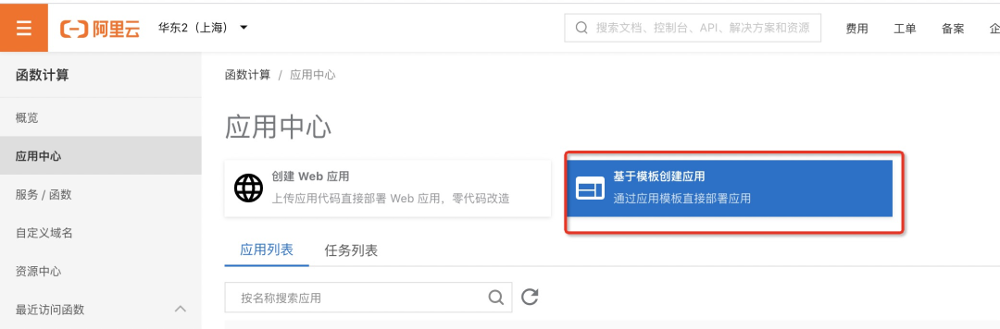
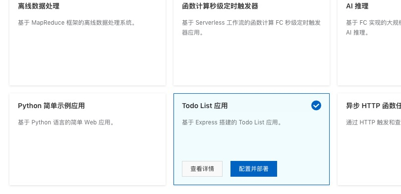
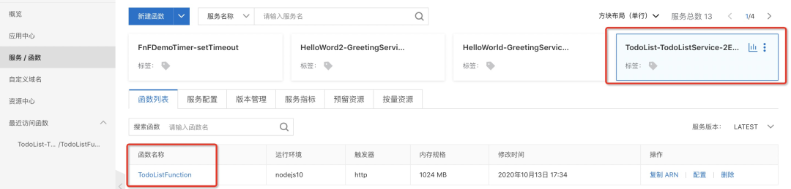
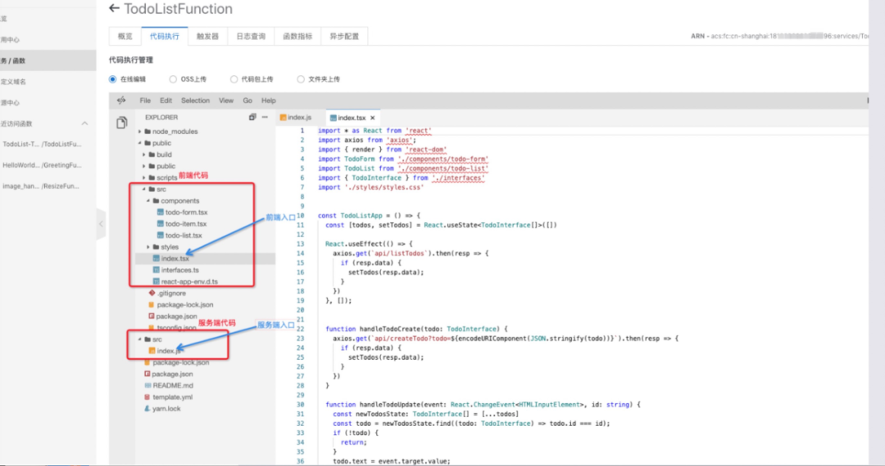
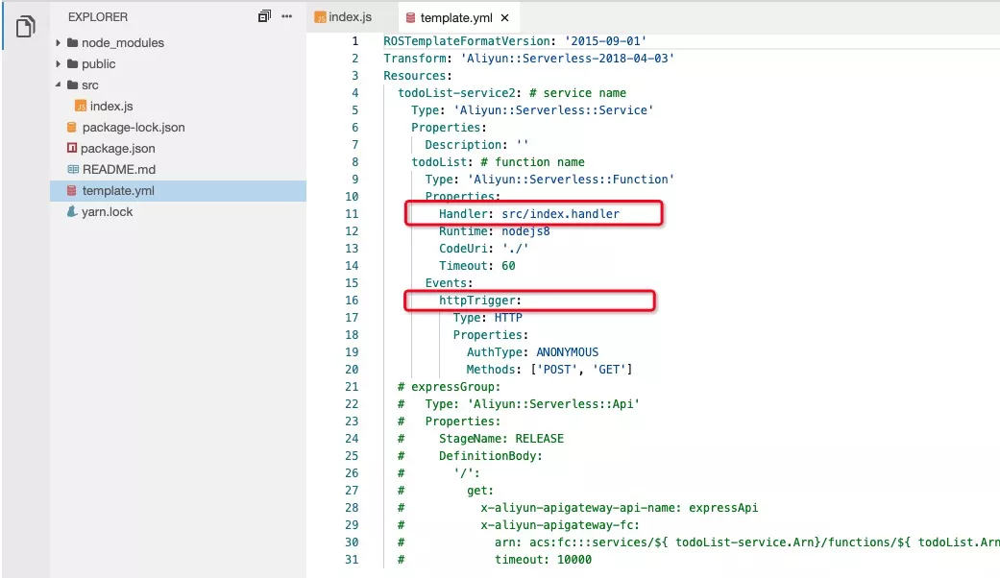
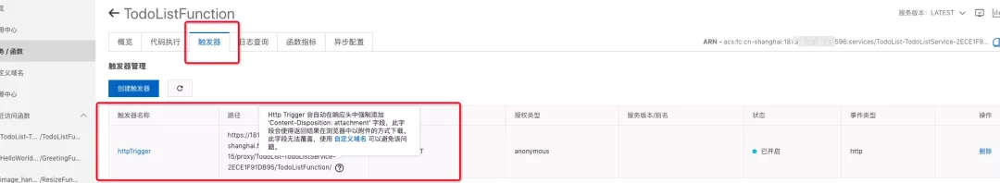
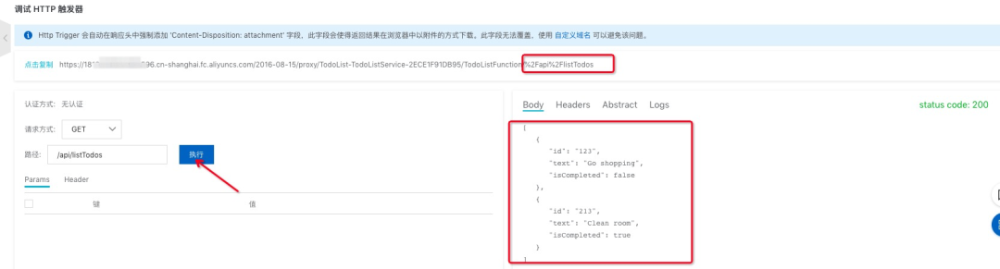
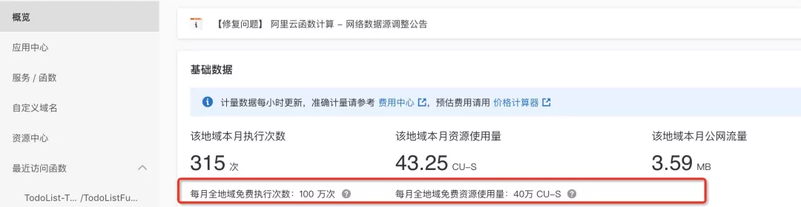
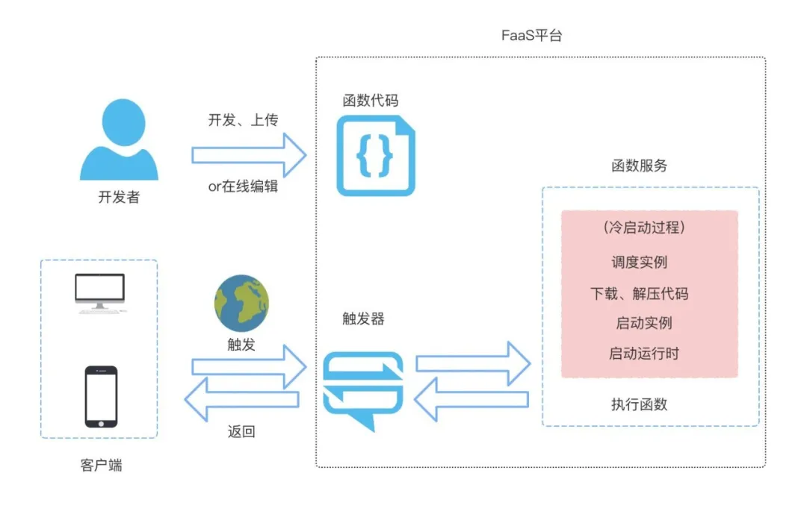

# Faas 实践

让我们从实际的 `faas` 开发中理解 `faas` 的工作过程：

## 概念

`FaaS`  是无服务器计算的一种形式。通过 `FaaS`，可以快速构建任何类型的应用和服务，它具有开发敏捷特性、自动弹性伸缩能力、免运维和完善的监控设施。因此：

- 开发者只需专注于业务逻辑开发，无需管理服务器、运行环境等 `IT` 基础设施
- `FaaS` 平台会为我们准备好计算资源，以弹性、可靠的方式运行我们的代码，实现毫秒级**弹性伸缩**，轻松应对峰值压力
- 用户只需根据函数的实际执行时间**按量付费**

## 快速创建 FaaS 应用

函数计算开发方式有很多种，比如：Fun 工具、函数计算 FC 平台、Serverless VScode、云开发平台。本文借助**阿里云函数计算平台**(https://fc.console.aliyun.com/fc/overview/cn-shanghai)，通过其提供的模版快速创建、部署一个 Web 应用，向大家更清楚地展示 FaaS 是什么。让我们来以一个实际流程来了解 `faas`，

本文直接基于模版创建，用户也可以选择自己上传应用代码直接部署 Web 应用。



我们选择有前后端交互、数据增删改查等行为的 **Todo List 应用**，它是一个**前后端一体化**（前后端代码共属一个项目中开发、调试、部署，高效且节省资源） FaaS 应用。



## 服务

一个应用可以拆分为多个服务。从资源使用维度出发，一个服务可以由多个函数组成。先创建服务，再创建函数。

可以看到 `TodoList` 应用部署成功后创建好的服务，我们可以对该服务进行配置、删除、查看指标等操作，还可以对其下的函数进行配置、删除。



## 函数

函数是系统调度和运行的单位。函数必须从属于服务，同一个服务下可以有多个函数，同一个服务下的所有函数共享相同的设置，例如服务授权、日志配置，但彼此相互独立，互不影响。

### 函数代码

`FaaS` 对**多种语言**都有良好的支持性，比如阿里云支持 `Node.js`、`Python`、`PHP`、`Java` 等等，开发者可以使用自己熟悉的语言，根据平台提供的函数接口形式编写代码。这也意味着，团队协作时，大家可以利用多种语言混合开发复杂应用。

点击代码执行，可以看到这里有一个在线编辑器，里面就是模板生成的代码，可以在此处进行运行、调试。该应用前端页面用 `React` 实现，后端服务基于 `Node` 的 `Express` 框架。



总的来说 `faas` 开发实际上是在开发一个前后端一体化应用，前端开发流程不变，而服务端代码放在一个项目里且只有逻辑部分。

### 函数入口

`template.yml` 是我们的**函数信息配置文件**，告诉云厂商我们的代码入口函数、触发器类型等操作。



函数入口为 `src/index.handler` ，即 `src/index.js` 服务端代码文件中的 `handler` 方法，该文件代码如下：

```ts
const { Server } = require('@webserverless/fc-express')
const express = require('express');
const fs = require('fs');
const path = require('path');
const bodyParser = require('body-parser');

// initial todo list
let todos = [
  {
    id: '123',
    text: 'Go shopping',
    isCompleted: false,
  },
  {
    id: '213',
    text: 'Clean room',
    isCompleted: true,
  },
];


const staticBasePath = path.join('public', 'build');

const app = express();

// index.html
app.all("/", (req, resp) => {
  resp.setHeader('Content-Type', 'text/html');
  resp.send(fs.readFileSync('./public/build/index.html', 'utf8'));
});

// 静态资源文件：js、css、图片
// static js resources  
app.all('/*.js', (req, resp) => {
  const filePath = path.join(staticBasePath, req.path);
  resp.setHeader('Content-Type', 'text/javascript');
  resp.send(fs.readFileSync(filePath, 'utf8'));
});

// static css resources
app.all('/*.css', (req, resp) => {
  const filePath = path.join(staticBasePath, req.path);
  resp.setHeader('Content-Type', 'text/css');
  resp.send(fs.readFileSync(filePath, 'utf8'));
});

// static svg resources
app.all('/*.svg', (req, resp) => {
  const filePath = path.join(staticBasePath, req.path);
  resp.setHeader('Content-Type', 'image/svg+xml');
  resp.send(fs.readFileSync(filePath, 'utf8'));
});

// static png resources
app.all('/*.png', (req, resp) => {
  const filePath = path.join(staticBasePath, req.path);
  resp.setHeader('Content-Type', 'image/png');
  resp.send(fs.readFileSync(filePath, 'utf8'));
});

app.all('/manifest.json', (req, resp) => {
  const filePath = path.join(staticBasePath, req.path);
  resp.setHeader('Content-Type', 'application/json');
  resp.send(fs.readFileSync(filePath, 'utf8'));
});

// 增删改查对应的api接口
// list api
app.get('/api/listTodos', (req, resp) => {
  resp.send(JSON.stringify(todos));
});

// create api
app.get('/api/createTodo', (req, resp) => {
  const { todo: todoStr } = req.query;
  const todo = JSON.parse(todoStr);
  todos.push({
    id: todo.id,
    text: todo.text,
    isCompleted: todo.isCompleted,
  });
  resp.send(JSON.stringify(todos));
});

// update api
app.get('/api/updateTodo', (req, resp) => {
  const { todo: todoStr } = req.query;
  const targetTodo = JSON.parse(todoStr);
  const todo = todos.find((todo) => todo.id === targetTodo.id);
  if (todo) {
    todo.isCompleted = targetTodo.isCompleted;
    todo.text = targetTodo.text;
  }
  resp.send(JSON.stringify(todos));
});

// remove api
app.get('/api/removeTodo', (req, resp) => {
  const { id } = req.query
  // TODO: Implement methods to filter todos, filtering out item with the same id
  // todos = todos.filter();
  const todosIndex = todos.findIndex((todo) => todo.id === id);
  if (todosIndex !== -1) {
    todos.splice(todosIndex, 1);
  } 
  resp.send(JSON.stringify(todos));
});

const server = new Server(app);

// 向外暴露了 http触发器入口
// http trigger entry
module.exports.handler = function(req, res, context) {
  server.httpProxy(req, res, context);
};

```

可以看到，我们不需要自己起服务，`FaaS` 平台会为我们管理。这个文件，有两个重要的部分：

1. 函数入口 `handler`，也是 `HTTP` 触发器入口，下文会详细介绍

```ts
// http trigger entry
module.exports.handler = function(req, res, context) {
  server.httpProxy(req, res, context);
};
```

2. `Web Service` 和 `API`，通过路由调用相应的服务，比如请求路径为 `"/"` 时，会返回 `Web` 应用的 `Html` 页面；请求 `"/api/*"` 时，调用接口返回数据

## 触发器

前面说过，`FaaS` 是一种**事件驱动**的计算模型，即函数的执行是由事件驱动的，没有事件触发，函数就不运行。与传统开发模式不同，函数不需要自己启动一个服务去监听数据，而是通过绑定一个（或者多个）触发器。

**触发器**就是触发函数执行的方式，我们需要为函数创建指定的触发器。

`FaaS` 应用的触发器有多种（不同云厂商的触发器会有所区别），但基本都支持 `HTTP`、对象存储、定时任务、消息队列等触发器，其中 `HTTP` 触发器是最常见的。

以阿里云函数计算为例，介绍几个代表类型：

| 名称                 | 描述                                                         |
| :------------------- | :----------------------------------------------------------- |
| HTTP 触发器          | 1.HTTP 触发器通过发送 HTTP 请求触发函数执行，主要适用于快速构建 Web 服务等场 2.HTTP 触发器支持 HEAD、POST、PUT、GET 和 DELETE 方式触发函数 3.可以通过绑定自定义域名为 HTTP 函数映射不同的 HTTP 访问路径 4.开发人员可以快速使用 HTTP 触发器搭建 Web Service和 API |
| OSS 触发器(对象存储) | 1.OSS 事件能触发相关函数执行，实现对 OSS 中的数据进行自定义处理 |
| 日志服务触发器       | 1.当日志服务定时获取更新的数据时，通过日志服务触发器，触发函数消费增量的日志数据，并完成对数据的自定义加工 |
| 定时触发器           | 1.在指定的时间点自动触发函数执行                             |
| API 网关触发器       | 1.API 网关作为事件源，当有请求到达后端服务设置为函数计算的 API 网关时，API 网关会触发函数的执行。函数计算会将执行结果返回给 API 网关 2.与 HTTP 触发器类似，可应用于搭建 Web 应用。相较于 HTTP 触发器，您可以使用 API 网关进行 IP 白名单或黑名单设置等高级操作 |

我们点开 TodoList 的触发器，可以看到创建的 **HTTP 触发器**，WEB 用户通过 HTTP 请求即可触发函数的执行。



### HTTP 触发器

该应用 **HTTP 触发器的入口函数**形式如下：

```ts
// http trigger entry
module.exports.handler = function(req, res, context) {
  server.httpProxy(req, res, context);
};
```

**配置 HTTP 触发器的函数可以通过 HTTP 请求被触发执行。此时函数可以看做一个 Web Server，对 HTTP 请求进行处理，并将处理结果返回给调用端**。

访问 Html 页面、请求静态资源文件，以及请求接口，都是通过 HTTP 请求去触发相应函数的执行。

可以在这里进行调试：



## 收费标准

传统应用我们的服务是一直占用资源的，而 FaaS 在资源空闲时不收费，**按需付费**，可以大大节省开支。

收费标准：

- 调用函数次数
- 函数运行时间

因为每月都有免费额度，所以在个人日常使用时基本不需要付费。



## 冷启动

再说说 `FaaS` 目前备受关注的一个问题——**冷启动**。

`FaaS` 中的函数**首次调用**、**更新函数或长时间未调用时重新调用函数**时，平台会初始化一个函数实例，这个过程就是**冷启动**，平均耗时在几百毫秒。

### 延迟问题

`FaaS` 因为冷启动，不能立即调用函数，调用延迟会给应用性能带来影响，针对冷启动的延迟问题，各大云服务商非常关注，正在想办法不断优化。

与冷启动相呼应的是热启动，**热启动**指函数调用时不用重新创建新的函数实例，而是直接复用之前的函数实例。因为 `FaaS` 函数若在一段时间内没有被事件触发运行，云服务商就会回收运行函数的容器资源，销毁函数实例，所以，在未被回收的这段时间内再次调用函数就是热启动；销毁后，重新创建就是冷启动。

### 延迟原因

冷启动具体做了哪些操作呢？以阿里云为例，大致包括了调度实例、下载解压代码、启动容器、启动运行时，这一过程结束后，函数才开始执行。所以冷启动的启动消耗时间受到很多因素的影响：

- 编程语言：有专门研究对比，不同语言的冷启动时间不同
- 代码大小：这个过程在冷启动过程中相对比较耗时，可能几十毫秒，也可能几秒，看代码体积大小
- 容器创建：这个过程的耗时取决于云服务商
- 配置等

### 如何优化

各大云厂商都已经有了一些优化方案的最佳实践，需要开发者和云厂商共同努力：

- 减少代码体积：
- 开发者可以通过精简代码，删除无用依赖，加速下载函数代码过程
- 比如腾讯云对代码做了两级的缓存，可以有效降低下载代码时间
- 资源复用，缩短函数执行时间
- 选择冷启动时间较少的语言
- 选择合适的内存：函数内存越大，冷启动表现越优
- 避免不必要的配置
- 降低冷启动频率
- 使用定时触发器定时访问函数，这样可以防止函数实例一段时间没被使用被销毁
- 使用 initializer 函数入口，函数计算会异步调用初始化接口，消除初始化用户代码的时间
- 预留实例

### 执行时长

`FaaS` 还有一个局限性，就是平台会限制函数的执行时间，超出时间后执行代码的进程会被强行销毁，所以 `FaaS` 不适合长时间运行的应用。例如 `AWS Lambda` 函数不允许运行超过 `15` 分钟（以前只有 5 分钟），如果超过就会中断。使用时，应该根据自己的预期执行时间来设置超时值，防止函数的运行时间超出预期，并且建议调用函数的 `Client` 端的 `timeout` 要稍稍大于函数设置的 `timeout`，这样才能防止执行环境不会意外退出。

## FaaS 工作流程

相信大家读到这里，应该差不多可以明白 `FaaS` 的工作流程了，我们总结一下：

- 开发者编写**函数代码**，可以在线编辑或者本地上传，完成后，`FaaS` 平台为我们部署应用，创建**函数服务**；
- 客户端通过设置的**触发器**，通知**函数服务**；
- 若存在**函数实例**，则直接在该执行环境中调用函数；没有，则先经过**冷启动**（调度实例、下载代码、启动实例、启动运行时），再执行函数；
- 函数根据用户请求量动态扩容响应请求，将内容返回给用户。函数执行完后，若一段时间内无事件触发，函数实例就会被销毁，`FaaS` 应用快速缩容到 `0`；

用个图来看：



## 对前端的影响

`Serverless` 现在这么热，它对前端到底有什么影响呢？

整个实践下来发现，`FaaS` 帮我们前端扩展了能力边界，作为前端，我们自己一个人也能快速完成前后端开发以及部署工作，完全不用关心服务器以及运维方面我们不擅长的问题。前端也有机会参与服务端业务逻辑开发，更深入业务，创造更大的价值。

