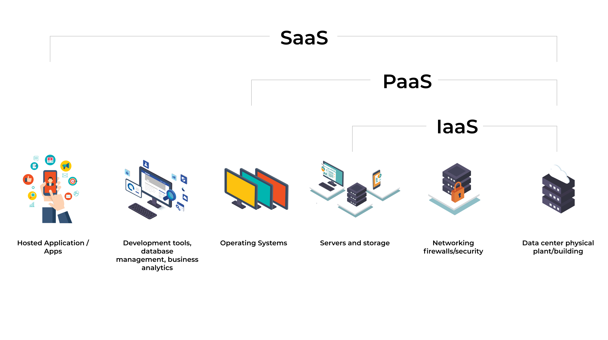

# 云服务

从以前还望而却步的[云计算]()到现在我们哪哪都是[云服务]()，[云]()的概念已经从概念落到地上，说到[云]()其实也是个不说人话的装X词，说白了就是我们以前和现在 不停使用的[服务器]()罢了，云计算、云服务就是一种更优化的服务器功能，从只是个服务器硬件本身，升级到在这个硬件中集成了很多方便使用，或者开箱即用的[软件服务]()，不需要你知道怎么安装，怎么配置，你只要花钱买了，就开箱即用。即有硬件使用，也有服务提供，这就是[云服务]()。

如果[云服务]()还有分类的话，那么就是下面要说的几个既有区别又有联系的分类了，我们也可以称他们为基于不同架构的云服务。但是不管这些分类怎么变，名字怎么起，怎么高大上，其实在我看来，就是作为客户的你(软件开发者)花钱享受**不同服务**来满足你的需求，统统都是简化了你要做的事情，把复杂的事情简单了，花钱就行了。看着很憷人，其实很简单。

常见的云服务架构这些名词后面都带着 `aas` 三个字母，`aas` 是 `As-a-Service`，即为服务的意思。

## IaaS

**基础设施服务，`Infrastructure as a service`**，如果把软件开发比作厨师做菜，那么 `IaaS` 就是他人提供了厨房，炉子，锅等基础东西，你自己使用这些东西，自己根据不同需要做出不同的菜。在常见的 `web` 开发架构中，`Iaas` 指的就是云服务公司提供的**网络环境、安全、服务器实体、服务器中心**等这些接近于硬件的基础设施。

如果使用 `Iaas` 相当于你只是拥有一个可以远程登录的服务器实体，你需要在上面安装操作系统、语言运行时、服务器组件(`nginx`、消息中间件、`redis`、`mysql`...)，并且开发自己的软件服务。

## PaaS

**平台即服务, `Platform as a Service`**，还是做菜比喻，比如我做一个黄焖鸡米饭，除了提供基础东西外，那么PaaS还给你提供了现成剁好的鸡肉，土豆，辣椒，你只要把这些东西放在一起，加些调料，用个小锅子在炉子上焖个20分钟就好了。

`PaaS` 处于中间层，服务商提供基础设施底层服务，提供操作系统(`Windows`、`Linux`)、开发环境运行时(`java`、`go`、`nodejs`)、数据库服务器、`Web` 服务器(`nginx`、`tomcat`)、域控制器和其他中间件(`etcd`、`nsq`、`edan`...)，以及服务模型中的备份服务等中件层服务。近几年比较流行的 `paas` 一般采用 `docker` 容器服务的技术，直接提供开发环境/数据库的镜像服务。

## SaaS

**软件服务，`Software as a service`**，同样还是做黄焖鸡米饭，这次是直接现成搞好的一个一个小锅的鸡，什么调料都好了，已经是个成品了，你只要贴个牌，直接卖出去就行了，做多是在炉子上焖个20分钟，有点像料理包哈。

`SaaS` 处于最上层，服务商提供基于软件的解决方案，满足客户最终需求；如公司里的常用应用`scm`(编译发布平台)、`goofy`(前端部署平台)、`tce`(通用部署平台)、`esm`(接口管理平台)、`gitlab`(版本管理平台)等应用，客户不需考虑任何形式的专业技术知识，获得完整的软件包(`c`端/`b`端)，使他们的日常工作和生活变得更轻松。

## BaaS

**后端即服务，`Backend as a Service`**，服务商为客户(开发者)提供整合云后端的服务，如提供文件存储、数据存储、推送服务、身份验证服务等功能，以帮助开发者快速开发应用。比如云数据库、对象存储、消息队列等。

## FaaS

**函数服务，`Function as a Service`**，同样是做黄焖鸡米饭，这次我只提供酱油，色拉油，盐，醋，味精这些调味料，其他我不提供，你自己用我的佐料来做。

`Faas` 位于 `SaaS` 和 `PaaS` 之间，你可能已经明白了，它提供的就是服务端抛开实际业务逻辑代码之外的一切。

作为一个前端，我们平日里很难接触到服务器、运维方面的操作。假设现在给你一个任务，让你自己开发一个有前后端交互的应用，并从 `0` 到 `1 `进行部署，你可能直到服务端代码怎么写，但是是不是还是觉得光靠自己根本搞不定，这个任务有点难。

传统应用的部署，我们需要做很多工作：准备服务器、配置环境、购买域名、配置 `Nginx`、配置 `mysql`、配置 `redis`、配置 `zookeeper`、配置 `etcd`...。应用发布之后，我们还要考虑运维的问题，线上监控，扩缩容，容灾等等等等。

现在，我们运用 `FaaS` 去开发部署的话，以上都不用考虑，只需要专注于业务逻辑开发即可，因为**其它一切都托管给 `FaaS` 平台**帮我们处理了。

------

> `BaaS` 其实依然是服务外包，而 `FaaS` 使我们更加关注应用程序的逻辑，两者使我们不需要关注应用程序所在的服务器，但实际上服务器依然是客观存在的。

> 其实还有很多的 `aaS`，比如 `DaaS`(`Data as a service`，数据即服务)、`NaaS`(`Network as a service`，网络即服务) 等等。

## MicroService

**微服务，Micro service**，微服务是服务整体的细化，如果还是做黄焖鸡米饭，就好比一家供应商提供好了所有调料，一家供应商提供好了所有的鸡块等食材，你只要把这两 家供应商提供的东西做成黄焖鸡米饭就行了。

## Serverless

如同许多新的概念一样，`Serverless` 目前还没有一个普遍公认的权威的定义。最新的一个定义是这样描述的：“无服务器架构是基于互联网的系统，其中应用开发不使用常规的服务进程。相反，它们仅依赖于第三方服务（例如 `AWS Lambda` 服务），客户端逻辑和服务托管远程过程调用的组合。”

最开始，“无服务器”架构试图帮助开发者摆脱运行后端应用程序所需的服务器设备的设置和管理工作。这项技术的目标并不是为了实现真正意义上的“无服务器”，而是指由第三方云计算供应商负责后端基础结构的维护，以服务的方式为开发者提供所需功能，例如数据库、消息，以及身份验证等。

简单地说，这个架构的就是要让开发人员关注**代码的运行**而不需要管理任何的基础设施，换句话说就是你需要的服务器组件都给你提供好了，比如 `mq`、数据库服务、缓存服务、校验服务，你需要的就是开发自己的业务代码(接口)。

## Faas 和 Serverless

`Serverless`架构可以提供一种更加“代码碎片化”的软件架构范式，我们称之为 `Function as a Services(FaaS)`。而所谓的“函数”`Function`提供的是相比微服务更加细小的程序单元。例如，可以通过微服务代表为某个客户执行所有 `CRUD` 操作所需的代码，而 `FaaS` 中的“函数”(这个函数的参数使我们需要操作的上下文)可以代表客户所要执行的每个操作：创建、读取、更新，以及删除。当触发“创建账户”事件后，将通过 `AWS Lambda` 函数的方式执行相应的“函数”。从这一层意思来说，我们可以简单地将 `Serverless` 架构与 `FaaS` 概念等同起来。

实例中，程序代码被部署在诸如 `AWS Lambda` 这样的平台之上，通过事件驱动的方法去触发对函数的调用。很明显，这是一种完全针对程序员的架构技术。其技术特点包括了事件驱动的调用方式，以及有一定限制的程序运行方式，例如` AWS Lambda` 的函数的运行时间默认为 `3` 秒到 `5` 分钟。从这种架构技术出现的两年多时间来看，这个技术已经有了非常广泛的应用，例如移动应用的后端和物联网应用等。简而言之，无服务器架构的出现不是为了取代传统的应用。然而，从具有高度灵活性的使用模式及事件驱动的特点出发，开发人员／架构师应该重视这个新的计算范例，它可以帮助我们达到减少部署、提高扩展性并减少代码后面的基础设施的维护负担。

## Serverless 与 MicroService

`MicroService` 是微服务，是一种专注于单一责任与功能的小型服务，`Serverless` 相当于`更加细粒度和碎片化`的单一责任与功能小型服务，他们都是一种特定的小型服务，从这个层次来说，`Serverless<=MicroService`。

> 这几个之间有这么多联系，但是从架构的定义范围也有个包含关系，`PaaS > SaaS > FaaS > MicroService > Serverless*`