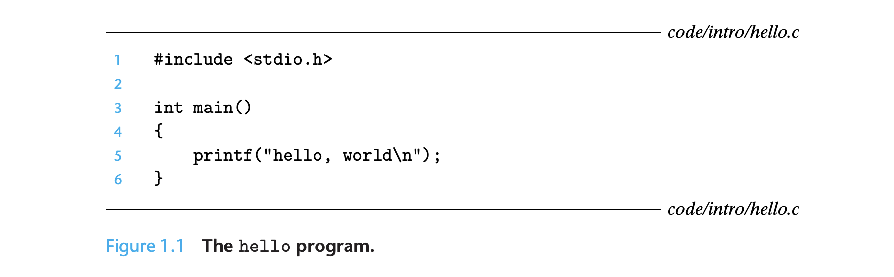
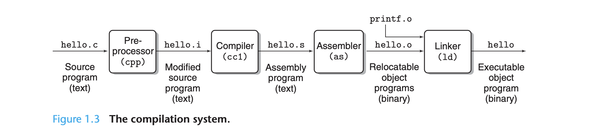

## Hello World

学习任何一门语言都要先从hello world开始，透过hello world这个案例我们来看看C语言的编译过程。



### GCC编译

GCC 编译器是 Linux 系统下最常用的 C/C++ 编译器，大部分 Linux 发行版中都会默认安装。GCC 编译器通常以`gcc`命令的形式在终端（Shell）中使用，它有很多选项。

执行如下命令，可查看gcc默认定义的预编译宏：

```bash
gcc -E -dM - </dev/null | grep "STDC_VERSION"
```

- 查看 __STDC_VERSION__的值，如果没查到，则默认是c89的标准；

- 如果是#define __STDC_VERSION__ 199901L，则默认支持的是c99标准；

- 如果是#define __STDC_VERSION__ 201112L，则默认支持的c11标准；
  

gcc 编译器驱动程序读取源文件 hello.c 并将其转换为可执行对象文件 hello。翻译按顺序执行图所示的四个阶段。执行四个阶段的程序(预处理器、编译器、汇编器和链接器)统称为编译系统。



- 预处理阶段:
  - 预处理器 （cpp） 修改原始 C 程序根据以 # 字符开头的指令。例如，hello.c 行 1 中的 #include [stdio.h] 命令告诉预处理器读取系统头文件 stdio.h 的内容并直接插入到程序文本中。结果是另一个 C 程序，通常使用 .i后缀。

- 编译阶段:
  - 编译器 （cc1） 将文本文件 hello.i 转换为包含汇编语言程序的文本文件 hello.s。每个汇编语言程序中的语句精确描述了一个低级标准文本形式的机器语言指令。汇编语言是非常有用，因为它为不同的编译器提供了通用的输出语言适用于不同的高级语言。
- 装配阶段:
  - 接下来，汇编器将 hello.s 转换为机器语言指令，将它们打包为称为`可重定位对象`的形式程序，并将结果存储在对象文件中 hello.o。hello.o 文件是字节编码机器语言指令的二进制文件，而不是字符。
- 链接阶段。
  - 请注意，我们的 hello 程序调用 printf 函数，该函数是每个 C 编译器提供的标准 C 库的一部分。打印函数驻留在一个单独的预编译对象文件中，称为 printf.o，该文件必须以某种方式与我们的hello.o程序合并。链接器 (ld句柄)这个合并。结果是 hello 文件，这是一个可执行的对象文件。

