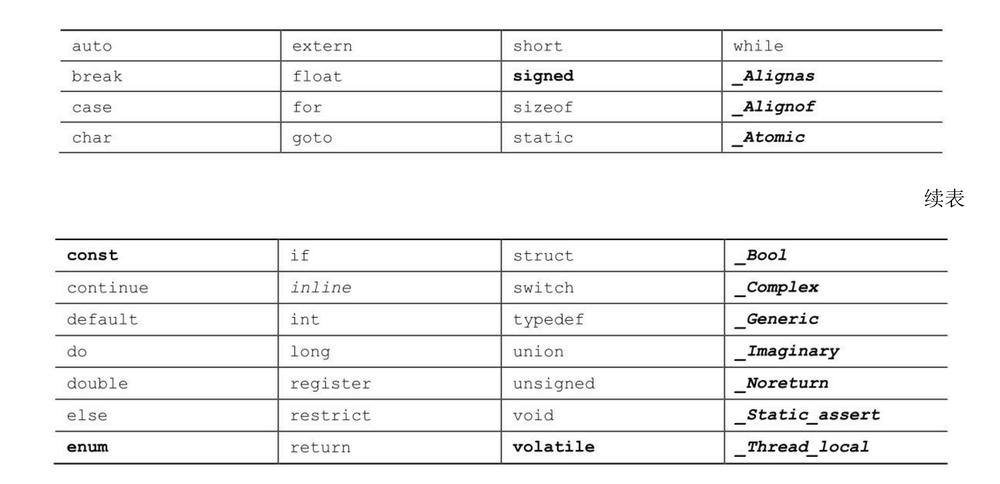

## 关键字

关键字是C语言的词汇。它们对C而言比较特殊，不能用它们作为标识符(如：变量名)。如果使用关键字不当(如:用关键字作为变量名)，编译器会将其视为语法错误。在表中所列的C语言关键字中，粗体表示的是C90标准新增的关键字，斜体表示的C99标准新增的 关键字，粗斜体表示的是C11标准新增的关键字。

还有一些保留标识符(reserved identifier)，保留标识符包括那些以下划线字符开头的标识符和标准库函数名，比如`printf()`。C语言已经指定了它们的用途或保留它们的使用权，如果你使用这些标识符来表示其他意思会导致一些问题。因此，尽管它们也是有效的名称，不会引起语法错误，也不能随便使用。

