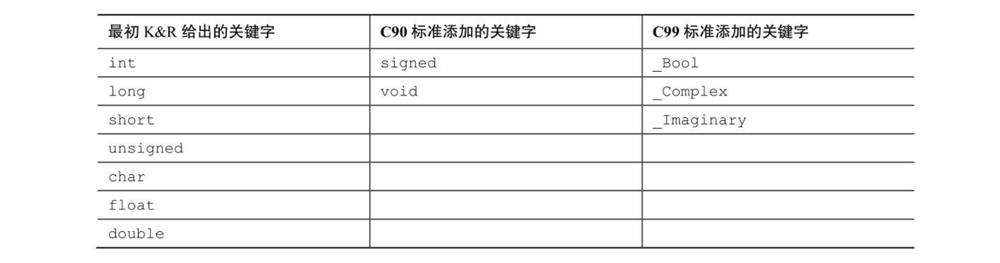
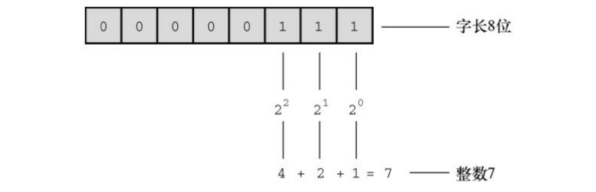
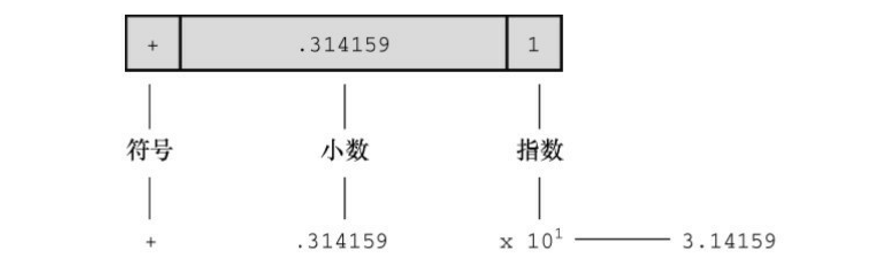
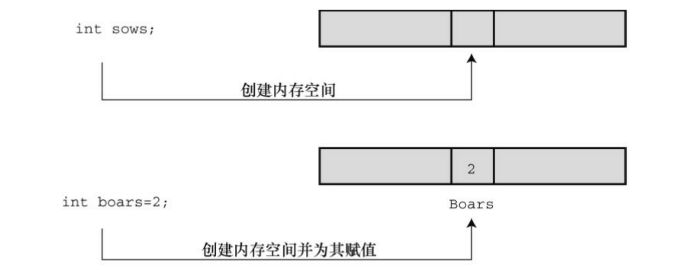
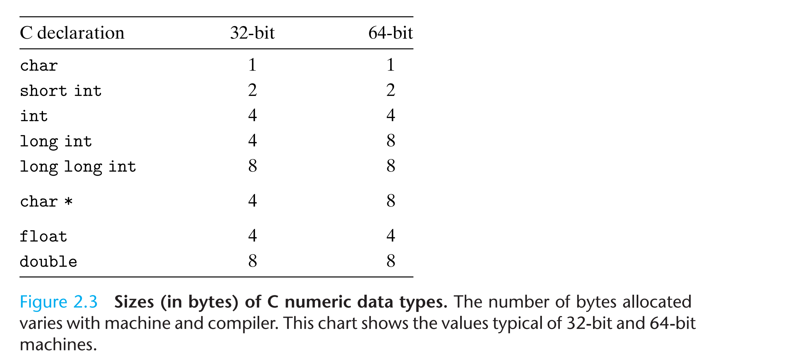
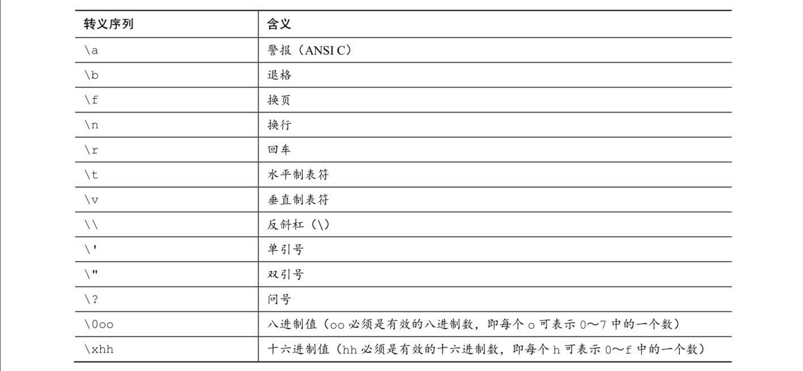
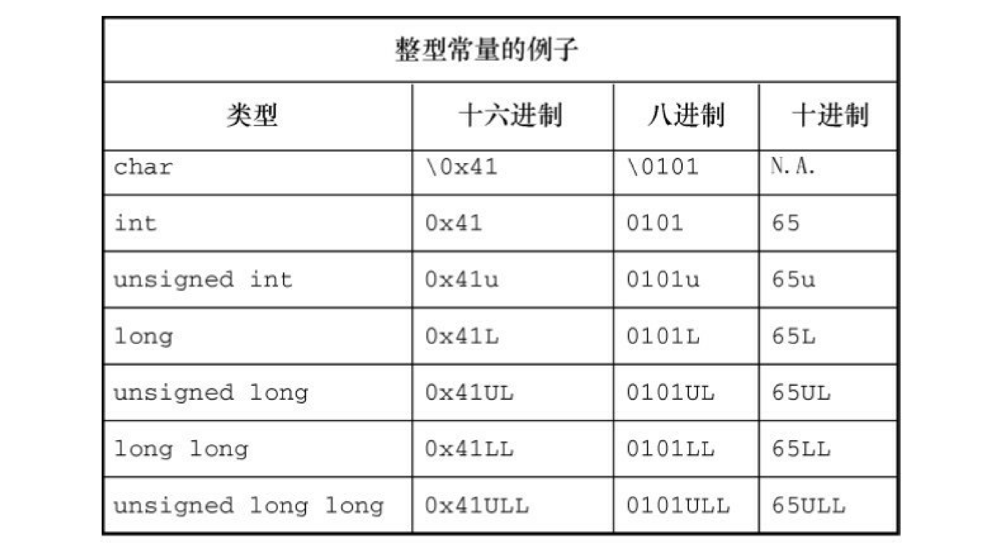
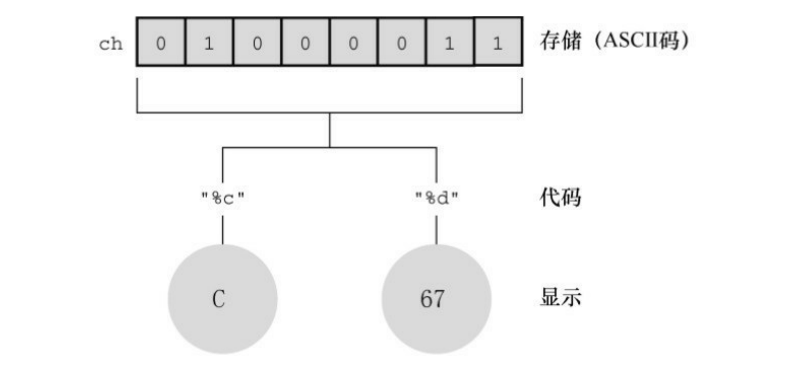
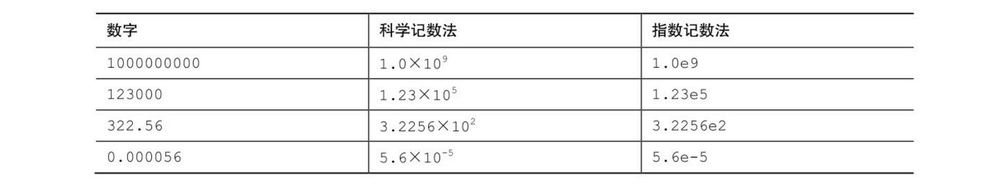

## 前置知识

### 位、字节和字

位、字节和字是描述计算机数据单元或存储单元的术语。这里主要指存储单元。

- **位（bit）**：最小的存储单元，可以储存0或1（或者说，位用于设 置“开”或“关”）。虽然1位储存的信息有限，但是计算机中位的数量十分庞 大。位是计算机内存的基本构建块。 

- **字节（byte**）：是常用的计算机存储单位。对于几乎所有的机器，1字节 均为8位。这是字节的标准定义，至少在衡量存储单位时是这样。既然1位可以表示0或1，那 么8位字节就有256（2的8次方）种可能的0、1的组合。通过二进制编码（仅 用0和1便可表示数字），便可表示0～255的整数或一组字。

- **字（word）**：是设计计算机时给定的自然存储单位。对于8位的微型计算 机（如，最初的苹果机）， 1个字长只有8位。从那以后，个人计算机字长 增至16位、32位，直到目前的64位。计算机的字长越大，其数据转移越快， 允许的内存访问也更多。

### C的基本数据类型

如果数据是常量，编译器 一般通过用户书写的形式来识别类型（如，42是整数，42.100是浮点数）。 但是，对变量而言，要在声明时指定其类型。我们先来了解一下 C语言的基本类型关键字。K&C给出了7个与类型相关的关键字。C90标准添加了2个关键字，C99标准又添加了3个关键字



### 整数

和数学的概念一样，在C语言中，整数是没有小数部分的数。例如， 2、−23和2456都是整数。而3.14、0.22和2.000都不是整数。计算机以二进制数字储存整数，例如，整数7以二进制写是111。因此，要在8位字节中储存 该数字，需要把前5位都设置成0，后3位设置成1。当然整数还包括有符号和无符号补码两种，这里不多做考虑。



### 浮点数

浮点数与数学中实数的概念差不多。2.75、3.16E7、7.00 和 2e-8 都是浮点数。注意，在一个值后面加上一个小数点，该值就成为一个浮点值。所以，7是整数，7.00是浮点数。显然，书写浮点数有多种形式。稍后将详细介绍e记数法，这里先做简要介绍：3.16E7 表示3.16×107（3.16 乘以10 的7次方）。其中， 107=10000000，7被称为10的指数。浮点数可以表示的范围比整数大。但是同字长精度要比整数小。



对于一些算术运算（如，两个很大的数相减），浮点数损失的精度更多。因为在任何区间内（如，1.0 到 2.0 之间）都存在无穷多个实数，所以计算机的浮点数不能表示区间内所有的值。浮点数通常只是实际值的近似 值。例如，7.0可能被储存为浮点值6.99999。稍后会讨论更多精度方面的内容。过去，浮点运算比整数运算慢。不过，现在许多CPU都包含浮点处理 器，缩小了速度上的差距。

## 整型

### **int**类型

int类型是有符号整型，即int类型的值必须是整数，可以是正整数、负整数或零。其取值范围依计算机系统而异。一般而言，储存一个int要占用一个机器字长。目前的个人计算机一般是32位，因此用32位储存一个int值。C规定int的取值范围最小 为-32768～32767。

**声明**

```c
int erns; 
int hogs, cows, goats;
```

**赋值**

```c
erns = 100;
```

**初始化**

```c
int hogs = 21; 

int cows = 32, goats = 14; 

int dogs, cats = 94; /* 有效，但是这种格式很糟糕 */ 
```

以上示例的最后一行，只初始化了cats，并未初始化dogs。这种写法很容易让人误认为dogs也被初始化为94，所以最好不要把初始化的变量和未初始化的变量放在同一条声明中。 




#### int类型常量

C语言把大多数整型常量视为int类型，但是非常大的整数除外。

#### 十六进制

C语言都假定整型常量是十进制数。然而，许多程序员很喜欢使用八进制和十六进制数。例如，十进制数 65536经常出现在16位机中，用十六进制表示正好是10000。另外，十六进制数的每一位的数恰好由4位二进制数表示。例如，十六进制数3是0011，十六进制数5是0101。因此，十六进制数35的位组合（bit pattern）是00110101， 十六进制数53的位组合是01010011。这种对应关系使得十六进制和二进制的转换非常方便。

```c
int main(void) {
    int num = 100;
    printf("dec=%d, hex=%x, hexWith0X=%#X", num, num, num);
		// dec=100, hex=64, hexWith0X=0X64
    return 0;
}
```

在C语言中，用特定的前缀表示使用哪种进制。0x或0X前缀表示十六进制值，所以十进制数16表示成十六进制是0x10或0X10。显示十六进制，以十六进制显示数字，使用%x。另外，要显示各进制数的前缀0x和0X，必须分别使用%#x/%#X。

### 其他整数类型

C语言提供3个附属关键字修饰基本整数类型：short、long、unsigned、signed。应记住以下几点:

- short int类型（或者简写为short）占用的存储空间可能比int类型少，常用于较小数值的场合以节省空间。与int类似，short是有符号类型。 
- long int或long占用的存储空间可能比int多，适用于较大数值的场合。与 int类似，long是有符号类型。 
- long long int或long long（C99标准加入）占用的储存空间可能比long多， 适用于更大数值的场合。该类型至少占64位。与int类似，long long是有符号 类型。
- unsigned int或unsigned只用于非负值的场合。这种类型与有符号类型表示的范围不同。

在C90标准中，添加了unsigned long int或unsigned long和unsigned int或 unsigned short类型。C99标准又添加了unsigned long long int或unsigned long long。在任何有符号类型前面添加关键字signed，可强调使用有符号类型的意图。例如，short、short int、signed short、signed short int都表示同一种类型。 



上图展示了在32位和64位机型中不同数据类型所占字节数，short int 一般16位，int一般32位，long int根据机型分别为32位或者会64位，long long int不管是在32位还是64位中都占64位。

### 整数溢出

当数据超出其类型所能表示的范围的时候就会溢出，溢出的规则不在这里多说，以下面的代码为例。

```c
int main() {
    unsigned short int i = 65535;
  	// 1111 1111 1111 1111
    printf("%hd\n",i);
  	// -32768 + 32767
    printf("%u\n",i);
  	// 65535
    i = i+1;
    printf("%",i);
  	// 1(截断) 0000 0000 0000 0000 -> 0
    return 0;
}
```

### **char**类型

char类型用于储存字符（如，字母或标点符号），但是从技术层面看，char是整数类型。因为char类型实际上储存的是整数而不是字符。计算机使用数字编码来处理字符，即用特定的整数表示特定的字符。最常用的编码是ASCII编码，标准ASCII码的范围是0～127，只需7位二进制数即可表示。一般而言，C语言会保证char类型足够大，以储存系统（实现C语言的系统）的基本字符集。 许多字符集都超过了127，甚至多于255。C语言把1字节定义为char类型占用的位（bit）数，因此无论是16位还是32位系统，都可以使用char类型。

**声明**

```c
char response; 
char itable, latan;
```

**赋值**

在C语言中，用单引号括起来的单个字符被称为字符常量（character constant）。编译器一发现'A'，就会将其转换成相应的代码值。

```c
char grade = 'A';
```

实际上，字符是以数值形式储存的，所以也可使用数字代码值来赋值： 

```c
char grade = 65; /* 对于ASCII，这样做没问题，但这是一种不好的编程 风格 */
```

**非打印字符**

单引号只适用于字符、数字和标点符号，浏览ASCII表会发现，有些 ASCII字符打印不出来。例如，一些代表行为的字符。C语言提供了2种方法表示这些字符。

第1种方法前面介绍过——使用ASCII码。例如，蜂鸣字符的ASCII值是 7，因此可以这样写： 

```c
char beep = 7;
```

第 2 种方法是，使用特殊的符号序列表示一些特殊的字符。这些符号序列叫作转义序列（escape sequence）。把转义序列赋给字符变量时，必须用单引号把转义序列括起来。例如，假设有下面一行代码：

```c
char nerf = '\n';
```



何时使用ASCII码？何时使用转义序列？如果要在转义序列（假设使用'\f'）和ASCII码（'\014'）之间选择，请选择前者（即'\f'）。这样的写法不仅更好记，而且可移植性更高。'\f'在不使用ASCII码的系统中，仍然有效。 

如果要使用ASCII码，为何要写成'\032'而不是032？首先，'\032'能更清晰地表达程序员使用字符编码的意图。其次，类似\032这样的转义序列可以嵌入C的字符串中，如printf("Hello!\007\n");中就嵌入了\007。 



**打印字符** 

%c指明待打印的字符。如果用%d转换说明打印 char类型变量的值，打印的是一个整数。



```c
#include <stdio.h>

int main(void)
{
	char c = 'j';
	printf("The code %c `s ASCII is %d.", c, c);
	return 0;
}
```

**_Bool类型** 

C99标准添加了\_Bool类型，用于表示布尔值，即逻辑值true和false。因为C语言用值1表示true，值0表示false，所以_Bool类型实际上也是一种整数类型。但原则上它仅占用1位存储空间。

```c
#include <stdio.h>

int main(void)
{
	_Bool c = true;
	return 0;
}
```

## 浮点数

#### **float**、**double**和**long double**

浮点数的表示类似于科学记数法（即小数乘以10的幂来表示数字）。该记数系统常用于表示非常大或非常小的数。



第1列是一般记数法；第2列是科学记数法；第3列是指数记数法（或称为e记数法），这是科学记数法在计算机中的写法，e后面的数字代表10的指数。

C语言提供的另一种浮点类型是double（意为双精度）。double类型和float类型的最小取值范围相同，但至少必须能表示10位有效数字。一般情况下，double占用64位而不是32位。一些系统将多出的 32 位全部用来表示非指数部分，这不仅增加了有效数字的位数（即提高了精度），而且还减少了舍入误差。

C语言的第3种浮点类型是long double，以满足比double类型更高的精度要求。不过，C只保证long double类型至少与double类型的精度相同。 

**取值范围**

C标准规定，float类型必须至少能表示6位有效数字，且取值范围至少是`10^-37～10^+37`。前一项规定指float类型必须至少精确表示小数点后的6位有效 

这后面是计算得出来的：float占32个bit位，1位来表示正负，八位用来表示位偏移，23位表示尾数：

- 位偏移最大值：(2^8-1) - (2^(8-1)-1)  = 127; log10( 2^127 ) = 38.xxxx = 38 但是取 37。
- 尾数范围：log10(2^23-1) = 6.9 = 6 取 6。

**声明**

```c
float noah, jonah; 
double trouble; 
float planck = 6.63e-34;
```

可以没有小数点（如，2E5）或指数部分（如19.28），但是不能同时省略两者。可以省略小数部分（如，3.E16）或整数 部分（如，.45E-6）

```c
3.14159 
.24e16 
.8E-5 
100.
```

**浮点型常量**

默认情况下，编译器假定浮点型常量是double类型的精度。例如，假设some是float类型的变量，编写下面的语句：

```c
some = 4.0 * 2.0;
```

通常，4.0和2.0被储存为64位的double类型，使用双精度进行乘法运算，然后将乘积截断成float类型的宽度。这样做虽然计算精度更高，但是会减慢程序的运行速度。 

在浮点数后面加上f或F后缀可覆盖默认设置，编译器会将浮点型常量看作float类型，如2.3f和9.11E9F。使用l或L后缀使得数字成为long double类型，如54.3l和4.32L。注意，建议使用L后缀，因为字母l和数字1很容易混淆。没有后缀的浮点型常量是double类型。 

**打印浮点值** 

printf()函数使用%f转换说明打印十进制记数法的float和double类型浮点数，用%e打印指数记数法的浮点数。

```c
int main()
{
	float f;
	f = 2.0 * 4.0;
	f = 2.0f * 4.0f;

	printf("floatWithE:%e,floatWith10:%f", f, f);
	return 0;
}
```

**浮点数溢出**

```c
  1 #include <stdio.h>
  2
  3 int main()
  4 {
  5     float toobig = 3.4E38 * 100.0f;
  6     printf("%e\n", toobig);	// inf
  7     return 0;
  8 }
```

会发生什么？这是一个上溢（overflow）的示例。当计算导致数字过大，超过当前类型能表达的范围时，就会发生上溢。这种行为在过去是未定义的，不过现在C语言规定，在这种情况下会给toobig赋一个表示无穷大的 特定值，而且printf()显示该值为inf或infinity（或者具有无穷含义的其他内容）。

## 类型大小 

如何知道当前系统的指定类型的大小是多少？sizeof是C语言的内置运算符，以字节为单位给出指定类型的大小。C99和C11提供%zd转换说明匹配sizeof的返回类型。

```c
printf("Type int has a size of %zd bytes.\n", sizeof(int)); 
printf("Type char has a size of %zd bytes.\n", sizeof(char)); 
printf("Type long has a size of %zd bytes.\n", sizeof(long)); 
printf("Type long long has a size of %zd bytes.\n", sizeof(long long)); 
printf("Type double has a size of %zd bytes.\n", sizeof(double)); 
printf("Type long double has a size of %zd bytes.\n",sizeof(long double));

// Type int has a size of 4 bytes.
// Type char has a size of 1 bytes.
// Type long has a size of 8 bytes.
// Type long long has a size of 8 bytes.
// Type double has a size of 8 bytes.
// Type long double has a size of 16 bytes.
```

## 使用数据类型

C语言是一个弱类型的静态类型语言，支持隐式类型转换。

```c
#include <stdio.h>

int main(void) {
    int a = 1;
    float f = 1.0f;
    a = f;
    printf("%d", a);
    return 0;
}
```

同时C在检查类型匹配方面不太严格。C编译器甚至允许二次初始化，但在激活了较高级别警告时，会给出警告。最好不要养成这样的习惯。

**Int的转换规则：**

C编译器把浮点数转换成整数时，会直接丢弃（截断）小数部分，而不进行四舍五入。对于char类型是可以完美的转换成int类型的，不过字串在转换的时候回warning一下但是可以执行。

```c
#include <stdio.h>

int main(void) {
    int a = 1;
    a = 1.0f;		// 1
  	a = 'a';		// 97
    a = "dasd";	// warning but exec with 188919724
  	// incompatible pointer to integer conversion assigning to 'int' from 'char [5]' 
    printf("%d", a);
    return 0;
}
```

许多程序员和公司内部都有系统化的命名约定，在变量名中体现其类 型。例如，用 i\_前缀表示 int类型，us_前缀表示 unsigned short 类型。这样， 一眼就能看出来 i_smart 是 int 类型的变量， us_versmart是unsigned short类型的变量。 

