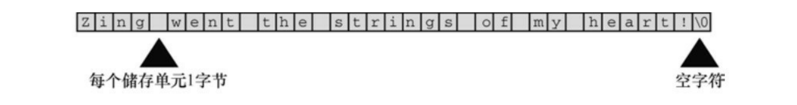
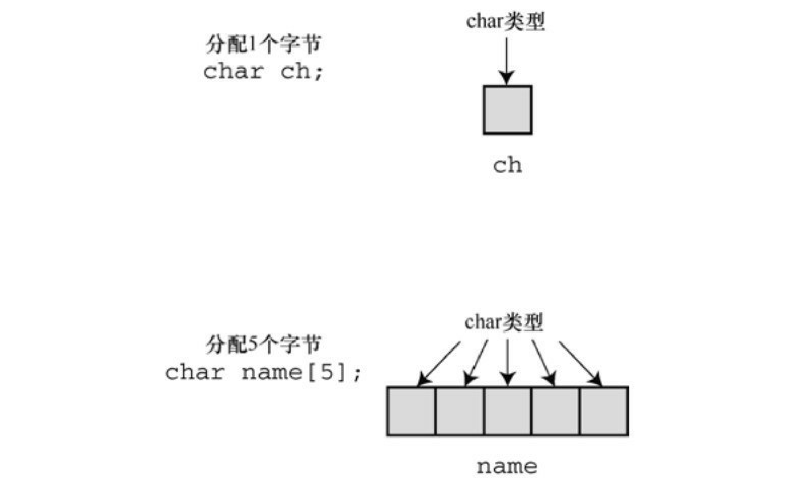
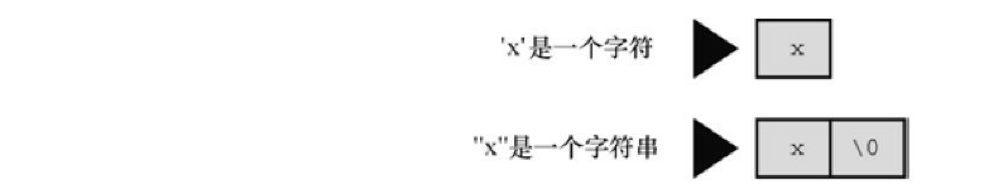

## 字符串

字符串（character string）是一个或多个字符的序列，如下所示： 

```bash
"Zing went the strings of my heart!" 
```

双引号不是字符串的一部分。双引号仅告知编译器它括起来的是字符串，正如单引号用于标识单个字符一样。 

## **char**类型数组和**null**字符

C语言没有专门用于储存字符串的变量类型，字符串都被储存在char类型的数组中。数组由连续的存储单元组成，字符串中的字符被储存在相邻的存储单元中，每个单元储存一个字符。



注意图中数组末尾位置的字符\0。这是空字符（null character），C语言用它标记字符串的结束。空字符不是数字0，它是非打印字符，其ASCII码值是（或等价于）0。C中的字符串一定以空字符结束，这意味着数组的容量必须至少比待存储字符串中的字符数多1。因此，有40个存储单元的字符串，只能储存39个字符，剩下一个字节留给空字符。

### 数组

数组可以看作是一行连续的多个存储单元。用更正式的说法是，数组是同类型数据元素的有序序列。



字符串看上去比较复杂！必须先创建一个数组，把字符串中的字符逐个放入数组，还要记得在末尾加上一个\0。还好，计算机可以自己处理这些细节。 

### 字符串和字符

字符串常量"x"和字符常量'x'不同。区别之一在于'x'是基本类型（char），而"x"是派生类型（char数组）；区别之二是"x"实际上由两个字符组成：'x'和空字符\0。 



### 字符串的使用

**声明：**

使用双引号声明字符串最多能获取等于数组容量的字符，但是scanf只能获取`数组容量-1`的容量。

```c
1 char str[4] = "fuck";
```

**溢出：**

当你声明的字符超过储存上限的时候编译器会发出警告，多出去的字符不会被储存。

```c
string.c:5:20: warning: initializer-string for char array is too long
    char str[40] = "qwerqwerqwerqwerqwerqwerqwerqwerqwerqwerq";
                   ^~~~~~~~~~~~~~~~~~~~~~~~~~~~~~~~~~~~~~~~~~~
string.c:6:20: warning: format specifies type 'int' but the argument has type 'unsigned long' [-Wformat]
```

