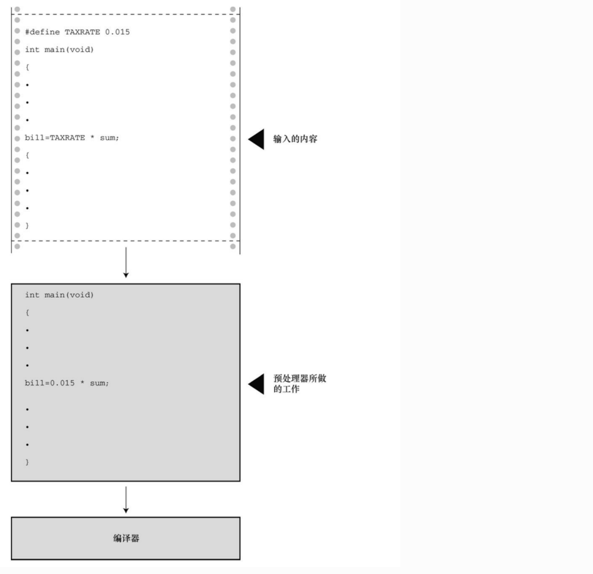
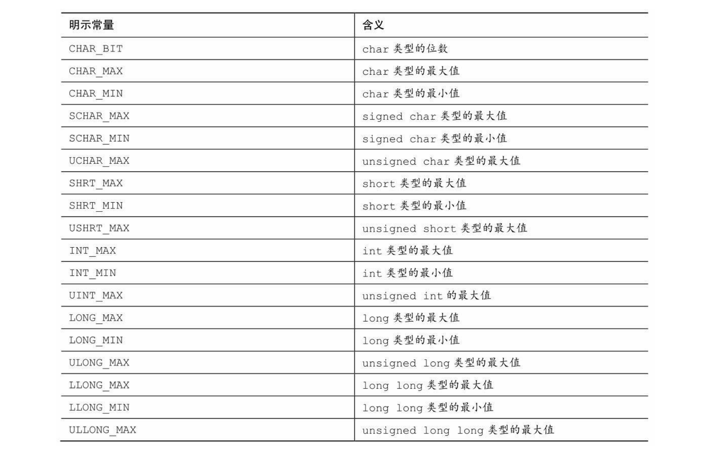
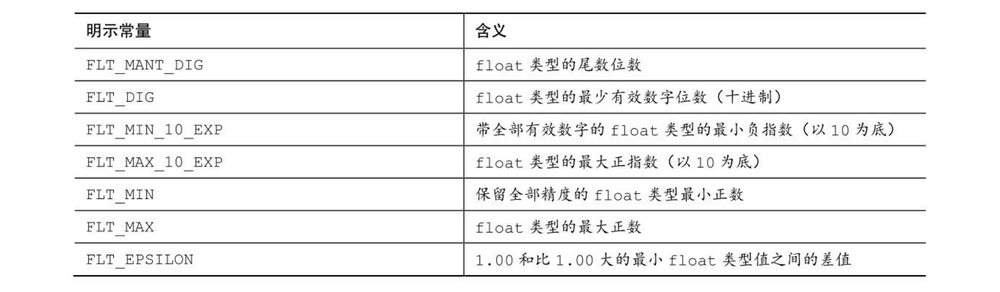

### 引言

有时，在程序中要使用常量。例如，可以这样计算圆的周长： 

```c
circumference = 3.14159 * diameter; 
```

这里，常量3.14159代表著名的常量pi（π）。在该例中，输入实际值便可使用这个常量。然而，这种情况使用符号常量(symbolic constant)会更好。

### C预处理器

预处理器使用#include包含其他文件的信息。预处理器也可用来定义常量。只需在程序顶部添加下面一行： 

```c
#define TAXRATE 0.015 
```

编译程序时，程序中所有的TAXRATE都会被替换成0.015。这一过程被 称为编译时替换(compile-time substitution)。在运行程序时，程序中所有的 替换均已完成通常，这样定义的常量也称为明示常量(manifest constant)

其通用格式如下：

```c
#define NAME value
```

用大写表示符号常量是 C 语言一贯的传统。这样，在程序中看到全大写的名称就立刻明白这是一个符号常量，而非变量。

**执行过程：**



**代码：**

```c
#include <stdio.h>
#define PI 3.1415
int main(void) 
{
    int r = 3;
    printf("%1.2f", PI * r * r);
    return 0;
}
```

#define指令还可定义字符和字符串常量。前者使用单引号，后者使用双 引号。如下所示：

```c
#define BEEP '\a' 
#define TEE 'T' 
#define ESC '\033' 
#define OOPS "Now you have done it!"
```

### **const**限定符

C90标准新增了const关键字，用于限定一个变量为只读 。其声明如下：

```c
const int MONTHS = 12; // MONTHS在程序中不可更改，值为12
```

这使得MONTHS成为一个只读值。也就是说，可以在计算中使用 MONTHS，可以打印MONTHS，但是不能更改MONTHS的值。const用起来 比#define更灵活

### 明示常量

C头文件limits.h和float.h分别提供了与整数类型和浮点类型大小限制相关的详细信息。每个头文件都定义了一系列供实现使用的明示常量。例如，limits.h头文件包含以下类似的代码：

```c
#define INT_MAX +32767 
#define INT_MIN -32768
```

这些明示常量代表int类型可表示的最大值和最小值。如系统使用32位的int，该头文件会为这些明示常量提供不同的值。

```c
int main(void) {
    printf("max int on this machine:%d", INT_MAX);
    return 0;
}
```

以下列出了所有的明示常量：



类似的float.h头文件也定义一些明示常量，如FLT_DIG和 DBL_DIG，分别表示float类型和double类型的有效数字位数。



