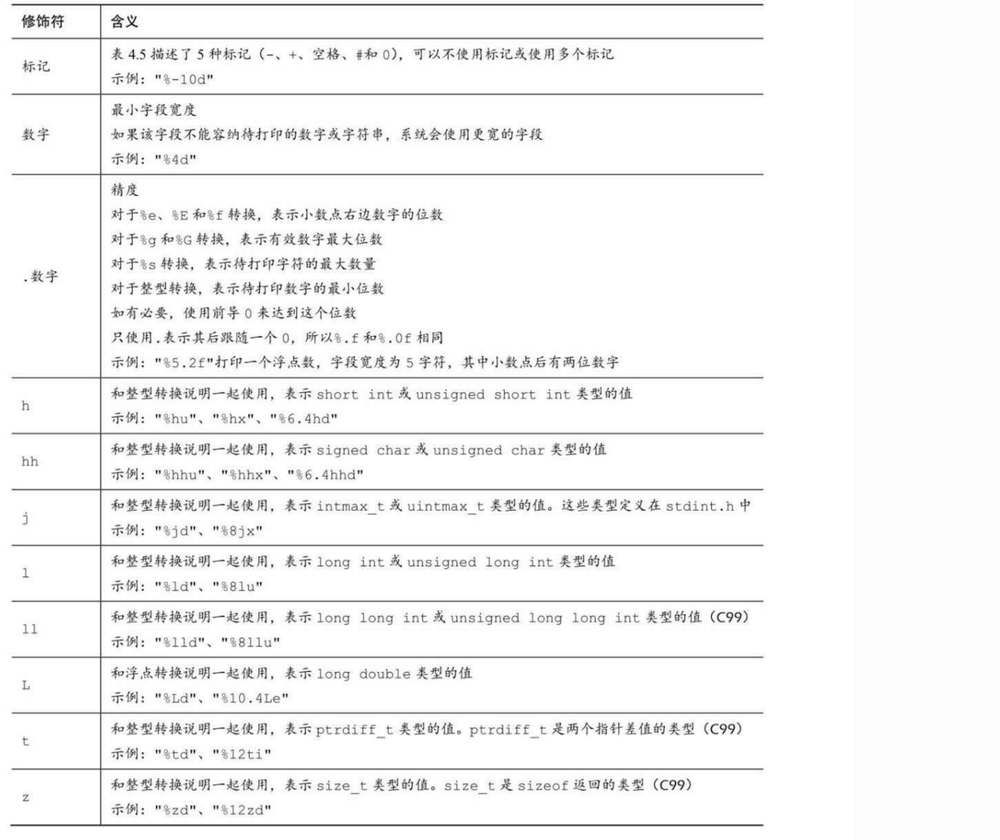
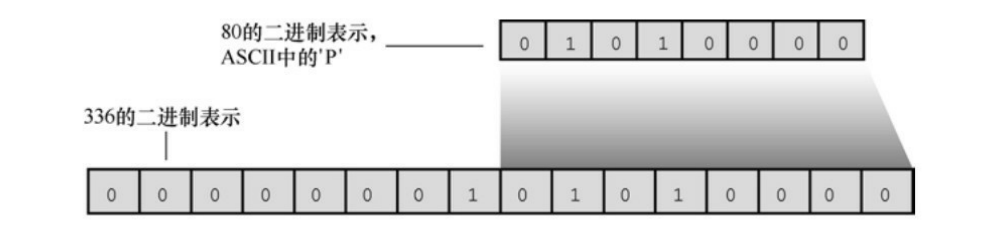

## Scanf & Printf

printf()函数和scanf()函数能让用户可以与程序交流，它们是输入/输出函 数，或简称为I/O函数。它们不仅是C语言中的I/O函数，而且是最多才多艺 的函数。过去，这些函数和C库的一些其他函数一样，并不是C语言定义的 一部分。最初，C把输入/输出的实现留给了编译器的作者，这样可以针对特 殊的机器更好地匹配输入/输出。后来，考虑到兼容性的问题，各编译器都 提供不同版本的printf()和scanf()。

### Scanf

```c
#include <stdio.h>
int main(void)
{
    int a,b,c;
    printf("Give me the value of a,b,c seperated with whitespaces:\n");
    scanf("%d%d%d",&a,&b,&c);
    printf("a=%d,b=%d,c=%d\n",a,b,c);
    return 0;
}
```

函数 scanf() 是从[标准输入流](https://baike.baidu.com/item/标准输入流)stdin [1] (标准输入设备，一般指向键盘)中读内容的通用[子程序](https://baike.baidu.com/item/子程序)，可以说明的格式读入多个字符，并保存在对应地址的变量中。 

函数的第一个参数是格式字符串，它指定了输入的格式，并按照格式说明符解析输入对应位置的信息并存储于可变参数列表中对应的指针所指位置。每一个指针要求非空，并且与字符串中的格式符一一顺次对应。

### Printf

对于short类型，可以使用h前缀。%hd表示以 十进制显示short类型的整数，%ho表示以八进制显示short类型的整数。h和l前缀都可以和u一起使用，用于表示无符号类型。例如，%lu表示打印 unsigned long类型的值。程序清单3.4演示了一些例子。对于支持long long类 型的系统，%lld和%llu分别表示有符号和无符号类型。

#### 格式参数

type的[字符](https://baike.baidu.com/item/字符)用于规定输出数据的类型，含义如下：

| 字符  | 对应数据类型       | 含义                                                         |
| ----- | ------------------ | ------------------------------------------------------------ |
| d / i | int                | 接受整数值并将它表示为有符号的[十进制](https://baike.baidu.com/item/十进制)整数，i是老式写法 |
| o     | unsigned int       | 无符号8进制整数(不输出前缀0）                                |
| u     | unsigned int       | 无符号10进制[整数](https://baike.baidu.com/item/整数)        |
| x / X | unsigned int       | 无符号[16进制](https://baike.baidu.com/item/16进制)整数，x对应的是abcdef，X对应的是ABCDEF（不输出前缀0x) |
| f(lf) | double             | [单精度浮点数](https://baike.baidu.com/item/单精度浮点数)和[双精度浮点数](https://baike.baidu.com/item/双精度浮点数)用f(lf 在C99开始加入标准，意思和 f 相同) |
| e / E | double             | [科学计数法](https://baike.baidu.com/item/科学计数法)表示的数，此处"e"的大小写代表在输出时用的“e”的大小写 |
| g / G | double             | 有效位数，如：%.8g表示单精度浮点数保留8位有效数字。          |
| c     | char               | [字符](https://baike.baidu.com/item/字符)型。可以把输入的数字按照[ASCII码](https://baike.baidu.com/item/ASCII码)相应转换为对应的字符 |
| s / S | char * / wchar_t * | [字符串](https://baike.baidu.com/item/字符串)。输出字符串中的字符直至字符串中的空字符（字符串以'\0‘结尾，这个'\0'即空字符） |
| p     | void *             | 以16进制形式输出[指针](https://baike.baidu.com/item/指针)    |
| n     | int *              | 到此字符之前为止，一共输出的字符个数，不输出文本             |
| %     | 无输入             | 不进行转换，输出字符‘%’（百分号）本身                        |
| m     | 无                 | 打印errno值对应的出错内容,(例: printf("%m\n"); )             |

注：%g、%G在小数点位数四位或指数大于等于精度时用%e、%E，否则用%f。

**标志flags**

flags 规定输出样式，取值和含义如下：

| 字符 | 字符名称 | 说明                                                         |
| ---- | -------- | ------------------------------------------------------------ |
| -    | 减号     | 左对齐，右边填充空格(默认右对齐)                             |
| +    | 加号     | 在数字前增加符号 + 或 -                                      |
| 0    | 数字零   | 将输出的前面补上0，直到占满指定列宽为止（不可以搭配使用“-”） |
|      | 空格     | 输出值为正时加上空格，为负时加上负号                         |
| #    | 井号     | type是o、x、X时，增加前缀0、0x、0Xtype是e、E、f、g、G时，一定使用小数点type是g、G时，尾部的0保留 |

#### 修饰符

在%和转换字符之间插入修饰符可修饰基本的转换说明。



**看看浮点型格式:**

本例的第1个转换说明是%f。在这种情况下，字段宽度和小数点后面的 位数均为系统默认设置，即字段宽度是容纳带打印数字所需的位数和小数点后打印6位数字。

```c
const double RENT = 3852.99; 	
printf("*%f*\n", RENT); 			// *3852.990000*      
printf("*%e*\n", RENT); 			// *3.852990e+03*
printf("*%4.2f*\n", RENT);  	// *3852.99*
printf("*%3.1f*\n", RENT); 		// *3853.0*
printf("*%10.3f*\n", RENT); 	// * 3852.990*
printf("*%10.3E*\n", RENT); 	// * 3.853E+03*
printf("*%+4.2f*\n", RENT);  	// *+3852.99*
```

这样打印的数字太多！解决方案是指定 小数点右侧显示的位数，程序中接下来的 4 个例子就是这样做的。请注意， 第4个和第6个例子对输出结果进行了四舍五入。

#### 转换说明的意义 

转换（conversion）可能会误导读者认为原始值被转替换成转换后的 值。实际上，转换说明是翻译说明，%d的意思是“把给定的值翻译成十进制 整数文本并打印出来”。

如果说转换不成功那么编译器会给出警告，同时打印的结果通过会以错误的解释方式解释传入内容的二进制串，比如说下面的把336转换为字符：



#### 参数传递

参数传递机制因实现而异。下面以我们的系统为例，分析参数传递的原理。函数调用如下：

```c
printf("%ld %ld %ld %ld\n", n1, n2, n3, n4);
```

该调用告诉计算机把变量n1、n2、、n3和n4的值传递给程序。这是一种 常见的参数传递方式。程序把传入的值放入被称为栈（stack）的内存区域。 **计算机根据变量类型（不是根据转换说明）**把这些值放入栈中。因此，n1被储存在栈中，占8字节（float类型被转换成double类型）。同样，n2也在栈中占8字节，而n3和n4在栈中分别占4字节。然后，控制转到printf()函数。该函 数根据转换说明（不是根据变量类型）从栈中读取值。%ld转换说明表明 printf()应该读取4字节，所以printf()读取栈中的前4字节作为第1个值。这是 n1的前半部分，将被解释成一个long类型的整数。根据下一个%ld转换说 明，printf()再读取4字节，这是n1的后半部分，将被解释成第2个long类型的 整数（见图4.9）。类似地，根据第3个和第4个%ld，printf()读取n2的前半部 分和后半部分，并解释成两个long类型的整数。因此，对于n3和n4，虽然用 对了转换说明，但printf()