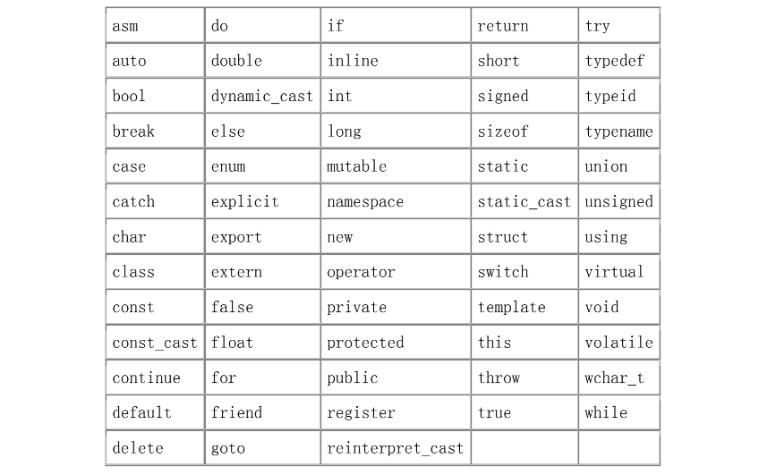

## 算术类型

C++ 定义了一组表示整数、浮点数、单个字符和布尔值的**算术类型**，另外还定义了一种称为 **void** 的特殊类型。void 类型没有对应的值，仅用在有限的一些情况下，通常用作无返回值函数的返回类型。 

算术类型的存储空间依机器而定。这里的存储空间是指用来表示该类型的**bit**数。C++标准规定了每个算术类型的最小存储空间，但它并不阻止编译器使用更大的存储空间。事实上，对于 int 类型，几乎所有的编译器使用的存储空间都比所要求的大。

**C++** **算术类型**

| 类型        | 含义         | 大小         |
| ----------- | ------------ | ------------ |
| `bool`      | 布尔类型     | 未定义       |
| `char`      | 字符         | 8位          |
| `wchar_t`   | 宽字符       | 16位         |
| `short`     | 短整型       | 16位         |
| `int`       | 整型         | 16位         |
| `long`      | 长整型       | 32位         |
| `long long` | 长整型       | 64位         |
| `float`     | 单精度浮点数 | 6个有效数字  |
| `double`    | 双精度浮点数 | 10个有效数字 |

#### **整型**

表示整数、字符和布尔值的算术类型合称为**整型**。 

字符类型有两种：`char `和` wchar_t`。`char` 类型保证了有足够的空间，能够存储机器基本字符集中任何字符相应的数值，因此，char 类型通常是单个机器字节（byte）。wchar_t 类型用于扩展字符集，比如汉字和日语，这些字符集中的一些字符不能用单个 char 表示。 

`short、int 和 long` 类型都表示整型值，存储空间的大小不同。一般， `short` 类型为半个机器字长，int 类型为一个机器字长，而 long 类型为一个或两个机器字长

`bool `类型表示真值 true 和 false。可以将算术类型的任何值赋给 `bool `对象。0 值代表 false，任何非 0 的值都代表 true。 

#### **带符号和无符号类型**

除 bool 类型外，整型可以是**带符号的（signed）**也可以是**无符号的** **（unsigned）**。顾名思义，带符号类型可以表示正数也可以表示负数（包括 0），而无符号型只能表示大于或等于 0 的数。 

整型 int、short 和 long 都默认为带符号型。要获得无符号型则必须指定该类型为 unsigned，比如 unsigned long。

和其他整型不同，char 有三种不同的类型：plain char 、unsigned char 和 signed char。虽然 char 有三种不同的类型，但只有两种表示方式。可以使用 unsigned char 或 signed char 表示 char 类型。使用哪种 char 表示方式由编译器而定。 

#### 浮点型

类型`float、 double 和 long double` 分别表示单精度浮点数、双精度浮点数和扩展精度浮点数。一般 float 类型用一个字（32 位）来表示，double 类型用两个字（64 位）来表示，long double 类型用三个或四个字（96 或 128 位）来表示。

> float 类型精度通常是不够的——float 型只能保证 6 位有效数字，而 double 型至少可以保证 10 位有效数字，能满足大多数计算的需要。 

## **字面值常量** 

像 42 这样的值，在程序中被当作**字面值常量**。称之为字面值是因为只能用它的值称呼它，称之为常量是因为它的值不能修改。每个字面值都有相应的类型，例如：0 是 int 型，3.14159 是 double 型。只有内置类型存在字面值。

#### **整型字面值规则**

定义字面值整数常量可以使用以下三种进制：十进制、八进制和十六进制，当然这些进制不会改变其二进制位的表示形式。

```c++
20 		// decimal 
024 	// octal 
0x14 	// hexadecimal
```

> 以 0（零）开头的字面值整数常量表示八进制，以 0x 或 0X 开头的表示十六进制。 

字面值整数常量的类型默认为 int 或 long 类型。其精度类型决定于字面值——其值适合 int 就是 int 类型，比 int 大的值就是 long 类型，通过在数值后面加 L 或者 l（字母“l”大写或小写）指定常量为 long 类型。 

可通过在数值后面加 U 或 u 定义 unsigned 类型。同时加 L 和 U 就能够得到 unsigned long 类型的字面值常量。

```c++
128u /* unsigned */ 1024UL  /* unsigned long */ 
1L 	/* long */ 		  8Lu 		/* unsigned long */
```

#### **浮点字面值规则**

通常可以用十进制或者科学计数法来表示浮点字面值常量。使用科学计数法时，指数用 E 或者 e 表示。默认的浮点字面值常量为 double 类型。在数值的后面加上 F 或 f 表示单精度。同样加上 L 或者 l 表示扩展精度（再次提醒，不提倡使用小写字母 l）。

```cpp
3.14159F 		.001f 	12.345L 		0. 
3.14159E0f 	1E-3F 	1.2345E1L 	0e0
```

#### **布尔字面值和字符字面值**

单词 true 和 false 是布尔型的字面值： 

```cpp
bool test = false;
```

可打印的字符型字面值通常用一对单引号来定义，这些字面值都是 char 类型的。在字符字面值前加 L 就能够得到 wchar_t 类型的宽字符字面值。如： 

```cpp
'a' '2' ',' L'a'
```

#### **字符串字面值的连接**

两个相邻的仅由空格、制表符或换行符分开的字符串字面值（或宽字符串字面值），可连接成一个新字符串字面值。这使得多行书写长字符串字面值变得简单： 

```cpp
// concatenated long string literal 
cout << "a multi-line " 
 				"string literal " 
 				"using concatenation"
		 << endl;
```

如果连接字符串字面值和宽字符串字面值，将会出现什么结果呢？例如： 

```cpp
 // Concatenating plain and wide character strings is undefined 
 std::cout << "multi-line " L"literal " << std::endl; 
```

其结果是**未定义的**，也就是说，连接不同类型的行为标准没有定义。这个程序可能会执行，也可能会崩溃或者产生没有用的值。

#### **多行字面值**

处理长字符串有一个更基本的（但不常使用）方法，这个方法依赖于很少使用的程序格式化特性：在一行的末尾加一反斜线符号可将此行和下一行当作同一行处理。 

```c++
// ok: A \ before a newline ignores the line break 
std::cou\ 
  t << "Hi" << st\ 
  d::endl;
// same as
std::cout << "Hi" << std::endl;
```

> 注意反斜线符号必须是该行的尾字符——不允许有注释或空格符。同样，后继行行首的任何空格和制表符都是字符串字面值的一部分。

## **变量**

变量提供了程序可以操作的有名字的存储区。C++ 中的每一个变量都有特定的类型，该类型决定了变量的内存大小和布局、能够存储于该内存中的值的取值范围以及可应用在该变量上的操作集。

> **强静态类型：**
>
> C++ 是一门静态类型语言，在编译时会作类型检查。 当编写表达式时，编译器检查表达式中的对象是否按该对象的类型定义的使用方式使用。如果不是的话，那么编译器会提示错误，而不产生可执行文件。 

#### **左值和右值**

我们在第五章再详细探讨表达式，现在先介绍 C++ 的两种表达式：

1. **左值**`（ell-value）`：左值可以出现在赋值语句的左边或右边。 

2. **右值**`（are-value）`：右值只能出现在赋值的右边，不能出现在赋值语句的左边。 

变量是左值，因此可以出现在赋值语句的左边。数字字面值是右值，因此不能被赋值。给定以下变量： 

```cpp
int units_sold = 0; 
double sales_price = 0, total_revenue = 0;
```

> C++中一般而言，对象就是内存中具有类型的区域。说得更具体一些，计算左值表达式就会产生对象。 

#### **变量名**

变量名，即变量的**标识符**，可以由字母、数字和下划线组成。变量名必须以字母或下划线开头，并且区分大小写字母：C++ 中的标识符都是大小写敏感的。

```cpp
// declares four different int variables 
 int somename, someName, SomeName, SOMENAME;
```

**变量命名习惯**

变量命名有许多被普遍接受的习惯，遵循这些习惯可以提高程序的可读性。 

- 变量名一般用小写字母。例如，通常会写成 index，而不写成 Index 或 INDEX。 
- 包含多个词的标识符书写为在每个词之间添加一个下划线，或者每个内嵌的词的第一个字母都大写。例如通常会写成 student_loan 或 studentLoan，而不写成 studentloan。

#### 关键字

C++ 保留了一组词用作该语言的关键字。关键字不能用作程序的标识符：

