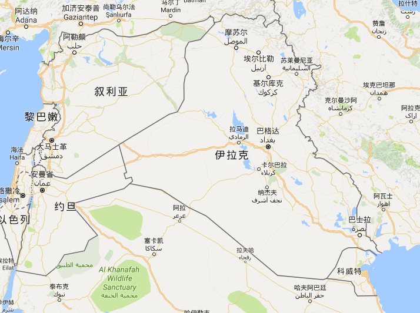

## 犹太教、基督教、伊斯兰教

-------

犹太教、基督教、伊斯兰教同属亚伯拉罕系宗教，他们是**同一个源头，同一个始祖**。他们都信奉上帝，只是叫法不一样，犹太教里称之“雅卫”，基督教称之“耶和华”，伊斯兰教称之“安拉或真主”。

**犹太教最为古老，是犹太民族的民族宗教，是基督教和伊斯兰教的本源**；基督教是从犹太教的一个“异端”派别发展而来，起初所有的基督徒都是犹太人（耶稣也是犹太人），后来才将传教重点转为“非犹太人”；伊斯兰教是在吸收犹太教、基督教的基础上，发展而来的，他们尊奉亚伯拉罕、摩西、耶稣、默罕默德等为先知，只是默罕默德是上帝最后一位“封印使者”罢了。

#### 犹太教

犹太教，起源于公元前`18`世纪以前的西亚闪米特人的原始宗教。公元前`18`世纪，犹太祖先亚伯拉罕率领部落民众从两河流域迁居至迦南地区（现巴勒斯坦），在迁徙过程中，摒弃了多神信仰，确立了部落唯一信奉的神——上帝。

此后不久，因为饥荒等原因，犹太民族又从迦南迁至埃及，之后，便经历了`400`余年被埃及奴役的历史。

公元前`14`世纪，犹太民族另一位英雄——摩西，率领部众逃离埃及的魔抓，回到迦南地区，并在此过程中基本确立了犹太教的基本教义，所以一般认为摩西是犹太教的创始人。

犹太教是犹太的民族宗教，信徒一般是犹太人。其信奉的圣经《旧约》约形成于公元前`6`世纪。（也就是巴比伦王国侵占犹太王国后，将犹太民族强迫前往巴比伦之时，这也是犹太民族历史上的一次苦难史。）

#### 基督教

基督教，由耶稣于公元`1`世纪在现在的以色列和巴勒斯坦地区开始传教（公元元年即为耶稣的诞辰年），它最初是犹太教的新兴派别，被当时的犹太教保守派视为异端邪说，受到了多方面的迫害，起初基督徒都是清一色的犹太人（耶稣也是犹太人）。

“基督”是希腊语的弥赛亚（救世主），当时在犹太人中传布着一种弥赛亚的预言，大致是说，犹太人将要出一个像古代名王大卫（公元前`11`世纪的一位犹太民族英雄，建立犹太王国，定都耶路撒冷）那样的民族救世主，实现“上帝的国”。

约公元`28`年，根据这个传说，耶稣以犹太人的君王自居，并自称为神的儿子和弥赛亚，结果被罗马政府逮捕，并钉死在十字架上（钉死在十字架只是罗马政府较为残酷的一种行刑方式）。

耶稣死后，耶稣门徒不断宣扬基督教义，并将传教对象由最初的“犹太人”转为“非犹太人”，尤其是耶稣的门徒彼得和保罗，他们带领“基督使徒团”进行传教，保罗用文字将基督教教义编纂成圣经《新约》。 因而主流学术界认为保罗是基督信仰的实际创始人。

公元`2`世纪初，基督教自称为天主教，从各方面脱离犹太教。天主教会认为教会是耶稣创立。

#### 伊斯兰教

伊斯兰教，由默罕默德于公元7世纪，在吸收犹太教、基督教的经典和教义思想的基础上，创立于阿拉伯半岛。比基督教还晚近700年。

“伊斯兰”系阿拉伯语音译，意为“顺从”、“和平”，指顺从和信仰创造宇宙的独一无二的主宰安拉及其意志，信奉伊斯兰教的人统称为“穆斯林”，意为“顺从者”。

伊斯兰教认为，穆罕默德是真主（即上帝、耶和华）的最后一位封印使者（基督教称耶稣为上帝的儿子），《古兰经》是真主通过穆罕默德宣示给人类的最后一部最完整的经典。

默罕默德与耶稣不同的是，他不仅传教，而且还于公元622年左右，在麦地那以伊斯兰教共同信仰代替部落血缘关系，建立了以“乌玛”(意为“民族”、“国家”)为形式的政教合一的政权，穆罕默德成为麦地那宗教、政治、军事和司法的最高领袖。通过不断的征战，默罕默德基本统一了阿拉伯半岛，并强迫民众信奉伊斯兰教，从而使得伊斯兰教不断发扬光大，成为阿拉伯民族的民族宗教，接着又作为一个封建帝国的精神源泉，然后又作为一种世界性的宗教、文化和政治的力量。

> **PS**所以不难理解，为什么伊斯兰教徒喜欢建立政教合一的政权，喜欢不断征服别人，这是有历史原因和宗教基因的，因为伊斯兰教宣扬的就是“征服”和“顺从”，这与基督教宣扬的“仁爱”不同。

#### 共同点

1. 都信奉度唯一神（上帝）。只是各自叫法不同，犹太教称之“雅卫”、基督教称为“耶和华”、伊斯兰教称之“阿拉”。
2. 都尊奉《圣经旧约》中的亚伯拉罕（伊斯兰称“易卜拉辛”）为信仰上的始祖。均认为亚伯拉罕的嫡子以撒是犹太民族的祖先、庶子以实玛利是阿拉伯民族的祖先，均以亚伯拉罕（易卜拉辛）为先知。
3. 都相信世界末日。他们都相信有世界末日、有末日审判，只是具体细节不同，且都坚信末日宣判将在耶路撒冷，这也是各教不断争夺耶路撒冷的原因之一。
4. 有共同的圣地是：耶路撒冷。犹太教的圣殿哭墙便在此处，是先知穆罕默德的升天之地，是耶稣传福音、背十字架受钉以及复活的圣地。

#### 有关伊斯兰教

因为伊斯兰教的意志为顺从，所以一直和恐怖教派挂边，当然世界恐怖组织基本都和伊斯兰教挂边。

**ISIS**

`ISIS（Islamic State of Iraq and al Shams）`，伊拉克和大叙利亚伊斯兰国，其实就是美国主要打击的两个国家，它的地理位置是这样的：

而我们通常所说的“极端恐怖组织”一般指的是“``ISIS``组织”，因为这个组织发源地在``ISIS``，所以就以``ISIS``命名，

